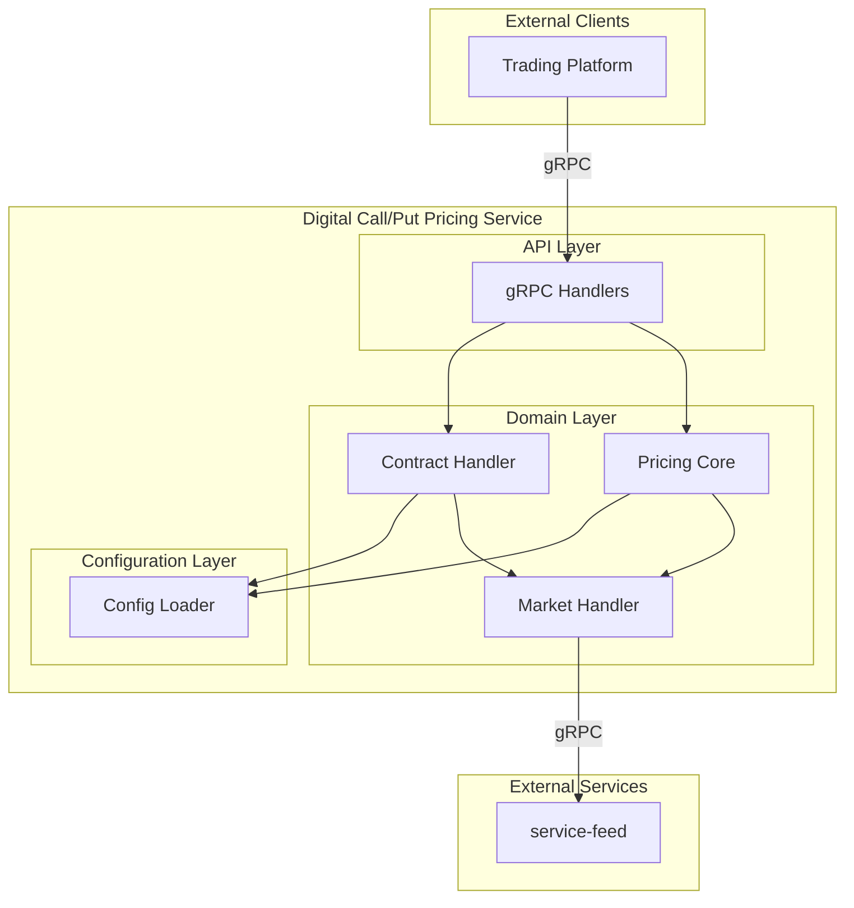
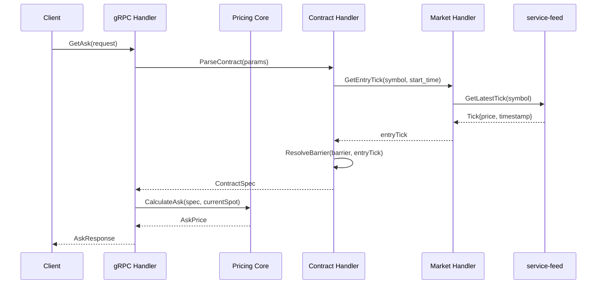

# Service Architecture
# Digital Call/Put Options Pricing Service

**Version**: 1.0  
**Date**: 2026-01-08  
**Status**: Draft

---

## 1. Executive Summary

This document defines the service architecture for the Digital Call/Put Options Pricing Service, a stateless Go microservice that provides real-time pricing for digital (binary) options contracts using the Black-Scholes pricing model.

### Architecture Approach

The system is designed as a **single microservice** with internal module boundaries that map directly to the domain model's bounded contexts. This approach is appropriate because:

1. **Stateless Design**: The service maintains no persistent state, making decomposition into multiple services unnecessary
2. **Cohesive Domain**: All functionality (pricing, contract handling, market data) serves a single business capability - options pricing
3. **Single Data Flow**: All requests follow the same pattern: receive → validate → price → respond
4. **External Dependency**: Market data comes from a single external service (service-feed)

### Key Design Decisions

| Decision | Rationale |
|----------|-----------|
| Single Service | Cohesive business domain, no data persistence, simpler deployment |
| Internal Modules | Separation of concerns without microservice overhead |
| gRPC API | Efficient binary protocol, native streaming support, strong typing |
| Dependency Inversion | Pricing core has no dependencies; all modules depend on pricing |
| Stateless | All contract state reconstructed from request parameters |

---

## 2. Service Architecture Overview

### 2.1 Architecture Diagram



### 2.2 Component Communication Flow



### 2.3 Technology Stack

| Layer | Technology | Rationale |
|-------|------------|-----------|
| Language | Go | Performance, concurrency, team expertise |
| API Protocol | gRPC | Streaming support, binary efficiency, type safety |
| Serialization | Protocol Buffers | Schema evolution, cross-language support |
| Configuration | YAML | Human-readable, easy to modify |
| Build | Make | Standard Go project tooling |
| Containerization | Docker | Deployment consistency |

### 2.4 Architectural Principles

Based on workspace preferences, these rules MUST be followed:

1. **Handler Delegation**: gRPC handlers receive requests and delegate to domain modules. Handlers MUST NOT fetch data from various sources or assemble responses directly.

2. **Standard Error Codes**: Always return gRPC standard error codes with descriptive messages.

3. **Dependency Direction**: All dependencies flow toward the pricing core. Other modules depend on pricing; pricing depends on nothing else within the service.

4. **Interface Location**: Interfaces are defined where they are consumed, not where they are implemented.

5. **No models/types Package**: No shared models package. Each module defines its own types as needed.

---

## 3. Service Definition

### 3.1 Service Overview

**Service ID**: SVC-PR-K3M  
**Service Name**: digitalcallput  
**Purpose**: Provides real-time Ask and Bid pricing for digital call/put options using Black-Scholes pricing model. The service handles both single-request and streaming pricing scenarios for time-based and tick-based contracts.

**Domain Alignment**: 
- DOM-PR-H8L (Pricing Domain) - Primary
- DOM-CT-I9M (Contract Domain) - Supporting
- DOM-MK-J1N (Market Domain) - Supporting
- DOM-CF-K2O (Configuration Domain) - Supporting

### 3.2 Business Capabilities

| Capability | Description |
|------------|-------------|
| Ask Price Generation | Calculate purchase price for new digital options |
| Bid Price Generation | Calculate current value of active contracts |
| Streaming Pricing | Real-time price updates via server streaming |
| Barrier Resolution | Resolve absolute, relative, and ATM barriers |
| Duration Handling | Support time-based and tick-based contract durations |
| Win/Loss Determination | Determine contract outcome at expiry |

### 3.3 Data Domains

This service owns no persistent data (stateless). It operates on:

| Data Concept | Ownership | Description |
|--------------|-----------|-------------|
| Contract Parameters | Transient | Reconstructed from request parameters |
| Pricing Results | Computed | Generated per request/stream update |
| Symbol Configuration | Static | Loaded from YAML at startup |
| Tick Data | External | Retrieved from service-feed |

### 3.4 Public API

The service exposes four gRPC endpoints:

#### 3.4.1 GetAsk
**Type**: Unary RPC  
**Purpose**: Returns a single Ask price for a proposed contract

**Request**:
```protobuf
message GetAskRequest {
  string symbol = 1;           // Underlying asset (e.g., "USD/JPY")
  ContractType contract_type = 2; // CALL or PUT
  string currency = 3;         // Payout currency
  string duration = 4;         // Duration string (e.g., "1m", "5t")
  string stake = 5;            // Premium amount
  optional string barrier = 6; // Relative or absolute barrier
  optional int64 pricing_time = 7; // Epoch time for pricing
}
```

**Response**:
```protobuf
message GetAskResponse {
  string ask_price = 1;
  string currency = 2;
  string current_spot = 3;
  int64 current_spot_time = 4;
  string payout = 5;
  Limits limits = 6;
}
```

**PRD References**: REQ-AP-G1A, REQ-PR-A1J

#### 3.4.2 StreamAsk
**Type**: Server Streaming RPC  
**Purpose**: Streams Ask prices as market conditions change

**Request**: Same as GetAskRequest  
**Response Stream**: Continuous GetAskResponse messages

**Behavior**:
- Time-based: Update on tick OR every 5 seconds
- Tick-based: Update only on new ticks

**PRD References**: REQ-AP-S2B, REQ-ST-U1P, REQ-ST-T2Q

#### 3.4.3 GetBid
**Type**: Unary RPC  
**Purpose**: Returns current market value of an active contract

**Request**:
```protobuf
message GetBidRequest {
  string symbol = 1;
  ContractType contract_type = 2;
  string currency = 3;
  string duration = 4;
  optional string barrier = 5;
  int64 start_time = 6;        // Contract start timestamp
  string payout = 7;           // Fixed payout from purchase (REQUIRED)
}
```

**Response**:
```protobuf
message GetBidResponse {
  string bid_price = 1;
  bool is_expired = 2;
  string current_spot = 3;
  int64 current_spot_time = 4;
  string entry_spot = 5;
  int64 entry_spot_time = 6;
  optional string exit_spot = 7;    // Only when expired
  optional int64 exit_spot_time = 8; // Only when expired
  string barrier = 9;           // Resolved barrier value
  int64 start_time = 10;
  int64 expiry_time = 11;
  string currency = 12;
}
```

**PRD References**: REQ-AP-G3C, REQ-PR-B2K, REQ-PR-N3L, REQ-LC-P3O

#### 3.4.4 StreamBid
**Type**: Server Streaming RPC  
**Purpose**: Streams Bid prices for active contracts

**Request**: Same as GetBidRequest  
**Response Stream**: Continuous GetBidResponse messages

**Behavior**:
- Time-based: Update on tick OR every 5 seconds
- Tick-based: Update ONLY on new ticks (no time-based fallback)
- Stream terminates when contract expires

**PRD References**: REQ-AP-S4D, REQ-ST-U1P, REQ-ST-T2Q

### 3.5 Internal API

Not applicable - this is a standalone service with no downstream consumers within our system.

### 3.6 Dependencies

| Dependency | Type | Purpose |
|------------|------|---------|
| service-feed | External gRPC | Market data (ticks) for pricing calculations |

**Required Capabilities from service-feed**:
- `GetLatestTick(symbol)`: Single tick retrieval for unary requests
- `StreamTicks(symbol)`: Continuous tick stream for streaming endpoints
- `GetTicks(symbol, from, to)`: Historical ticks for entry/exit determination

### 3.7 Key Responsibilities

1. **Request Validation**
   - Validate required fields (symbol, contract_type, currency, duration, stake)
   - Validate stake against min_stake limit
   - Validate calculated payout against max_payout limit
   - Validate duration format and range
   - Validate barrier format (if provided)

2. **Contract Specification**
   - Parse duration string to determine type (time-based vs tick-based)
   - Resolve barrier (absolute, relative, or ATM)
   - Calculate expiry time/tick count

3. **Pricing Calculation**
   - Apply Black-Scholes formula with fixed parameters (volatility=10%, rate=0%)
   - Calculate Ask price from stake and probability
   - Calculate Bid price from remaining time/ticks and current spot
   - Apply commission from symbol configuration

4. **Market Data Integration**
   - Retrieve current spot price from service-feed
   - Determine entry tick (first tick after start_time)
   - Determine exit tick (at expiry)

5. **Stream Management**
   - Manage tick subscriptions for streaming endpoints
   - Handle 5-second heartbeat for time-based streams
   - Track tick count for tick-based contracts
   - Gracefully terminate streams on client disconnect or contract expiry

6. **Error Handling**
   - Return appropriate gRPC error codes
   - Provide descriptive error messages
   - Handle service-feed unavailability gracefully

### 3.8 User Stories Coverage

| Story ID | Summary |
|----------|---------|
| US-PR-K3M | Request Ask price for Call option |
| US-PR-P7R | Request Ask price for Put option |
| US-PR-A1E | See potential payout with Ask price |
| US-PR-B2F | See trading limits |
| US-PR-C3G | See current spot price and timestamp |
| US-PR-D4H | Receive streaming Ask price updates |
| US-PR-E5I | Ask stream updates on new tick |
| US-PR-F6J | Ask stream updates every 5 seconds |
| US-PR-G7K | Request Bid price for active contract |
| US-PR-H8L | See resolved barrier in Bid response |
| US-PR-I9M | See entry spot price and timestamp |
| US-PR-J1N | See exit spot when expired |
| US-PR-L2O | Original payout preserved |
| US-PR-M3P | Streaming Bid price updates |
| US-PR-N4Q | Stream terminates on expiry |
| US-PR-O5R | Time-based Bid stream behavior |
| US-PR-Q6S | Tick-based Bid stream behavior |
| US-CT-R7T | Specify absolute barrier |
| US-CT-S8U | Specify relative barrier (+) |
| US-CT-T9V | Specify relative barrier (-) |
| US-CT-U1W | Use default ATM barrier |
| US-CT-V2X | Duration in seconds |
| US-CT-W3Y | Duration in minutes |
| US-CT-X4Z | Duration in hours |
| US-CT-Y5A | Duration in days |
| US-CT-Z6B | Time-based expiry behavior |
| US-CT-A7C | Duration in ticks |
| US-CT-B8D | Tick counting after entry |
| US-CT-C9E | No early exit for tick-based |
| US-MK-D1F | Entry price from first tick after start |
| US-MK-E2G | Exit price at expiry |
| US-MK-F3H | Timestamps from market feed |
| US-VL-G4I | Error for unsupported symbol |
| US-VL-H5J | Error for stake below minimum |
| US-VL-I6K | Error for payout above maximum |
| US-VL-J7L | Error for invalid duration |
| US-VL-K8M | Error for invalid barrier |
| US-VL-L9N | Error when market data unavailable |

### 3.9 Constraints

#### Performance Requirements
| Metric | Target |
|--------|--------|
| GetAsk response time | < 100ms p95 |
| GetBid response time | < 100ms p95 |
| Stream first response | < 500ms |
| Stream update latency | < 200ms from tick receipt |
| Concurrent streams | 10,000 per instance |
| Requests per second | 5,000 RPS per instance |

#### Precision Requirements
| Data Type | Precision |
|-----------|-----------|
| Monetary values | 8 decimal places |
| Prices (spot, barrier) | 8 decimal places |
| Duration (years) | 10 decimal places |

#### Reliability Requirements
- Target availability: 99.9%
- Graceful degradation on service-feed unavailability
- No partial responses (all-or-nothing)

### 3.10 Internal Structure

The service will be organized into logical components (Score 6/10 - Standard complexity):

```
digitalcallput/
├── cmd/
│   └── digitalcallput/
│       └── main.go              # Application entry point
├── internal/
│   ├── app/
│   │   └── app.go               # Application setup and wiring
│   ├── grpcsvc/
│   │   └── grpcsvc.go           # gRPC handler implementations
│   ├── pricing/
│   │   ├── ask.go               # Ask price calculation
│   │   ├── bid.go               # Bid price calculation
│   │   └── blackscholes.go      # Black-Scholes formula
│   ├── contract/
│   │   ├── barrier.go           # Barrier resolution logic
│   │   └── duration.go          # Duration parsing and handling
│   ├── market/
│   │   ├── feed.go              # service-feed client wrapper
│   │   └── tick.go              # Tick handling and entry/exit logic
│   └── config/
│       └── config.go            # YAML configuration loader
├── proto/
│   └── digitalcallput/
│       └── v1/
│           └── digitalcallput.proto
├── config/
│   └── symbols.yaml             # Symbol configuration
└── Makefile
```

**Component Responsibilities**:

- **grpcsvc**: Receives gRPC requests, validates input, delegates to pricing/contract modules, returns responses. Does NOT orchestrate data fetching.

- **pricing**: Core domain module. Contains Black-Scholes calculations, Ask/Bid price generation. Has NO dependencies on other internal modules. Defines interfaces for what it needs (market data, config).

- **contract**: Handles contract parameter processing - barrier resolution, duration parsing. Depends on market module for tick data.

- **market**: Wraps service-feed client. Provides tick retrieval and stream management. Implements interfaces defined in pricing module.

- **config**: Loads and provides symbol configuration (limits, commission). Implements interfaces defined in pricing module.

**Dependency Flow**:
```
grpcsvc → pricing (core)
grpcsvc → contract
contract → market
market → service-feed (external)
config (standalone, accessed via interfaces)
```

### 3.11 Orchestration Requirements

**Startup Dependencies**:
- service-feed must be available (graceful degradation if not)

**Health Check**:
- Endpoint: `/grpc.health.v1.Health/Check` (gRPC health checking protocol)
- Also: TCP port check

**Environment Variables**:
| Variable | Description | Default |
|----------|-------------|---------|
| GRPC_PORT | gRPC server port | 50051 |
| FEED_HOST | service-feed hostname | localhost |
| FEED_PORT | service-feed port | 50052 |
| CONFIG_PATH | Path to symbols.yaml | ./config/symbols.yaml |
| LOG_LEVEL | Logging verbosity | info |

**Database Requirements**: None (stateless service)

**Port Allocation**: 50051 (gRPC)

---

## 4. Data Strategy

### 4.1 Data Ownership Principles

This service follows a **stateless architecture** with no persistent data storage:

| Data Category | Ownership | Strategy |
|---------------|-----------|----------|
| Contract Parameters | Request-scoped | Reconstructed from each request |
| Pricing Results | Computed | Generated fresh for each calculation |
| Symbol Configuration | Service-owned | Loaded from YAML at startup, cached in memory |
| Tick Data | External | Retrieved from service-feed per request/stream |
| Stream State | Connection-scoped | Maintained only for active stream connections |

### 4.2 Consistency Patterns

| Boundary | Consistency Type | Notes |
|----------|------------------|-------|
| Single Request | Strong | Atomic computation within request |
| Stream Session | Eventual | Each update is consistent snapshot |
| Configuration | Read-only | Immutable after startup |

### 4.3 Critical Business Rules

1. **Payout Immutability** (BR-LC-M9J): Payout is fixed at purchase and MUST be provided in Bid requests. Service never recalculates payout.

2. **Entry/Exit Timestamps**: Tick timestamps come from market feed (service-feed), not calculated internally.

3. **Win/Loss Determination**: Strict comparison - equality goes to the house.
   - Call: exit > barrier = win
   - Put: exit < barrier = win

### 4.4 External Data Integration

**service-feed Integration**:
- Use `GetLatestTick` for unary requests (single tick retrieval)
- Use `StreamTicks` for streaming requests (continuous updates)
- Use `GetTicks` for historical tick retrieval (entry/exit determination)

**Error Handling**:
- If service-feed is unavailable: Return `UNAVAILABLE` gRPC status
- If tick data is stale: Include timestamp in response for client validation

---

## 5. Inter-Service Communication Matrix

| Consumer | Provider | Required Capability | Pattern | Purpose | Priority |
|----------|----------|---------------------|---------|---------|----------|
| digitalcallput | service-feed | GetLatestTick(symbol) | Sync gRPC | Get current spot price for unary pricing | Critical |
| digitalcallput | service-feed | StreamTicks(symbol) | Streaming gRPC | Receive tick updates for streaming pricing | Critical |
| digitalcallput | service-feed | GetTicks(symbol, from, to) | Sync gRPC | Get historical ticks for entry/exit determination | Critical |

---

## 6. Requirements Coverage Matrix

| PRD Requirement | Service | Implementation Notes |
|-----------------|---------|---------------------|
| REQ-CT-K3M: Call Option | digitalcallput | pricing module - win if exit > barrier |
| REQ-CT-P7R: Put Option | digitalcallput | pricing module - win if exit < barrier |
| REQ-AP-G1A: GetAsk | digitalcallput | grpcsvc - unary Ask endpoint |
| REQ-AP-S2B: StreamAsk | digitalcallput | grpcsvc - streaming Ask endpoint |
| REQ-AP-G3C: GetBid | digitalcallput | grpcsvc - unary Bid endpoint |
| REQ-AP-S4D: StreamBid | digitalcallput | grpcsvc - streaming Bid endpoint |
| REQ-BR-A1E: Absolute Barrier | digitalcallput | contract module - direct value |
| REQ-BR-R2F: Relative Barrier | digitalcallput | contract module - entry +/- offset |
| REQ-BR-N3G: Default Barrier | digitalcallput | contract module - ATM = entry |
| REQ-DU-T1H: Time-Based Duration | digitalcallput | contract module - s/m/h/d parsing |
| REQ-DU-K2I: Tick-Based Duration | digitalcallput | contract module - tick counting |
| REQ-PR-A1J: Ask Calculation | digitalcallput | pricing module - Black-Scholes |
| REQ-PR-B2K: Bid Calculation (Time) | digitalcallput | pricing module - remaining time |
| REQ-PR-N3L: Bid for Tick-Based | digitalcallput | pricing module - no early exit |
| REQ-LC-E1M: Entry Tick | digitalcallput | market module - first tick after start |
| REQ-LC-X2N: Exit Tick | digitalcallput | market module - tick at expiry |
| REQ-LC-P3O: Payout Immutability | digitalcallput | payout from request, never recalculated |
| REQ-ST-U1P: Time-Based Stream | digitalcallput | grpcsvc - 5s heartbeat |
| REQ-ST-T2Q: Tick-Based Stream | digitalcallput | grpcsvc - tick-only updates |
| NFR-PF-L1A: Response Latency | digitalcallput | <100ms unary, <500ms stream init |
| NFR-PF-T2B: Throughput | digitalcallput | 5000 RPS, 10000 streams |
| NFR-RL-A1C: Availability | digitalcallput | 99.9% uptime target |
| NFR-RL-F2D: Fault Tolerance | digitalcallput | graceful degradation |
| NFR-PR-D1E: Precision | digitalcallput | 8 decimal places for monetary |

---

## 7. User Story Coverage Matrix

| Story ID | Summary | Service | API |
|----------|---------|---------|-----|
| US-PR-K3M | Ask price for Call | digitalcallput | GetAsk |
| US-PR-P7R | Ask price for Put | digitalcallput | GetAsk |
| US-PR-A1E | See payout with Ask | digitalcallput | GetAsk |
| US-PR-B2F | See trading limits | digitalcallput | GetAsk |
| US-PR-C3G | See spot price/time | digitalcallput | GetAsk, GetBid |
| US-PR-D4H | Streaming Ask updates | digitalcallput | StreamAsk |
| US-PR-E5I | Ask update on tick | digitalcallput | StreamAsk |
| US-PR-F6J | Ask update every 5s | digitalcallput | StreamAsk |
| US-PR-G7K | Bid price for active | digitalcallput | GetBid |
| US-PR-H8L | See barrier in Bid | digitalcallput | GetBid |
| US-PR-I9M | See entry spot/time | digitalcallput | GetBid |
| US-PR-J1N | See exit on expiry | digitalcallput | GetBid |
| US-PR-L2O | Payout preserved | digitalcallput | GetBid, StreamBid |
| US-PR-M3P | Streaming Bid updates | digitalcallput | StreamBid |
| US-PR-N4Q | Stream ends on expiry | digitalcallput | StreamBid |
| US-PR-O5R | Time-based Bid stream | digitalcallput | StreamBid |
| US-PR-Q6S | Tick-based Bid stream | digitalcallput | StreamBid |
| US-CT-R7T | Absolute barrier | digitalcallput | All endpoints |
| US-CT-S8U | Relative barrier (+) | digitalcallput | All endpoints |
| US-CT-T9V | Relative barrier (-) | digitalcallput | All endpoints |
| US-CT-U1W | Default ATM barrier | digitalcallput | All endpoints |
| US-CT-V2X | Duration in seconds | digitalcallput | All endpoints |
| US-CT-W3Y | Duration in minutes | digitalcallput | All endpoints |
| US-CT-X4Z | Duration in hours | digitalcallput | All endpoints |
| US-CT-Y5A | Duration in days | digitalcallput | All endpoints |
| US-CT-Z6B | Time-based expiry | digitalcallput | All endpoints |
| US-CT-A7C | Duration in ticks | digitalcallput | All endpoints |
| US-CT-B8D | Tick counting | digitalcallput | StreamAsk, StreamBid |
| US-CT-C9E | No tick-based early exit | digitalcallput | GetBid, StreamBid |
| US-MK-D1F | Entry from first tick | digitalcallput | All endpoints |
| US-MK-E2G | Exit at expiry | digitalcallput | GetBid, StreamBid |
| US-MK-F3H | Timestamps from feed | digitalcallput | All endpoints |
| US-VL-G4I | Error: bad symbol | digitalcallput | All endpoints |
| US-VL-H5J | Error: low stake | digitalcallput | GetAsk, StreamAsk |
| US-VL-I6K | Error: high payout | digitalcallput | GetAsk, StreamAsk |
| US-VL-J7L | Error: bad duration | digitalcallput | All endpoints |
| US-VL-K8M | Error: bad barrier | digitalcallput | All endpoints |
| US-VL-L9N | Error: feed unavailable | digitalcallput | All endpoints |

---

## 8. Development Order Recommendation

Since this is a single service, development order focuses on internal components:

### Phase 1: Foundation (Week 1)
1. **Project Setup**: Initialize from go-templates, configure proto
2. **Configuration Module**: Symbol YAML loading
3. **Proto Definition**: Define gRPC service and messages

### Phase 2: Core Domain (Week 1-2)
4. **Pricing Core**: Black-Scholes implementation
5. **Contract Module**: Duration parsing, barrier resolution
6. **Market Module**: service-feed client integration

### Phase 3: API Layer (Week 2)
7. **GetAsk Handler**: Unary Ask endpoint
8. **GetBid Handler**: Unary Bid endpoint
9. **Input Validation**: All validation rules

### Phase 4: Streaming (Week 2-3)
10. **StreamAsk Handler**: Streaming Ask with tick subscription
11. **StreamBid Handler**: Streaming Bid with expiry detection
12. **Stream Management**: 5-second heartbeat, tick counting

### Phase 5: Hardening (Week 3)
13. **Error Handling**: gRPC error codes, graceful degradation
14. **Testing**: Unit tests, integration tests
15. **Performance**: Optimization, profiling

---

## 9. Glossary

| Term | Definition |
|------|------------|
| Ask | Price to purchase (enter) a contract |
| Bid | Current market value of an active contract |
| Barrier | Price level determining win/loss outcome |
| Digital Option | Binary option with fixed payout on win |
| Entry Spot | First tick price after contract start |
| Exit Spot | Final tick price at contract expiry |
| ATM | At-the-money: barrier equals entry price |
| Tick | Single price update from market feed |

---

## 10. Changelog

| Version | Date | Author | Changes |
|---------|------|--------|---------|
| 1.0 | 2026-01-08 | Service Architect | Initial architecture creation |
