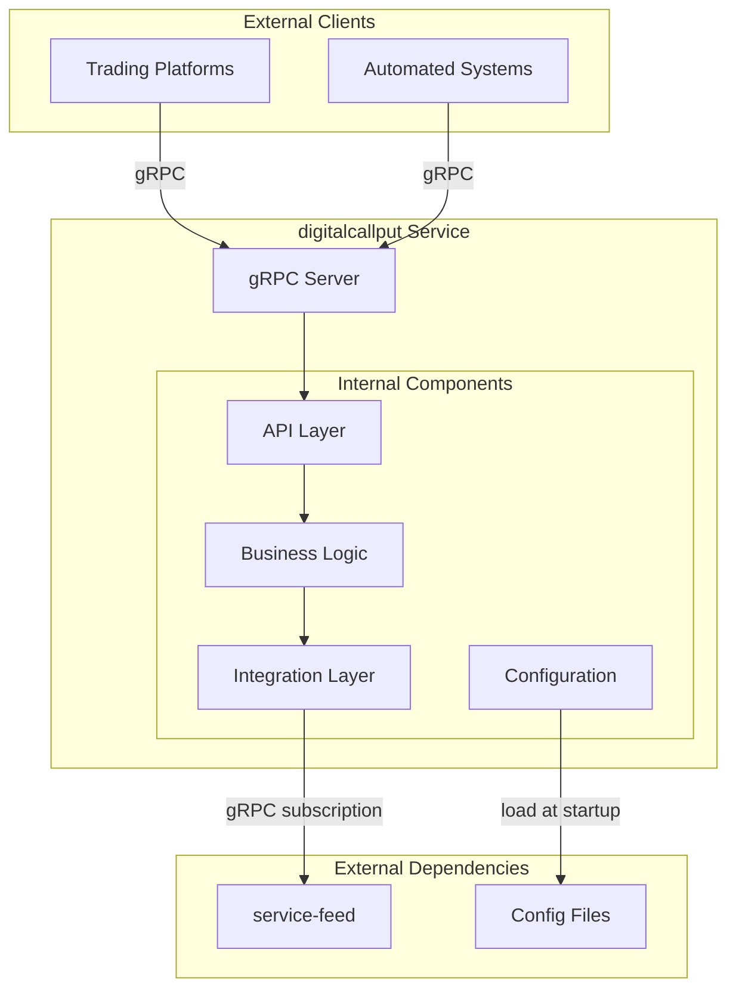
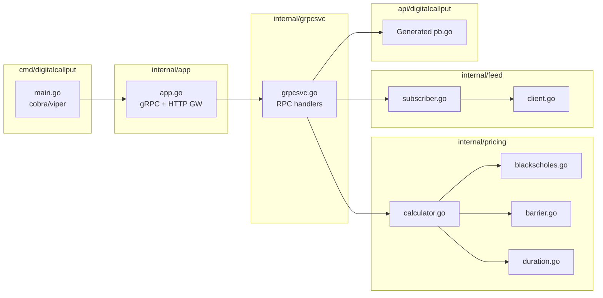
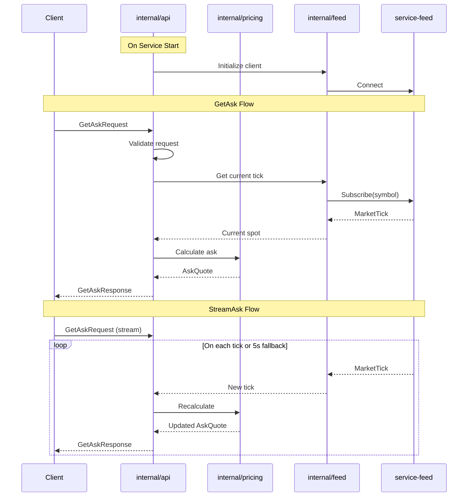

# Service Architecture
# Digital Call/Put Options Pricing Service

**Document Version**: 1.0
**Last Updated**: 2025-12-23
**Service Name**: digitalcallput
**Complexity Score**: 6/10 (Standard)

---

## 1. Executive Summary

This document defines the internal architecture for the Digital Call/Put Options Pricing Service (`digitalcallput`), a stateless gRPC microservice that provides real-time pricing for binary options contracts.

### Architecture Characteristics

| Aspect | Decision |
|--------|----------|
| **Pattern** | Single stateless microservice |
| **Protocol** | gRPC (proto3) |
| **Language** | Go (Golang) |
| **Scaffolding** | go-templates (service template) |
| **Internal Structure** | Light modular organization (complexity 6/10) |
| **State** | Stateless (no database) |

### Key Design Principles

1. **Stateless Design**: No persistent storage, enables horizontal scaling
2. **Single Responsibility**: Focused solely on pricing calculations
3. **Clean Architecture**: Separation of concerns with clear package boundaries
4. **Template-Based Scaffolding**: Using go-templates for consistent project structure

---

## 2. Service Architecture Overview

### 2.1 High-Level Architecture



### 2.2 Technology Stack

| Layer | Technology | Rationale |
|-------|------------|-----------|
| **Runtime** | Go 1.21+ | PRD requirement, performance, concurrency |
| **Protocol** | gRPC/HTTP2 | Low latency, streaming support, type safety |
| **Serialization** | Protocol Buffers | Efficient binary serialization |
| **Configuration** | YAML/JSON | Human-readable, environment override support |
| **Containerization** | Docker | Standard deployment, portability |
| **Scaffolding** | go-templates | Consistent project structure |

---

## 3. Service Definition

### 3.1 Service Identity

| Attribute | Value |
|-----------|-------|
| **Service ID** | SVC-DC-K3M |
| **Service Name** | digitalcallput |
| **Repository** | service-pricer-digitalcallput |
| **Module Path** | github.com/regentmarkets/service-pricer-digitalcallput |
| **Default Port** | 50051 |

### 3.2 Purpose

The digitalcallput service provides real-time pricing calculations for digital (binary) call and put options using the Black-Scholes pricing model. It serves as the pricing engine for trading platforms that offer binary options products.

### 3.3 Domain Alignment

This service implements the entire **Pricing Domain** from the domain model:
- OptionParameters value object
- ContractType enumeration
- Duration parsing and calculation
- Barrier calculation
- AskQuote generation
- BidQuote generation

### 3.4 Business Capabilities

| Capability | Description |
|------------|-------------|
| **BC-1** | Calculate ask prices for new contract proposals |
| **BC-2** | Stream continuous ask price updates |
| **BC-3** | Calculate bid prices for active contracts |
| **BC-4** | Stream continuous bid price updates |
| **BC-5** | Validate trading parameters against limits |
| **BC-6** | Parse and resolve barrier specifications |
| **BC-7** | Handle time-based and tick-based durations |

### 3.5 Data Domains

This service owns no persistent data. All data is transient:

| Data Type | Ownership | Storage |
|-----------|-----------|---------|
| Request Parameters | Client | In-flight only |
| Calculated Quotes | Service | Response only |
| Market Ticks | service-feed | Not stored |
| Trading Limits | Configuration | In-memory |
| Pricing Config | Configuration | In-memory |

### 3.6 Public API

The service exposes a single gRPC service with 4 RPC methods:

| Method | Type | Purpose |
|--------|------|---------|
| `GetAsk` | Unary | Single ask price calculation |
| `StreamAsk` | Server Streaming | Continuous ask price updates |
| `GetBid` | Unary | Single bid price for active contracts |
| `StreamBid` | Server Streaming | Continuous bid price updates |

**Full API specification**: [`workspace/output/api/digitalcallput_public.md`](../api/digitalcallput_public.md)

### 3.7 Internal API

None. This service has no downstream consumers in the current architecture.

### 3.8 Dependencies

| Dependency | Type | Purpose | Critical |
|------------|------|---------|----------|
| **service-feed** | gRPC client | Real-time market data | Yes |
| **Configuration files** | File system | Trading limits, pricing params | Yes |

### 3.9 Key Responsibilities

1. **Request Validation**
   - Validate symbol exists in market feed
   - Validate contract type (CALL/PUT)
   - Validate currency code
   - Validate duration format
   - Validate barrier format (if provided)
   - Validate stake against limits

2. **Pricing Calculation**
   - Implement Black-Scholes for binary options
   - Apply 10% fixed volatility
   - Apply 2% commission (hidden)
   - Calculate payout from probability

3. **Barrier Resolution**
   - Parse relative barriers (+/-value)
   - Parse absolute barriers (decimal)
   - Default to entry spot if not specified

4. **Duration Handling**
   - Parse time-based durations (s/m/h/d)
   - Parse tick-based durations (t)
   - Calculate expiry times
   - Handle tick counting for tick durations

5. **Stream Management**
   - Subscribe to market feed ticks
   - Recalculate on each tick
   - Apply 5-second fallback (time-based only)
   - Auto-terminate on contract expiry (bid streams)

6. **Configuration Management**
   - Load trading limits at startup
   - Load pricing parameters at startup
   - Fail fast on invalid configuration

### 3.10 Constraints

| Constraint | Requirement | Source |
|------------|-------------|--------|
| Response Latency | < 100ms (p95) | PRD 5.1 |
| Stream Latency | < 50ms from tick | PRD 5.1 |
| Throughput | 10,000+ req/s | PRD 5.1 |
| Concurrent Streams | 1000+ | PRD 5.1 |
| Availability | 99.9% uptime | PRD 5.3 |
| Stateless | No database allowed | PRD 5.2 |

### 3.11 Orchestration Requirements

| Requirement | Value |
|-------------|-------|
| **Startup Dependencies** | service-feed must be reachable |
| **Health Check** | `/health` gRPC health check endpoint |
| **Port Allocation** | 50051 (gRPC) |
| **Database Requirements** | None (stateless) |
| **Environment Variables** | See Configuration section |

---

## 4. Internal Package Structure

Based on go-templates scaffolding with complexity score 6/10 (standard), the service uses a **light modular organization** following the go-templates `service` template structure.

### 4.1 Project Scaffolding

```bash
# 1. Clone and install go-templates
git clone git@github.com:junbon-deriv/go-templates.git
cd go-templates && go install
cd ..

# 2. Generate service scaffold (creates service-pricer-digitalcallput directory)
go-templates --template service \
  --module-path github.com/regentmarkets/service-pricer-digitalcallput \
  --module-name digitalcallput

# 3. Enter project and generate protobuf code
cd service-pricer-digitalcallput
make lint-proto      # Verify proto file
make grpc-generate   # Generate Go code from proto
```

### 4.2 Package Layout (go-templates Generated Structure)

The go-templates `service` template generates this base structure. Additional packages (marked **ADD**) are created for pricing-specific functionality.

```
service-pricer-digitalcallput/
├── .clinerules                     # Template: Cline rules
├── .gitignore                      # Template: Git ignore
├── .golangci.yml                   # Template: Linter config
├── buf.gen.yaml                    # Template: Buf protobuf config
├── buf.yaml                        # Template: Buf config
├── Dockerfile                      # Template: Docker build
├── Makefile                        # Template: Build commands
├── README.md                       # Template: Documentation
├── go.mod                          # Generated: Go module
├── go.sum                          # Generated: Dependencies
│
├── cmd/
│   └── digitalcallput/
│       └── main.go                 # Template: cobra/viper CLI entry point
│
├── api/
│   └── digitalcallput/             # Generated: `make grpc-generate` output
│       ├── digitalcallput.pb.go
│       ├── digitalcallput_grpc.pb.go
│       └── digitalcallput.pb.gw.go
│
├── internal/
│   ├── app/
│   │   ├── app.go                  # Template: gRPC server + HTTP gateway setup
│   │   └── app_test.go             # Template: App tests
│   │
│   ├── grpcsvc/
│   │   ├── grpcsvc.go              # Template: Implement RPC handlers here
│   │   └── grpcsvc_test.go         # Template: Handler tests
│   │
│   ├── pricing/                    # **ADD**: Business logic for pricing
│   │   ├── blackscholes.go         # Black-Scholes implementation
│   │   ├── barrier.go              # Barrier calculation
│   │   ├── duration.go             # Duration parsing
│   │   └── calculator.go           # Price calculation orchestration
│   │
│   ├── feed/                       # **ADD**: Market data integration
│   │   ├── client.go               # service-feed gRPC client
│   │   └── subscriber.go           # Tick subscription management
│   │
│   └── tools/
│       └── tools.go                # Template: Build tools imports
│
└── proto/
    └── digitalcallput/
        └── v1/
            └── digitalcallput.proto  # Template: Define gRPC service here
```

**Legend:**
- `Template:` Files provided by go-templates (customize as needed)
- `Generated:` Files created by `make grpc-generate` from proto definitions
- `**ADD**:` New packages to create for pricing functionality

### 4.3 Package Descriptions

| Package | Source | Responsibility |
|---------|--------|----------------|
| `cmd/digitalcallput` | Template | CLI entry using cobra/viper for flags & env vars |
| `api/digitalcallput` | Generated | Protocol buffer Go code (pb.go, grpc.pb.go, gw.go) |
| `internal/app` | Template | App lifecycle, gRPC server init, HTTP gateway |
| `internal/grpcsvc` | Template | gRPC service implementation (RPC handlers go here) |
| `internal/pricing` | **Add** | Black-Scholes math, barrier/duration parsing |
| `internal/feed` | **Add** | service-feed client, tick subscription |
| `internal/tools` | Template | Build tool imports for go generate |
| `proto/digitalcallput/v1` | Template | Protobuf service definitions |

### 4.4 Component Diagram



### 4.5 Key go-templates Features

| Feature | Package | Usage |
|---------|---------|-------|
| **cobra** | `cmd/digitalcallput` | CLI command structure |
| **viper** | `cmd/digitalcallput` | Environment variable binding |
| **grpc-gateway** | `internal/app` | HTTP REST gateway for gRPC |
| **buf** | `proto/` | Protobuf linting and generation |
| **slog** | All | Structured JSON logging |
| **reflection** | `internal/app` | gRPC server reflection |

### 4.6 Environment Variables (viper-bound)

| Variable | Flag | Default | Description |
|----------|------|---------|-------------|
| `LOG_LEVEL` | `--log-level` | INFO | Log level (DEBUG/INFO/WARN/ERROR) |
| `LOG_TEXT_FORMAT` | `--log-text-format` | false | Use text format instead of JSON |
| `GRPC_ADDRESS` | `--grpc-address` | :8090 | gRPC server bind address |
| `HTTP_ADDRESS` | `--http-address` | :8080 | HTTP gateway bind address |

---

## 5. Implementation Rules (STRICT)

**⚠️ These rules MUST be strictly followed during implementation:**

### 5.1 Handler Responsibility Rule

> **RULE**: gRPC handlers should ONLY receive requests, delegate to pricing, and send responses. They MUST NOT manage subscriptions, fetch data from multiple sources, or assemble responses.

**✅ CORRECT Pattern for Unary RPCs**:
```go
// internal/grpcsvc/grpcsvc.go
func (s *Service) GetAsk(ctx context.Context, req *pb.GetAskRequest) (*pb.GetAskResponse, error) {
    // Delegate ALL work to the pricing module
    quote, err := s.calculator.CalculateAsk(ctx, toOptionParams(req))
    if err != nil {
        return nil, err  // Return error as-is (pricing returns proper gRPC errors)
    }
    return quote.ToProto(), nil
}
```

**✅ CORRECT Pattern for Streaming RPCs**:
```go
// internal/grpcsvc/grpcsvc.go
func (s *Service) StreamAsk(req *pb.GetAskRequest, stream pb.DigitalCallPutService_StreamAskServer) error {
    // Delegate subscription management to pricing - get a channel back
    sub, err := s.calculator.StreamAsk(stream.Context(), toOptionParams(req))
    if err != nil {
        return err
    }
    defer sub.Close()
    
    // Handler ONLY sends data to stream - no other logic
    for quote := range sub.Quotes() {
        if err := stream.Send(quote.ToProto()); err != nil {
            return err
        }
    }
    return sub.Err()
}
```

**Key Insight**: The pricing module returns a `Subscription` struct with a channel. The handler's ONLY job is to iterate the channel and send to the gRPC stream.

**❌ INCORRECT Pattern**:
```go
// DO NOT DO THIS - handler managing subscription logic
func (s *Service) StreamAsk(req *pb.GetAskRequest, stream pb.DigitalCallPutService_StreamAskServer) error {
    // BAD: Handler subscribing to feed directly
    ticks, _ := s.feedClient.Subscribe(ctx, req.Symbol)
    
    // BAD: Handler implementing fallback timer
    ticker := time.NewTicker(5 * time.Second)
    
    // BAD: Handler managing recalculation loop
    for {
        select {
        case tick := <-ticks:
            quote := s.calculator.Calculate(tick)  // BAD: handler orchestrating
            stream.Send(quote)
        case <-ticker.C:
            // fallback logic in handler
        }
    }
}
```

### 5.2 Error Handling Rule

> **RULE**: Always return standard gRPC error codes. Never create custom error types for API responses.

**Allowed Error Codes**:
| Code | When to Use |
|------|-------------|
| `codes.InvalidArgument` | Invalid input (symbol, duration, currency, barrier format) |
| `codes.FailedPrecondition` | Business rule violation (stake below minimum) |
| `codes.OutOfRange` | Value out of acceptable range (negative stake) |
| `codes.Unavailable` | service-feed unavailable |
| `codes.Internal` | Unexpected errors |

**✅ CORRECT**:
```go
// internal/pricing/calculator.go
import "google.golang.org/grpc/status"

func (c *Calculator) validateSymbol(symbol string) error {
    if symbol == "" {
        return status.Error(codes.InvalidArgument, "symbol is required")
    }
    return nil
}
```

**❌ INCORRECT**:
```go
// DO NOT create custom error types for API
type ValidationError struct { Field string; Message string }
```

### 5.3 Dependency Direction Rule

> **RULE**: Dependencies MUST point towards the core (`pricing`). The `pricing` package MUST NOT depend on any other internal package.

**Correct Dependency Graph**:
```
┌──────────────────────────────────────────────────────────────┐
│                        grpcsvc                                │
│                     (gRPC handlers)                           │
│                          │                                    │
│          ┌───────────────┼───────────────┐                   │
│          ▼               ▼               ▼                   │
│       pricing         feed           (config)                │
│        (core)     (integration)                              │
│                                                              │
│  pricing depends on: NOTHING (only stdlib + proto)           │
│  feed depends on: service-feed client, pricing (for types)   │
│  grpcsvc depends on: pricing, feed, proto                    │
└──────────────────────────────────────────────────────────────┘
```

**✅ CORRECT**:
```go
// internal/grpcsvc/grpcsvc.go
import (
    "your/module/internal/pricing"  // OK: handler depends on core
    "your/module/internal/feed"     // OK: handler depends on integration
)

// internal/feed/subscriber.go
import (
    "your/module/internal/pricing"  // OK: integration depends on core for types
)
```

**❌ INCORRECT**:
```go
// internal/pricing/calculator.go
import (
    "your/module/internal/feed"     // BAD: core depends on integration
    "your/module/internal/grpcsvc"  // BAD: core depends on handler
)
```

### 5.4 Domain Types Colocation Rule

> **RULE**: Do NOT create `models/`, `types/`, or `common/` packages. Domain types belong in the core (`pricing`) package, colocated with the code that uses them.

**Key Principle**: Types should be defined in the same file where they are primarily used.

**✅ CORRECT**:
```go
// internal/pricing/duration.go - Duration type lives with duration parsing
package pricing

type DurationUnit int
const (
    UnitSecond DurationUnit = iota
    UnitMinute
    UnitHour
    UnitDay
    UnitTick
)

type Duration struct {
    Value int
    Unit  DurationUnit
}

func ParseDuration(s string) (*Duration, error) { ... }
func (d *Duration) ToSeconds() int { ... }
```

```go
// internal/pricing/barrier.go - Barrier type lives with barrier calculation
package pricing

type BarrierType int
const (
    BarrierTypeNone BarrierType = iota
    BarrierTypeRelative
    BarrierTypeAbsolute
)

type Barrier struct {
    Type  BarrierType
    Value string
}

func ParseBarrier(s string) (*Barrier, error) { ... }
func (b *Barrier) Resolve(entrySpot string) (string, error) { ... }
```

```go
// internal/pricing/calculator.go - Request/Response types live with orchestration
package pricing

type OptionParams struct {
    Symbol       string
    ContractType string
    Duration     string
    Barrier      *string
    Stake        string
    Currency     string
    StartTime    *time.Time  // Required for bid requests
}

type AskQuote struct {
    AskPrice       string
    Payout         string
    CurrentSpot    string
    CurrentSpotTime time.Time
    Limits         *TradingLimits
}

type BidQuote struct {
    BidPrice    string
    EntrySpot   string
    Barrier     string
    ExpiryTime  time.Time
    IsExpired   bool
    ExitSpot    *string
}

type TradingLimits struct {
    MinStake  string
    MaxPayout string
}
```

**❌ INCORRECT**:
```go
// DO NOT CREATE:
// - internal/types/types.go         # Separate types package
// - internal/pricing/types.go       # All types in one file
// - internal/models/                # Models package
// - internal/common/                # Common package
```

### 5.5 Interface Definition Rule

> **RULE**: Interfaces MUST be defined where they are consumed, NOT where they are implemented.

**Key Insight**: The `pricing` package (core) consumes the `FeedSubscriber` interface because the Calculator needs market ticks. The `grpcsvc` package (handlers) consumes the Calculator interface because handlers delegate to Calculator.

**✅ CORRECT**:
```go
// internal/pricing/calculator.go - FeedSubscriber defined where Calculator USES it
package pricing

// FeedSubscriber is defined here because Calculator CONSUMES tick data
type FeedSubscriber interface {
    Subscribe(ctx context.Context, symbol string) (<-chan *Tick, error)
    GetCurrentTick(ctx context.Context, symbol string) (*Tick, error)
}

// Tick type also lives in pricing (the core)
type Tick struct {
    Symbol string
    Quote  string
    Time   time.Time
}

type Calculator struct {
    feed       FeedSubscriber  // Interface dependency
    config     *PricingConfig
    limits     *TradingLimits
}

func NewCalculator(feed FeedSubscriber, config *PricingConfig, limits *TradingLimits) *Calculator {
    return &Calculator{feed: feed, config: config, limits: limits}
}

func (c *Calculator) CalculateAsk(ctx context.Context, params *OptionParams) (*AskQuote, error) { ... }
func (c *Calculator) CalculateBid(ctx context.Context, params *OptionParams) (*BidQuote, error) { ... }
```

```go
// internal/grpcsvc/grpcsvc.go - PricingCalculator defined where handlers USE it
package grpcsvc

// PricingCalculator is defined here because grpcsvc USES it
type PricingCalculator interface {
    CalculateAsk(ctx context.Context, params *pricing.OptionParams) (*pricing.AskQuote, error)
    CalculateBid(ctx context.Context, params *pricing.OptionParams) (*pricing.BidQuote, error)
}

type Service struct {
    calculator PricingCalculator  // Interface, not concrete *pricing.Calculator
}
```

```go
// internal/feed/subscriber.go - NO interface defined here, just implements pricing.FeedSubscriber
package feed

import "your/module/internal/pricing"

type Subscriber struct {
    client *Client
}

// Implements pricing.FeedSubscriber interface (defined in pricing package)
func (s *Subscriber) Subscribe(ctx context.Context, symbol string) (<-chan *pricing.Tick, error) { ... }
func (s *Subscriber) GetCurrentTick(ctx context.Context, symbol string) (*pricing.Tick, error) { ... }
```

**❌ INCORRECT**:
```go
// internal/feed/interfaces.go - DO NOT define interface where implemented
package feed

type FeedSubscriber interface {  // BAD: interface at implementation site
    Subscribe(ctx context.Context, symbol string) (<-chan *Tick, error)
}

// internal/grpcsvc/grpcsvc.go - DO NOT define FeedSubscriber here
package grpcsvc

type FeedSubscriber interface {  // BAD: grpcsvc doesn't consume FeedSubscriber directly
    Subscribe(ctx context.Context, symbol string) (<-chan *pricing.Tick, error)
}
```

### 5.6 Package Structure Summary

```
internal/
├── grpcsvc/                   # Handler layer (thin delegation)
│   └── grpcsvc.go             # RPC handlers + PricingCalculator interface
│
├── pricing/                   # Core domain (THE CENTER)
│   ├── calculator.go          # Calculator + FeedSubscriber interface + request/response types
│   ├── blackscholes.go        # Black-Scholes math functions
│   ├── barrier.go             # Barrier struct + parsing/resolution
│   └── duration.go            # Duration struct + parsing/conversion
│
├── feed/                      # Integration layer
│   ├── client.go              # service-feed gRPC client
│   └── subscriber.go          # Implements pricing.FeedSubscriber
│
└── app/                       # Application bootstrap (from template)
    └── app.go                 # Wire: feed.Subscriber → pricing.Calculator → grpcsvc.Service
```

**Dependency Flow**:
```
grpcsvc ──uses──▶ pricing.Calculator (implements grpcsvc.PricingCalculator)
                        │
                        └─uses─▶ pricing.FeedSubscriber (interface)
                                        ▲
                                        │ implements
feed.Subscriber ────────────────────────┘
```

### 5.7 Tick Passing Rule

> **RULE**: When a tick triggers a recalculation, that specific tick MUST be passed through the calculation pipeline. Do NOT fetch a new tick during calculation.

**✅ CORRECT Pattern for Streaming**:
```go
// internal/pricing/calculator.go
func (c *Calculator) StreamAsk(ctx context.Context, params *pb.OptionParameters) (*AskSubscription, error) {
    // ...
    go func() {
        for {
            select {
            case tick, ok := <-tickChan:  // Receive the triggering tick
                if !ok {
                    return
                }
                
                // Pass the tick to calculation - DO NOT fetch again
                quote, err := c.calculateAskQuoteWithTick(ctx, optionParams, tick)
                if err != nil {
                    sub.err = err
                    return
                }
                
                sub.quotes <- quote
            }
        }
    }()
    return sub, nil
}

// calculateAskQuoteWithTick accepts the tick as a parameter
func (c *Calculator) calculateAskQuoteWithTick(
    ctx context.Context,
    params *OptionParams,
    tick *Tick,  // Use THIS tick, not a fresh fetch
) (*AskQuote, error) {
    // Use tick.Price and tick.Timestamp directly
    // Do NOT call c.feed.GetCurrentTick()
    
    barrier := tick.Price
    if params.Barrier != nil {
        barrier, _ = params.Barrier.ResolveBarrier(tick.Price)
    }
    
    probability := BlackScholesDigitalOption(
        tick.Price,  // Use the passed tick
        barrier,
        timeToExpiry,
        c.config.Volatility,
        c.config.InterestRate,
        c.config.QuantoDrift,
        params.ContractType,
    )
    
    return &AskQuote{
        CurrentSpot:     tick.Price,      // Use the passed tick
        CurrentSpotTime: tick.Timestamp,  // Use the passed tick
        // ... rest of quote
    }, nil
}
```

**❌ INCORRECT Pattern**:
```go
// BAD: Discards the triggering tick
case tick, ok := <-tickChan:
    if !ok {
        return
    }
    // WRONG: Fetches a different tick
    quote, err := c.calculateAskQuote(ctx, optionParams)  // This calls GetCurrentTick inside

func (c *Calculator) calculateAskQuote(ctx context.Context, params *OptionParams) (*AskQuote, error) {
    // RACE CONDITION: Gets a potentially different tick
    tick, err := c.feed.GetCurrentTick(ctx, params.Symbol)
    // ...
}
```

**Key Principle**: Each stream update must be deterministic - the same input tick must always produce the same output quote.

### 5.8 Tick-Based Expiry Rule

> **RULE**: Tick-based duration contracts MUST track tick count and MUST NOT use time-based expiry checks.

**✅ CORRECT Pattern**:
```go
// internal/pricing/calculator.go
type BidQuoteCalculator struct {
    // For tick-based contracts only
    tickCounter     int
    requiredTicks   int
    entryTickSeen   bool
}

func (c *Calculator) calculateBidQuote(ctx context.Context, params *OptionParams, tick *Tick) (*BidQuote, error) {
    if params.Duration.Unit == UnitTick {
        // Tick-based: use tick counting
        if !c.state.entryTickSeen {
            c.state.entryTickSeen = true
            c.state.tickCounter = 0
        } else {
            c.state.tickCounter++
        }
        
        isExpired := c.state.tickCounter >= params.Duration.Value
        
        // NO time-based checks for tick contracts
        
    } else {
        // Time-based: use time comparison
        expiryTime := params.StartTime.Add(params.Duration.ToSeconds() * time.Second)
        isExpired := time.Now().After(expiryTime)
    }
    
    // ...
}
```

**❌ INCORRECT Pattern**:
```go
// BAD: Uses far-future time as workaround
if params.Duration.Unit == UnitTick {
    expiryTime = time.Now().Add(365 * 24 * time.Hour)  // WRONG
}

// Later...
isExpired := time.Now().After(expiryTime)  // WRONG for tick contracts
```

**Key Principle**: Tick-based and time-based durations require separate expiry logic. Do not try to unify them with workarounds.

### 5.9 Entry/Exit Timestamp Rule

> **RULE**: Entry spot time and exit spot time MUST be the tick timestamp from the market feed, NOT calculated times.

**✅ CORRECT**:
```go
// When entry tick arrives
entrySpot = tick.Price
entrySpotTime = tick.Timestamp  // Use tick's timestamp, not start_time

// When exit tick arrives
exitSpot = tick.Price
exitSpotTime = tick.Timestamp   // Use tick's timestamp, not expiry_time
```

**❌ INCORRECT**:
```go
entrySpot = tick.Price
entrySpotTime = params.StartTime  // WRONG: using contract start time, not tick time

exitSpot = tick.Price
exitSpotTime = expiryTime  // WRONG: using calculated expiry time, not tick time
```

**Key Principle**: Spot times must always be actual market data timestamps, never calculated or derived times.

---

## 6. Data Strategy

### 5.1 Data Ownership

| Data | Owner | Persistence |
|------|-------|-------------|
| OptionParameters | Client | None (request-scoped) |
| AskQuote | Service | None (response-scoped) |
| BidQuote | Service | None (response-scoped) |
| MarketTick | service-feed | None (in-flight only) |
| TradingLimits | Config files | In-memory (service lifetime) |
| PricingConfig | Config files | In-memory (service lifetime) |

### 5.2 Data Flow



### 5.3 Consistency Model

Not applicable - stateless service with no persistent data.

---

## 6. Integration with service-feed

### 6.1 Integration Pattern

| Aspect | Details |
|--------|---------|
| Protocol | gRPC |
| Repository | github.com/junbon-deriv/service-feed |
| Proto | proto/grpcfeed/v1/ticks.proto |
| Client | client/client.go |

### 6.2 service-feed API Contract

**CRITICAL**: The following endpoints MUST be available in service-feed:

#### 6.2.1 GetTick (Unary RPC)
```protobuf
rpc GetTick(GetTickRequest) returns (Tick);

message GetTickRequest {
  string symbol = 1;
  optional int64 time = 2;  // Optional: get tick at specific time
}

message Tick {
  string symbol = 1;
  string quote = 2;      // Price as string
  google.protobuf.Timestamp time = 3;
}
```

**Purpose**: Retrieve a single current or historical tick efficiently.

**Usage in digitalcallput**:
- Initial price fetch for GetAsk/GetBid
- Fallback tick retrieval when stream has gaps (time-based durations only)
- DO NOT use for stream repricing (use tick from stream)

#### 6.2.2 StreamTicks (Server Streaming RPC)
```protobuf
rpc StreamTicks(StreamTicksRequest) returns (stream TickBatch);

message StreamTicksRequest {
  string symbol = 1;
  google.protobuf.Timestamp start_time = 2;
}

message TickBatch {
  repeated Tick ticks = 1;
}
```

**Purpose**: Continuous stream of ticks for a symbol.

**Usage in digitalcallput**:
- StreamAsk price updates
- StreamBid price updates
- Tick counting for tick-based durations

### 6.3 Client Implementation Requirements

```go
// internal/feed/client.go

// GetTick fetches a single current tick (uses GetTick endpoint)
func (c *Client) GetTick(ctx context.Context, symbol string) (*pricing.Tick, error) {
    // MUST use GetTick endpoint, NOT StreamTicks
    resp, err := c.client.GetTick(ctx, &feedapi.GetTickRequest{
        Symbol: symbol,
    })
    if err != nil {
        return nil, err
    }
    return &pricing.Tick{
        Symbol:    resp.Symbol,
        Price:     parseQuote(resp.Quote),
        Timestamp: resp.Time.AsTime(),
    }, nil
}

// Subscribe creates a continuous stream (uses StreamTicks endpoint)
func (c *Client) Subscribe(ctx context.Context, symbol string) (<-chan *pricing.Tick, error) {
    // Correct usage of StreamTicks for streaming
    stream, err := c.client.StreamTicks(ctx, &feedapi.StreamTicksRequest{
        Symbol:    symbol,
        StartTime: timestamppb.Now(),
    })
    // ... handle stream
}
```

**WRONG Implementation** (current code):
```go
// DO NOT use StreamTicks for single tick retrieval
func (c *Client) GetCurrentTick(ctx context.Context, symbol string) (*pricing.Tick, error) {
    stream, err := c.client.StreamTicks(ctx, ...) // WRONG ENDPOINT
    resp, err := stream.Recv()
    // Creates stream just to read one message - inefficient
}
```

### 6.4 Error Handling

| Scenario | Action |
|----------|--------|
| GetTick failure | Return UNAVAILABLE to client |
| StreamTicks connection failure | Retry with exponential backoff |
| StreamTicks stream disconnect | Reconnect and resume from last tick time |
| Tick timeout (time-based) | Use 5-second fallback: call GetTick |
| Tick timeout (tick-based) | NO fallback: wait for next tick indefinitely |

### 6.5 Integration Testing Requirements

**Before deployment, verify**:
1. service-feed has GetTick endpoint (not just StreamTicks)
2. GetTick returns single tick efficiently
3. StreamTicks maintains connection for long durations
4. Tick timestamps are monotonically increasing
5. Reconnection logic works correctly

---

## 7. Configuration Management

### 7.1 Configuration File

```yaml
# config/config.yaml
server:
  port: 50051
  max_concurrent_streams: 1000

feed:
  address: "service-feed:50052"
  reconnect_interval: 5s
  reconnect_max_retries: 10

pricing:
  volatility: 0.10        # 10%
  commission: 0.02        # 2%
  interest_rate: 0.0      # 0%
  quanto_drift: 0.0       # 0

limits:
  min_stake: "1.00"
  max_payout: "50000.00"

logging:
  level: info
  format: json
```

### 7.2 Environment Variables

| Variable | Description | Default |
|----------|-------------|---------|
| `GRPC_PORT` | gRPC server port | 50051 |
| `FEED_ADDRESS` | service-feed address | localhost:50052 |
| `LOG_LEVEL` | Logging level | info |
| `CONFIG_PATH` | Path to config file | /config/config.yaml |

### 7.3 Configuration Loading

```go
// config/config.go
type Config struct {
    Server  ServerConfig  `yaml:"server"`
    Feed    FeedConfig    `yaml:"feed"`
    Pricing PricingConfig `yaml:"pricing"`
    Limits  LimitsConfig  `yaml:"limits"`
    Logging LoggingConfig `yaml:"logging"`
}

func Load(path string) (*Config, error) {
    // Load from YAML, override with env vars
}
```

---

## 8. Requirements Coverage Matrix

| PRD Section | Requirement | Package | Implementation Notes |
|-------------|-------------|---------|---------------------|
| 4.1.1 GetAsk | Single ask calculation | internal/api, internal/pricing | handlers.go → calculator.go |
| 4.1.2 StreamAsk | Streaming ask | internal/api, internal/feed | handlers.go → subscriber.go |
| 4.1.3 GetBid | Single bid calculation | internal/api, internal/pricing | handlers.go → calculator.go |
| 4.1.4 StreamBid | Streaming bid | internal/api, internal/feed | handlers.go → subscriber.go |
| 4.2.1 Black-Scholes | Pricing formula | internal/pricing | blackscholes.go |
| 4.2.2 Barrier | Barrier calculation | internal/pricing | barrier.go |
| 4.2.3 Duration | Duration parsing | internal/pricing | duration.go |
| 4.3.1 service-feed | Market data | internal/feed | client.go, subscriber.go |
| 4.3.2 Configuration | Config files | config | config.go |
| 4.4 Validation | Input validation | internal/api | validation.go |
| 4.4.2 Error Handling | gRPC errors | internal/types | errors.go |

---

## 9. Development Workflow

### 9.1 Project Setup

```bash
# 1. Clone and install go-templates
git clone git@github.com:junbon-deriv/go-templates.git
cd go-templates && go install && cd ..

# 2. Create service repository
git clone git@github.com:regentmarkets/service-pricer-digitalcallput.git
cd service-pricer-digitalcallput

# 3. Scaffold project structure
go-templates --template service \
  --module-path github.com/regentmarkets/service-pricer-digitalcallput \
  --module-name digitalcallput

# 4. Generate protobuf code
protoc --go_out=. --go-grpc_out=. proto/digitalcallput/v1/pricing.proto

# 5. Build
go build -o bin/server ./cmd/server

# 6. Run
./bin/server
```

### 9.2 Development Order

1. **Foundation** (Day 1)
   - Project scaffolding with go-templates
   - Proto file definition
   - Configuration loading
   - Basic gRPC server

2. **Integration** (Day 2)
   - service-feed client implementation
   - Tick subscription management
   - Connection handling

3. **Pricing Logic** (Day 3-4)
   - Black-Scholes implementation
   - Barrier calculation
   - Duration parsing
   - Calculator orchestration

4. **API Handlers** (Day 5)
   - GetAsk/GetBid handlers
   - StreamAsk/StreamBid handlers
   - Request validation
   - Error handling

5. **Testing & Polish** (Day 6-7)
   - Unit tests for pricing
   - Integration tests with mock feed
   - Load testing
   - Documentation

---

## 10. Deployment

### 10.1 Dockerfile

```dockerfile
FROM golang:1.21-alpine AS builder
WORKDIR /app
COPY go.mod go.sum ./
RUN go mod download
COPY . .
RUN CGO_ENABLED=0 GOOS=linux go build -o /server ./cmd/server

FROM alpine:3.18
RUN apk --no-cache add ca-certificates
COPY --from=builder /server /server
COPY config/config.yaml /config/config.yaml
EXPOSE 50051
CMD ["/server"]
```

### 10.2 Health Check

```go
// internal/api/server.go
import "google.golang.org/grpc/health/grpc_health_v1"

func (s *Server) Check(ctx context.Context, req *grpc_health_v1.HealthCheckRequest) (*grpc_health_v1.HealthCheckResponse, error) {
    // Check service-feed connectivity
    if !s.feedClient.IsConnected() {
        return &grpc_health_v1.HealthCheckResponse{
            Status: grpc_health_v1.HealthCheckResponse_NOT_SERVING,
        }, nil
    }
    return &grpc_health_v1.HealthCheckResponse{
        Status: grpc_health_v1.HealthCheckResponse_SERVING,
    }, nil
}
```

---

## 11. Monitoring & Observability

### 11.1 Metrics (Prometheus)

| Metric | Type | Labels |
|--------|------|--------|
| `digitalcallput_requests_total` | Counter | method, status |
| `digitalcallput_request_duration_seconds` | Histogram | method |
| `digitalcallput_active_streams` | Gauge | method |
| `digitalcallput_feed_connected` | Gauge | - |
| `digitalcallput_feed_ticks_total` | Counter | symbol |

### 11.2 Logging

```go
// Structured JSON logging
{
    "level": "info",
    "ts": "2025-12-23T12:00:00Z",
    "msg": "price calculated",
    "method": "GetAsk",
    "symbol": "EUR/USD",
    "stake": "100.00",
    "ask_price": "100.00",
    "payout": "196.00",
    "duration_ms": 5
}
```

---

## 12. Quality Checklist

- [x] Service has clear, single-word name (digitalcallput)
- [x] Service boundaries well-defined (pricing domain only)
- [x] Data ownership documented (no persistent data)
- [x] Stateless design confirmed (no database)
- [x] Public API documented (4 gRPC methods)
- [x] All PRD requirements mapped to packages
- [x] Dependencies documented (service-feed only)
- [x] Architecture diagram shows component relationships
- [x] Internal structure matches complexity score (6/10 → light modular)
- [x] Package layout follows go-templates structure
- [x] Orchestration requirements documented
- [x] Health check endpoint specified
- [x] Configuration management defined

---

## Changelog

| Version | Date | Changes |
|---------|------|---------|
| 1.0 | 2025-12-23 | Initial architecture specification |

---

**End of Document**
