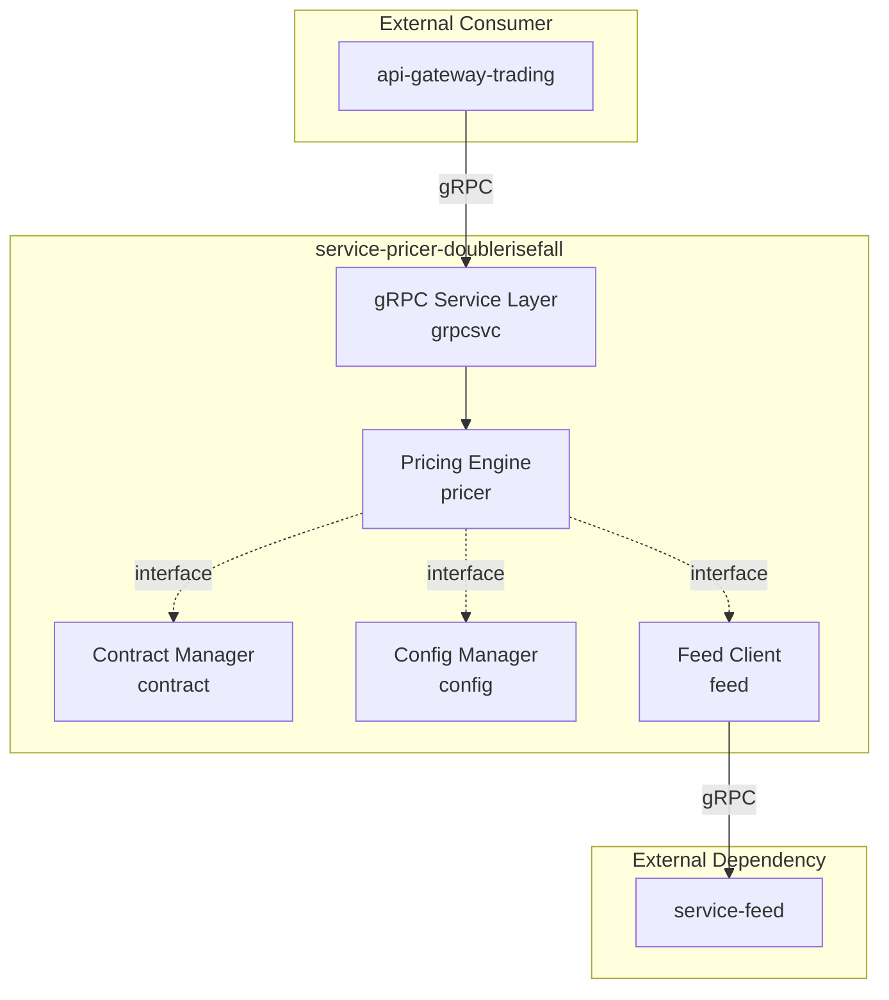
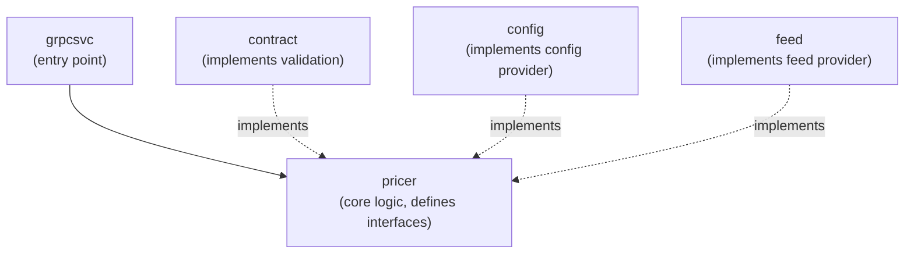
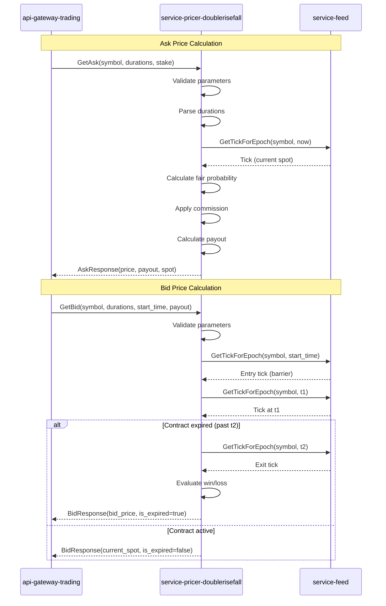

# Service Architecture: Double Rise/Fall Pricing Service

> **Version**: 1.0.0
> **Status**: Draft
> **Created**: 2026-01-15
> **Mode**: New

---

## Executive Summary

This document defines the service architecture for the **Double Rise/Fall Pricing Service** (`service-pricer-doublerisefall`), an internal gRPC service that calculates contract prices for Double Rise/Fall binary options. The service implements a closed-form analytical pricing model using bivariate normal distribution to determine fair probabilities for path-dependent contracts.

### Key Architectural Decisions

| Decision | Rationale |
|----------|-----------|
| **Single Service Architecture** | Product scope is focused on one derivative product type with clear boundaries |
| **gRPC-Only Protocol** | Internal service consumed only by `api-gateway-trading`, no REST required |
| **Light Modular Organization** | Complexity score 6/10 warrants organized components without over-engineering |
| **Interface-at-Consumer Pattern** | Interfaces defined where consumed (in `pricer` package) per service template guide |

### Service Boundaries

The service operates within clear boundaries:
- **Owns**: Pricing logic, contract validation, duration parsing, configuration management
- **Depends On**: Market data from `service-feed`
- **Consumed By**: `api-gateway-trading`

---

## Service Architecture Overview

### High-Level Architecture



### Component Dependency Direction

Per the service template guide, dependencies flow toward the core pricing logic:



### Technology Stack

| Layer | Technology | Justification |
|-------|------------|---------------|
| **Protocol** | gRPC/Protocol Buffers | High-performance binary protocol for internal services |
| **Language** | Go 1.21+ | Team standard, excellent concurrency support |
| **Configuration** | YAML + Viper | Flexible configuration with hot-reload capability |
| **Logging** | slog | Go standard library structured logging |
| **Build** | buf | Modern protobuf toolchain |

---

## Service Definition

### Service ID
`SVC-DRF-P1C`

### Service Name
`doublerisefall` (used in paths: `service-pricer-doublerisefall`)

### Purpose
Calculate ask (purchase) and bid (valuation) prices for Double Rise/Fall binary options contracts. The service evaluates path-dependent contracts that require spot price to breach barrier at two distinct evaluation times (t1 and t2) for a winning outcome.

### Domain Alignment
**Single Bounded Context**: Derivatives Pricing Domain
- Contract specification and validation
- Fair probability calculation  
- Commission and payout computation
- Contract lifecycle evaluation

### Business Capabilities

| Capability | Description |
|------------|-------------|
| **Ask Price Calculation** | Compute contract purchase price (stake to payout ratio) |
| **Bid Price Calculation** | Determine current value of active contracts |
| **Real-time Price Streaming** | Provide continuous price updates via gRPC streams |
| **Duration Validation** | Support both time-based (s/m/h/d) and tick-based (t) durations |
| **Symbol Configuration** | Manage per-symbol commission rates and limits |

### Data Domains

| Entity | Ownership | Description |
|--------|-----------|-------------|
| **Contract** | Owned | Request/response domain object representing pricing request |
| **Duration** | Owned | Parsed duration with unit discriminator |
| **SymbolConfig** | Owned | Per-symbol configuration (commission, limits) |
| **Tick** | Referenced | Market data from `service-feed`, wrapped locally |

### Public API

This service has **no public API**. It is an internal service consumed only by other backend services.

### Internal API (gRPC)

Defined in [`proto/doublerisefall/v1/doublerisefall.proto`](workspace/code/service-pricer-doublerisefall/api/proto/doublerisefall/v1/doublerisefall.proto):

| RPC Method | Type | Request | Response | Purpose |
|------------|------|---------|----------|---------|
| `GetAsk` | Unary | `GetAskRequest` | `GetAskResponse` | Single contract price calculation |
| `StreamAsk` | Server Stream | `StreamAskRequest` | `stream GetAskResponse` | Real-time price updates |
| `GetBid` | Unary | `GetBidRequest` | `GetBidResponse` | Active contract valuation |
| `StreamBid` | Server Stream | `StreamBidRequest` | `stream GetBidResponse` | Real-time contract valuation |

#### Message Definitions

**Request Messages**:
```protobuf
message OptionParameters {
  string symbol = 1;                    // e.g., "R_100"
  ContractType contract_type = 2;       // RISE or FALL
  string currency = 3;                  // e.g., "USD"
  string first_duration = 4;            // e.g., "1m", "30s", "5t"
  string second_duration = 5;           // e.g., "2m", "60s", "10t"
  optional int64 start_time = 6;        // Required for Bid
  string stake = 7;                     // Premium amount
  optional string payout = 8;           // Required for Bid (from Ask)
}

message GetAskRequest {
  OptionParameters option_parameters = 1;
  optional int64 pricing_time = 2;
}
```

**Response Messages**:
```protobuf
message GetAskResponse {
  string ask_price = 1;      // Contract price
  string currency = 2;
  string current_spot = 3;
  int64 current_spot_time = 4;
  string payout = 5;         // Potential payout
  Limits limits = 6;
}

message GetBidResponse {
  string bid_price = 1;      // Current value (0, payout, or error)
  bool is_expired = 2;
  string current_spot = 3;
  int64 current_spot_time = 4;
  string entry_spot = 5;     // Barrier
  int64 entry_spot_time = 6;
  string exit_spot = 7;
  int64 exit_spot_time = 8;
  string barrier = 9;
  int64 start_time = 10;
  int64 expiry_time = 11;
  string currency = 12;
  int64 evaluation_time = 13; // t1
}
```

### Dependencies

| Dependency | Type | Protocol | Purpose | Criticality |
|------------|------|----------|---------|-------------|
| `service-feed` | External Service | gRPC | Market data (spot prices, ticks) | **Critical** |

### Requirements from service-feed

Based on [`workspace/dependency/service-feed.md`](workspace/dependency/service-feed.md), the following capabilities are required:

| Method | Signature | Use Case |
|--------|-----------|----------|
| [`GetTickForEpoch`](workspace/code/service-feed/client/client.go:80) | `(ctx, symbol, epoch) (*Tick, bool, error)` | Entry tick, spot at t1/t2 |
| [`GetTicksFromLimit`](workspace/code/service-feed/client/client.go:98) | `(ctx, symbol, start, limit) ([]*Tick, bool, error)` | Tick-based contracts |
| [`Subscribe`](workspace/code/service-feed/client/client.go:146) | `(ctx, symbol, start) *Subscription` | StreamAsk, StreamBid |

**Integration Pattern**: Create thin wrapper around `service-feed/client` with interface defined in `pricer` package.

### Key Responsibilities

1. **Duration Parsing**: Parse duration strings ("1m", "30s", "5t") into structured Duration objects with unit discriminator
2. **Validation**: Validate all contract parameters against configuration rules
3. **Fair Probability Calculation**: Implement bivariate normal formula: `P_fair = 0.25 + arcsin(√(t1/t2)) / (2π)`
4. **Commission Application**: Add commission to fair probability for ask price
5. **Payout Calculation**: `Payout = Stake / P_client` where `P_client = P_fair + commission`
6. **Contract Evaluation**: For Bid, evaluate win/loss conditions at t1 and t2
7. **Stream Management**: Handle real-time tick subscriptions with proper lifecycle

### User Stories Coverage

| Story ID | Description | Implementation |
|----------|-------------|----------------|
| US-001 | As a trading gateway, I need to get contract prices for client display | `GetAsk` RPC |
| US-002 | As a trading gateway, I need real-time price updates for live pricing | `StreamAsk` RPC |
| US-003 | As a trading gateway, I need to value active contracts | `GetBid` RPC |
| US-004 | As a trading gateway, I need real-time contract value updates | `StreamBid` RPC |
| US-005 | As a trading gateway, I need validation errors with clear codes | gRPC status codes |

### Constraints

| Constraint | Requirement |
|------------|-------------|
| **Latency** | < 10ms for unary calls under normal load |
| **Streaming** | Update frequency: on tick OR every 5s (time-based), on tick only (tick-based) |
| **Precision** | 4 decimal places for unit price, 2 for payout |
| **Supported Symbols** | R_10, R_25, R_50, R_75, R_100 |
| **Duration Limits** | Time: 10s-1day, Tick: 2-10 ticks |
| **Duration Gap** | Minimum 10s (time) or 2 ticks (tick) between t1 and t2 |

### Internal Structure

The service follows **light modular organization** (complexity score 6) with these components:

```
service-pricer-doublerisefall/
├── cmd/doublerisefall/
│   └── main.go              # Application entry point
├── config/
│   └── symbols.yml          # Symbol configuration
├── internal/
│   ├── app/
│   │   └── app.go           # Application initialization, DI wiring
│   ├── config/
│   │   ├── config.go        # SymbolConfig, Manager
│   │   └── config_test.go
│   ├── contract/
│   │   ├── contract.go      # Duration, Contract, Validation
│   │   └── contract_test.go
│   ├── feed/
│   │   ├── client.go        # Wrapper for service-feed client
│   │   └── client_test.go
│   ├── grpcsvc/
│   │   ├── grpcsvc.go       # gRPC handlers (thin layer)
│   │   └── grpcsvc_test.go
│   └── pricer/
│       ├── pricer.go        # Core pricing logic, interfaces
│       └── pricer_test.go
└── proto/doublerisefall/v1/
    └── doublerisefall.proto # Service API definition
```

#### Component Responsibilities

| Package | Responsibility | Interfaces Defined | Implements |
|---------|---------------|-------------------|------------|
| `grpcsvc` | gRPC handlers, request/response mapping | None | Proto service |
| `pricer` | Pricing calculation, fair probability, commission | `ConfigProvider`, `FeedProvider`, `ContractValidator` | Core domain |
| `contract` | Duration parsing, validation rules | None | `ContractValidator` |
| `config` | Symbol configuration loading, hot-reload | None | `ConfigProvider` |
| `feed` | Market data client wrapper | None | `FeedProvider` |
| `app` | Application bootstrap, dependency injection | None | None |

### Orchestration Requirements

| Aspect | Value |
|--------|-------|
| **Startup Dependencies** | `service-feed` must be reachable |
| **Health Check** | gRPC health check protocol + `/health` HTTP endpoint |
| **Port** | 50051 (gRPC), 8081 (HTTP health/metrics) |
| **Environment Variables** | `FEED_SERVICE_ADDR`, `CONFIG_PATH`, `LOG_LEVEL` |
| **Database** | None required |

---

## Data Strategy

### Data Ownership

| Entity | Owner | Storage | Access Pattern |
|--------|-------|---------|----------------|
| **SymbolConfig** | This service | YAML file | Read at startup, hot-reload |
| **Contract** | This service | In-memory (request scope) | Request/response only |
| **Market Data** | `service-feed` | External | Read via gRPC |

### Data Flow



### Consistency Model

| Scenario | Approach |
|----------|----------|
| **Configuration Updates** | Hot-reload with graceful transition, no downtime |
| **Market Data** | Always fetch fresh data from `service-feed` |
| **Payout Consistency** | Payout fixed at purchase time, Bid must receive original payout |

### Error Handling Strategy

| Error Type | gRPC Status | Client Action |
|------------|-------------|---------------|
| Invalid symbol | `INVALID_ARGUMENT` | Check symbol list |
| Invalid duration | `INVALID_ARGUMENT` | Fix duration parameters |
| Market data unavailable | `UNAVAILABLE` | Retry with backoff |
| Missing tick data | `FAILED_PRECONDITION` | Wait for market data |
| Internal error | `INTERNAL` | Contact support |

---

## Inter-Service Communication Matrix

| Consumer | Provider | Capability | Pattern | Purpose | Priority |
|----------|----------|------------|---------|---------|----------|
| `service-pricer-doublerisefall` | `service-feed` | `GetTickForEpoch(symbol, epoch)` | Sync gRPC | Current spot, entry tick, evaluation ticks | **Critical** |
| `service-pricer-doublerisefall` | `service-feed` | `GetTicksFromLimit(symbol, start, limit)` | Sync gRPC | Tick-based contract evaluation | **Critical** |
| `service-pricer-doublerisefall` | `service-feed` | `Subscribe(symbol, start)` | Stream gRPC | Real-time tick updates for streaming | **Critical** |
| `api-gateway-trading` | `service-pricer-doublerisefall` | `GetAsk`, `GetBid`, `StreamAsk`, `StreamBid` | gRPC | Contract pricing | **Critical** |

---

## Requirements Coverage Matrix

| Requirement | Section | Service | Component | Notes |
|-------------|---------|---------|-----------|-------|
| Double Rise/Fall pricing model | Product Brief §4 | doublerisefall | `pricer` | Bivariate normal formula |
| RISE/FALL contract types | Product Brief §2.3 | doublerisefall | `contract` | Enum in proto |
| Win/Loss evaluation at t1 and t2 | Product Brief §2.3 | doublerisefall | `pricer` | Path-dependent logic |
| Time-based durations (s/m/h/d) | Product Brief §3.3 | doublerisefall | `contract` | Duration parsing |
| Tick-based durations (t) | Product Brief §3.3 | doublerisefall | `contract` | Duration parsing |
| Duration gap validation (10s/2t) | Product Brief §3.3 | doublerisefall | `contract` | Validation rules |
| Symbol configuration | Product Brief §3.1 | doublerisefall | `config` | YAML loading |
| Commission application | Product Brief §4.1 | doublerisefall | `pricer` | Additive model |
| Max payout limit (1000 USD) | Product Brief §3.2 | doublerisefall | `config` | Per-symbol config |
| Min stake limit (1 USD) | Product Brief §3.2 | doublerisefall | `config` | Per-symbol config |
| GetAsk RPC | Product Brief §6.1 | doublerisefall | `grpcsvc` | Unary call |
| StreamAsk RPC | Product Brief §6.1 | doublerisefall | `grpcsvc` | Server streaming |
| GetBid RPC | Product Brief §6.1 | doublerisefall | `grpcsvc` | Unary call |
| StreamBid RPC | Product Brief §6.1 | doublerisefall | `grpcsvc` | Server streaming |
| Error codes | Product Brief §7.2 | doublerisefall | `grpcsvc` | gRPC status codes |
| Market data integration | Product Brief §5 | doublerisefall | `feed` | Wrapper pattern |
| Real-time streaming (on tick/5s) | Product Brief §6.4 | doublerisefall | `grpcsvc` | Stream frequency |
| Payout precision (2 decimals) | Product Brief §4.1 | doublerisefall | `pricer` | Rounding policy |
| Price precision (4 decimals) | Product Brief §4.1 | doublerisefall | `pricer` | Rounding policy |

---

## User Story Coverage Matrix

| Story ID | Summary | Primary Service | Supporting Services | API |
|----------|---------|-----------------|---------------------|-----|
| US-001 | Get contract purchase price | doublerisefall | service-feed | `GetAsk` |
| US-002 | Stream real-time prices | doublerisefall | service-feed | `StreamAsk` |
| US-003 | Value active contract | doublerisefall | service-feed | `GetBid` |
| US-004 | Stream contract valuation | doublerisefall | service-feed | `StreamBid` |
| US-005 | Receive validation errors | doublerisefall | - | gRPC status |

---

## Development Order Recommendation

Since this is a single-service architecture, the development order focuses on internal components:

### Phase 1: Foundation (Day 1-2)
1. **Generate service scaffold** using `go-templates`
2. **Implement `config` package** - YAML loading, symbol configuration
3. **Implement `contract` package** - Duration parsing, validation rules

### Phase 2: Core Logic (Day 3-5)
4. **Implement `pricer` package** - Define interfaces, fair probability calculation
5. **Implement `feed` package** - Wrapper around `service-feed/client`

### Phase 3: Integration (Day 6-7)
6. **Implement `grpcsvc` package** - Wire up gRPC handlers
7. **Implement `app` package** - Dependency injection, startup

### Phase 4: Streaming (Day 8-9)
8. **Add streaming support** - `StreamAsk` and `StreamBid` with tick subscriptions
9. **Integration testing** - End-to-end tests with mock feed service

### Phase 5: Production Readiness (Day 10)
10. **Health checks**, graceful shutdown, configuration hot-reload

---

## Appendix

### A. Pricing Formula Reference

**Correlation**:
$$\rho = \sqrt{\frac{t1}{t2}}$$

**Fair Probability**:
$$P_{fair} = \frac{1}{4} + \frac{\arcsin(\rho)}{2\pi}$$

**Client Price (Ask)**:
$$P_{client} = P_{fair} + \text{commission}$$

**Payout**:
$$\text{Payout} = \frac{\text{Stake}}{P_{client}}$$

### B. Contract Lifecycle States

| State | Description | Bid Price |
|-------|-------------|-----------|
| **Active (pre-t1)** | Not yet reached first evaluation | Current spot info only |
| **Active (post-t1, pre-t2)** | Passed first evaluation | Depends on t1 result |
| **Expired (won)** | Both t1 and t2 conditions met | Original payout |
| **Expired (lost)** | Either t1 or t2 condition failed | 0 |

### C. Error Codes Quick Reference

| Error | gRPC Status | Code |
|-------|-------------|------|
| Invalid symbol | `INVALID_ARGUMENT` | `INVALID_SYMBOL` |
| Invalid duration | `INVALID_ARGUMENT` | `INVALID_DURATION` |
| Duration order invalid | `INVALID_ARGUMENT` | `DURATION_ORDER_INVALID` |
| Duration gap invalid | `INVALID_ARGUMENT` | `DURATION_GAP_INVALID` |
| Stake below minimum | `INVALID_ARGUMENT` | `INVALID_STAKE` |
| Payout exceeds maximum | `INVALID_ARGUMENT` | `PAYOUT_EXCEEDED` |
| Missing entry tick | `FAILED_PRECONDITION` | `MISSING_ENTRY_TICK` |
| Symbol disabled | `FAILED_PRECONDITION` | `SYMBOL_DISABLED` |
| Market data error | `UNAVAILABLE` | `MARKET_DATA_ERROR` |
| Internal error | `INTERNAL` | `INTERNAL_ERROR` |

---

> **Document Version**: 1.0.0
> **Last Updated**: 2026-01-15
