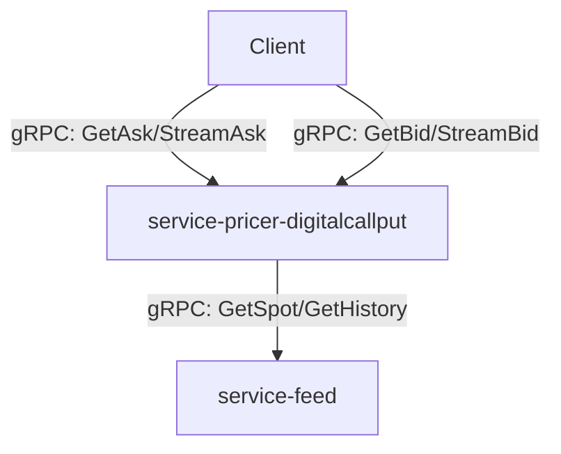

# Service Architecture: Digital Call/Put Options Pricer

## 1. Executive Summary
The architecture defines a single, stateless microservice `service-pricer-digitalcallput` responsible for pricing Digital Call/Put options. It follows a clean, modular internal structure appropriate for its complexity (Score: 6). The service relies on `service-feed` for real-time and historical market data and exposes a gRPC interface for Ask (pricing) and Bid (valuation) requests. It is designed to be highly performant and scalable, handling high-frequency streaming updates without maintaining internal state.

## 2. Service Architecture Overview

### 2.1 Architecture Diagram

### 2.2 Architectural Principles
- **Statelessness**: The service does not store contract state. All context is derived from the request or external feeds.
- **Synchronous Communication**: gRPC is used for all interactions to ensure low latency and strong typing.
- **Defensive Design**: The service is robust against missing feed data or invalid inputs.

### 2.3 Technology Stack
- **Language**: Golang
- **Protocol**: gRPC (Protobuf)
- **Dependencies**: `service-feed` (Market Data), `go-templates` (Project Structure)

## 3. Service Definitions

### 3.1 Service: Digital Call/Put Pricer
- **Service ID**: SVC-DP-X9L
- **Service Name**: `digitalcallput`
- **Purpose**: Calculate prices and valuations for Digital Call/Put options.
- **Domain Alignment**: Pricing Domain
- **Business Capabilities**:
  - Calculate Ask Price (Premium)
  - Calculate Bid Price (Sell Value)
  - Stream Price Updates
  - Validate Contract Parameters
- **Data Domains**: None (Stateless)
- **Public API**:
  - `GetAsk`: Single quote for new contract.
  - `StreamAsk`: Streaming quotes for new contract.
  - `GetBid`: Single value for active contract.
  - `StreamBid`: Streaming value for active contract.
- **Internal API**: None
- **Dependencies**:
  - `service-feed`: Real-time and historical spot prices.
- **Key Responsibilities**:
  - Fetch spot prices from feed.
  - Apply Black-Scholes pricing model.
  - Validate limits (stake, payout).
  - Manage streaming lifecycle (heartbeats, expiry).
- **User Stories Coverage**: All stories in PRD.
- **Constraints**:
  - Latency < 10ms for calculation.
  - No database access.
- **Internal Structure**:
  - **API Layer**: gRPC handlers (`internal/grpcsvc`).
  - **Business Logic**: Pricing engine and validation (`internal/pricer`).
  - **Integration**: Feed client wrapper (`internal/feed`).
  - **Model**: Domain structs and constants (`internal/model`).
- **Orchestration Requirements**:
  - **Startup Dependencies**: `service-feed` must be reachable.
  - **Health Check**: Standard gRPC health check.
  - **Environment Variables**: `FEED_SERVICE_ADDR`, `LOG_LEVEL`.
  - **Port Allocation**: Default gRPC port (e.g., 9090).

## 4. Data Strategy
- **Ownership**: The service is stateless and owns no data.
- **Consistency**:
  - **Real-time**: Uses latest available spot from `service-feed`.
  - **Historical**: Uses `service-feed` to reconstruct `Entry Spot` based on `start_time`.
- **Caching**: Short-lived in-memory caching for feed data may be used if necessary for performance, but is not strictly required for V1.

## 5. Inter-Service Communication Matrix

| Consumer Service | Provider Service | Required Capabilities | Communication Pattern | Purpose | Priority |
|------------------|------------------|-----------------------|-----------------------|---------|----------|
| digitalcallput | service-feed | GetLastSpot(symbol) | Sync gRPC | Get current price for Ask/Bid | Critical |
| digitalcallput | service-feed | GetHistory(symbol, time) | Sync gRPC | Get Entry Spot for Bid | Critical |

## 6. Requirements Coverage Matrix

| PRD Section | Requirement | Primary Service | Implementation Notes |
|-------------|-------------|-----------------|----------------------|
| 3.1 | Pricing Logic (Ask) | digitalcallput | Implemented in `internal/pricer` |
| 3.2 | Valuation Logic (Bid) | digitalcallput | Implemented in `internal/pricer` |
| 3.3 | Lifecycle Management | digitalcallput | Handled in `Stream` handlers |
| 4.1 | Performance (<10ms) | digitalcallput | Optimized Go code, no DB |
| 4.2 | Statelessness | digitalcallput | Design principle |
| 6.1 | gRPC Interface | digitalcallput | Defined in `api/digitalcallput` |

## 7. User Story Coverage Matrix

| Story ID | User Story Summary | Primary Service | API Exposure |
|----------|--------------------|-----------------|--------------|
| US-1 | Get Ask Price | digitalcallput | `GetAsk` |
| US-2 | Stream Ask Price | digitalcallput | `StreamAsk` |
| US-3 | Get Bid Price | digitalcallput | `GetBid` |
| US-4 | Stream Bid Price | digitalcallput | `StreamBid` |
| US-5 | Validate Limits | digitalcallput | Internal Logic |
