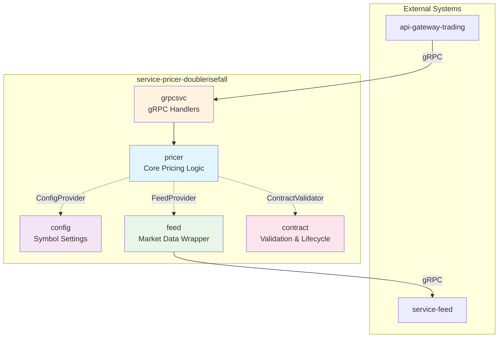
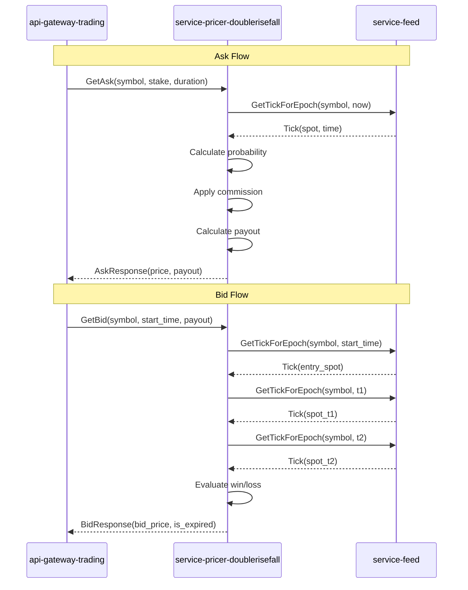

# Service Architecture: service-pricer-doublerisefall

> **Version**: 1.1.0
> **Created**: 2026-01-15
> **Status**: DRAFT - Second Iteration

---

## Executive Summary

This document defines the service architecture for `service-pricer-doublerisefall`, a specialized pricing engine for the Double Rise/Fall digital binary option product. The service implements a path-dependent contract pricing model that evaluates spot prices against a barrier at two distinct timestamps (t1 and t2).

The architecture follows a single-service design pattern optimized for focused pricing calculations, with clear internal module boundaries following the service template guide conventions. The service depends solely on `service-feed` for market data and uses local YAML configuration for symbol-specific settings.

**Key Architectural Decisions**:
- Single service with modular internal structure
- gRPC as primary communication protocol
- Dependency direction: grpcsvc → pricer → (config, feed, contract)
- Interfaces defined where consumed (in pricer package)
- Stateless design with configuration loaded at startup

---

## Service Architecture Overview

### High-Level View



### Architectural Principles

| Principle | Application |
|-----------|-------------|
| **Single Responsibility** | One service per product type (Double Rise/Fall) |
| **Dependency Inversion** | Pricer defines interfaces, other packages implement |
| **Interface Segregation** | Minimal interfaces (ConfigProvider, FeedProvider) |
| **Stateless Design** | All state passed via request, config loaded at startup |
| **Clean Boundaries** | gRPC handlers delegate to business logic, no data assembly |

### Technology Stack

| Component | Technology | Rationale |
|-----------|------------|-----------|
| **Language** | Go 1.21+ | Performance, gRPC support, type safety |
| **API Protocol** | gRPC + Protocol Buffers | Type-safe contracts, streaming support |
| **Configuration** | YAML + Viper | Human-readable, hot-reload capable |
| **Logging** | slog (structured) | Standard library, structured output |
| **Build** | Makefile + buf | Reproducible builds, proto generation |

---

## Service Definitions

### Service: doublerisefall

| Field | Value |
|-------|-------|
| **Service ID** | SVC-DRF-P7K |
| **Service Name** | `doublerisefall` |
| **Repository** | `github.com/regentmarkets/service-pricer-doublerisefall` |
| **Package** | `doublerisefall.v1` |

#### Purpose

The Double Rise/Fall pricing service calculates contract prices (Ask) and evaluates contract values (Bid) for path-dependent binary options. It implements a closed-form analytical pricing model using bivariate normal distribution with arcsin correlation, providing real-time and streaming price updates to the trading gateway.

#### Domain Alignment

| Bounded Context | Coverage |
|-----------------|----------|
| **Contract Pricing** | Full - Ask price calculation, payout computation |
| **Contract Valuation** | Full - Bid price evaluation, win/loss determination |
| **Market Data** | Partial - Consumes via service-feed, no ownership |

#### Business Capabilities

| Capability | Description |
|------------|-------------|
| **BC-001** | Calculate contract ask price (payout) based on stake and fair probability |
| **BC-002** | Apply commission to fair probability for client pricing |
| **BC-003** | Evaluate contract bid price based on win/loss conditions at t1 and t2 |
| **BC-004** | Stream real-time ask prices on tick updates |
| **BC-005** | Stream real-time bid prices for active contracts |
| **BC-006** | Validate contract parameters (symbol, duration, stake) |
| **BC-007** | Enforce trading limits (max payout, min stake) |

#### Data Domains

| Entity | Ownership | Description |
|--------|-----------|-------------|
| **Symbol Configuration** | Owned | Commission rates, payout limits, stake limits per symbol |
| **Contract Parameters** | Transient | Request-scoped contract specifications |
| **Tick Data** | External | Consumed from service-feed, not persisted |

#### Public API

The service exposes a gRPC API to `api-gateway-trading`:

```protobuf
service DoubleRiseFallService {
  // Request a single contract price (Ask)
  rpc GetAsk (GetAskRequest) returns (GetAskResponse);
  
  // Stream contract prices (Ask Stream)
  rpc StreamAsk (StreamAskRequest) returns (stream GetAskResponse);
  
  // Request value of an active contract (Bid)
  rpc GetBid (GetBidRequest) returns (GetBidResponse);
  
  // Stream value of an active contract
  rpc StreamBid (StreamBidRequest) returns (stream GetBidResponse);
}
```

| Operation | Input | Output | Description |
|-----------|-------|--------|-------------|
| **GetAsk** | OptionParameters + pricing_time | ask_price, payout, limits | Single ask price calculation |
| **StreamAsk** | OptionParameters + pricing_time | Stream of ask prices | Real-time ask updates |
| **GetBid** | OptionParameters (with payout) + pricing_time | bid_price, is_expired, spots | Single bid evaluation |
| **StreamBid** | OptionParameters (with payout) + pricing_time | Stream of bid prices | Real-time bid updates |

#### Internal API

Not applicable - this service does not provide APIs to other internal services. It is a leaf service consumed only by the trading gateway.

#### Dependencies

| Service | Purpose | Protocol | Criticality | Notes |
|---------|---------|----------|-------------|-------|
| **service-feed** | Market data (spot prices, tick history) | gRPC | Critical | Compatible with client v1.x |

> **⚠️ MANDATORY**: Import and use `github.com/regentmarkets/service-feed/client` - do NOT implement direct gRPC calls. See [`service-feed.md`](../../dependency/service-feed.md).

#### Key Responsibilities

| ID | Responsibility | Component |
|----|----------------|-----------|
| **R-001** | Parse and validate duration strings (s, m, h, d, t) | contract |
| **R-002** | Validate duration constraints (t2 > t1, gap ≥ 10s or ≥ 2t) | contract |
| **R-003** | Validate stake against symbol limits | contract |
| **R-004** | Calculate fair probability using arcsin formula | pricer |
| **R-005** | Apply commission to derive client price | pricer |
| **R-006** | Calculate payout from stake and unit price | pricer |
| **R-007** | Fetch current spot price for Ask | feed |
| **R-008** | Fetch entry tick (barrier) for Bid | feed |
| **R-009** | Fetch evaluation ticks at t1 and t2 | feed |
| **R-010** | Evaluate RISE win condition (spot > barrier at t1 AND t2) | pricer |
| **R-011** | Evaluate FALL win condition (spot < barrier at t1 AND t2) | pricer |
| **R-012** | Return payout (win) or 0 (loss) as bid price | pricer |
| **R-013** | Stream ask prices on tick updates | grpcsvc |
| **R-014** | Stream bid prices on tick updates (time-based: also every 5s) | grpcsvc |
| **R-015** | Load and validate symbol configuration | config |
| **R-016** | Return gRPC standard error codes | grpcsvc |

#### User Stories Coverage

| Story ID | Summary | Addressed By |
|----------|---------|--------------|
| **US-001** | Trader requests contract price for display | GetAsk |
| **US-002** | Trader streams live prices during trade setup | StreamAsk |
| **US-003** | Trader purchases contract (uses Ask response) | GetAsk → external purchase |
| **US-004** | System evaluates contract at expiry | GetBid |
| **US-005** | Trader views live contract value | StreamBid |
| **US-006** | System validates trade parameters | GetAsk validation |
| **US-007** | Trader sees potential payout before purchase | GetAsk response.payout |
| **US-008** | System enforces trading limits | GetAsk validation |

#### Constraints

| Type | Constraint | Rationale |
|------|------------|-----------|
| **Performance** | GetAsk < 50ms p99 latency | Real-time trading requirement |
| **Performance** | StreamAsk update < 100ms from tick | Competitive pricing |
| **Availability** | 99.9% uptime | Trading hours critical |
| **Consistency** | Payout fixed at purchase time | Contract integrity |
| **Scalability** | Support 1000 concurrent streams | Peak trading load |

#### Requirements from Other Services

| Service | Required Capability | Purpose |
|---------|---------------------|---------|
| **service-feed** | `GetTickForEpoch(symbol, epoch)` | Entry tick, spot at t1/t2 |
| **service-feed** | `GetTicksFromLimit(symbol, start, limit)` | Tick-based contract evaluation |
| **service-feed** | `Subscribe(symbol, start)` | Real-time tick streaming |

#### Internal Structure

The service follows the standard service template guide with light modular organization (Score 5 complexity):

```
service-pricer-doublerisefall/
├── api/                           # Generated gRPC code (do not edit)
│   └── doublerisefall/
│       ├── doublerisefall.pb.go
│       ├── doublerisefall_grpc.pb.go
│       └── doublerisefall.pb.gw.go
├── cmd/
│   └── doublerisefall/
│       └── main.go                # Application entry point
├── config/
│   └── symbols.yaml               # Symbol-specific configuration
├── internal/
│   ├── app/
│   │   ├── app.go                 # Application initialization
│   │   └── app_test.go
│   ├── grpcsvc/
│   │   ├── grpcsvc.go             # gRPC handlers (entry point)
│   │   └── grpcsvc_test.go
│   ├── pricer/
│   │   ├── pricer.go              # Core pricing logic, defines interfaces
│   │   ├── pricer_test.go
│   │   ├── ask.go                 # Ask price calculation
│   │   └── bid.go                 # Bid price evaluation
│   ├── config/
│   │   ├── config.go              # Configuration loading
│   │   └── config_test.go
│   ├── contract/
│   │   ├── contract.go            # Contract validation
│   │   ├── contract_test.go
│   │   └── duration.go            # Duration parsing
│   ├── feed/
│   │   ├── client.go              # Wrapper for service-feed
│   │   └── client_test.go
│   └── tools/
│       └── tools.go               # Build tool dependencies
└── proto/
    └── doublerisefall/
        └── v1/
            └── doublerisefall.proto  # API definition
```

**Component Responsibilities**:

| Component | Package | Responsibility |
|-----------|---------|----------------|
| **gRPC Handlers** | `internal/grpcsvc` | Request handling, response formatting, streaming |
| **Pricer** | `internal/pricer` | Fair probability, commission, payout calculation, win/loss evaluation |
| **Config** | `internal/config` | YAML loading, symbol configuration access |
| **Contract** | `internal/contract` | Duration parsing, validation, lifecycle |
| **Feed** | `internal/feed` | service-feed client wrapper |

**Dependency Direction**:
```
grpcsvc → pricer → (config, feed, contract)
```

#### Orchestration Requirements

| Requirement | Value |
|-------------|-------|
| **Startup Dependencies** | service-feed must be running |
| **Health Check** | `/health` (gRPC health check protocol) |
| **Port Allocation** | 50051 (gRPC), 8080 (HTTP gateway) |
| **Database Requirements** | None - stateless service |
| **Environment Variables** | `FEED_SERVICE_ADDR`, `CONFIG_PATH`, `LOG_LEVEL` |

---

## Data Strategy

### Data Ownership

| Data Type | Owner | Strategy |
|-----------|-------|----------|
| **Symbol Configuration** | service-pricer-doublerisefall | Local YAML, loaded at startup |
| **Contract State** | api-gateway-trading | Not persisted in pricer |
| **Market Data** | service-feed | Fetched on-demand |

### Data Flow



### Consistency Model

| Aspect | Strategy |
|--------|----------|
| **Configuration** | Loaded at startup, hot-reload supported |
| **Market Data** | Real-time, no caching (feed handles this) |
| **Contract State** | Stateless - computed on each request |
| **Payout** | Immutable once returned in Ask response |

### Transaction Boundaries

The service is stateless and does not manage transactions. Each request is independent:
- **Ask**: Point-in-time calculation based on current spot
- **Bid**: Point-in-time evaluation based on historical ticks

---

## Inter-Service Communication Matrix

| Consumer Service | Provider Service | Required Capabilities | Communication Pattern | Purpose | Priority |
|------------------|------------------|----------------------|----------------------|---------|----------|
| doublerisefall | service-feed | GetTickForEpoch(symbol, epoch) | Sync gRPC | Current spot, entry tick, evaluation ticks | Critical |
| doublerisefall | service-feed | GetTicksFromLimit(symbol, start, limit) | Sync gRPC | Tick-based contract evaluation | Critical |
| doublerisefall | service-feed | Subscribe(symbol, start) | Stream gRPC | Real-time tick updates for streaming | Critical |
| api-gateway-trading | doublerisefall | GetAsk(params) | Sync gRPC | Contract price request | Critical |
| api-gateway-trading | doublerisefall | StreamAsk(params) | Stream gRPC | Live price updates | High |
| api-gateway-trading | doublerisefall | GetBid(params) | Sync gRPC | Contract value evaluation | Critical |
| api-gateway-trading | doublerisefall | StreamBid(params) | Stream gRPC | Live contract value | High |

---

## Requirements Coverage Matrix

| PRD Section/Requirement | Primary Service | Supporting Services | Implementation Notes |
|-------------------------|-----------------|---------------------|---------------------|
| **2.2 Product Definition** | doublerisefall | - | Core pricing logic in pricer package |
| **2.3 Win/Loss Conditions** | doublerisefall | service-feed | Evaluation in bid.go with ticks from feed |
| **3.1 Configuration Schema** | doublerisefall | - | config package loads symbols.yaml |
| **3.3 Duration Constraints** | doublerisefall | - | contract package validates durations |
| **4.1 Pricing Model** | doublerisefall | - | pricer implements arcsin formula |
| **4.2 Pricing Formulas** | doublerisefall | - | ask.go implements probability + commission |
| **4.4 Bid Pricing** | doublerisefall | service-feed | bid.go evaluates with ticks |
| **5.3 Data Requirements** | doublerisefall | service-feed | feed wrapper implements |
| **6.1 Service Definition** | doublerisefall | - | grpcsvc implements all 4 RPCs |
| **6.2 Request Messages** | doublerisefall | - | proto definitions |
| **6.3 Response Messages** | doublerisefall | - | proto definitions |
| **7.2 Error Codes** | doublerisefall | - | grpcsvc returns standard gRPC codes |
| **7.3 Validation Rules** | doublerisefall | - | contract package validates |

---

## User Story Coverage Matrix

| Story ID | User Story Summary | Primary Service | Supporting Services | API Exposure |
|----------|-------------------|-----------------|---------------------|--------------|
| US-001 | Request contract price | doublerisefall | service-feed | GetAsk |
| US-002 | Stream live prices | doublerisefall | service-feed | StreamAsk |
| US-003 | Purchase contract | doublerisefall | - | GetAsk (price) |
| US-004 | Evaluate at expiry | doublerisefall | service-feed | GetBid |
| US-005 | View live contract value | doublerisefall | service-feed | StreamBid |
| US-006 | Validate parameters | doublerisefall | - | GetAsk validation |
| US-007 | See potential payout | doublerisefall | - | GetAsk.payout |
| US-008 | Enforce trading limits | doublerisefall | - | GetAsk validation |

---

## Development Order Recommendation

### Phase 1: Foundation (Week 1)

1. **Generate service template**
   ```bash
   go-templates --template service --module-path github.com/regentmarkets/service-pricer-doublerisefall --module-name doublerisefall
   ```

2. **Implement config package**
   - YAML loading
   - SymbolConfig struct
   - Validation

3. **Implement feed package**
   - Wrapper around service-feed/client
   - FeedProvider interface implementation

### Phase 2: Core Logic (Week 1-2)

4. **Implement contract package**
   - Duration parsing (ParseDuration)
   - Duration validation
   - Contract validation (ValidateAskRequest, ValidateBidRequest)

5. **Implement pricer package**
   - Interface definitions (ConfigProvider, FeedProvider)
   - Fair probability calculation (arcsin formula)
   - CalculateAsk
   - CalculateBid

### Phase 3: API Layer (Week 2)

6. **Implement grpcsvc package**
   - GetAsk handler
   - GetBid handler
   - StreamAsk handler
   - StreamBid handler
   - Error mapping to gRPC codes

### Phase 4: Integration (Week 2)

7. **Integration testing**
   - End-to-end tests with mock feed
   - Performance benchmarks

8. **Deployment configuration**
   - Dockerfile
   - Kubernetes manifests
   - Health checks

---

## Appendix

### A. Interface Definitions (pricer package)

> **Note**: All types (`*Tick`, `*SymbolConfig`, `*Subscription`, `Duration`, etc.) are internal types defined in the pricer package. **DO NOT** expose proto types in interfaces.

```go
// Tick is an internal type representing market data (NOT proto type)
type Tick struct {
    Symbol string
    Time   int64   // Unix epoch seconds
    Quote  string  // Price as string (preserve precision)
}

// SymbolConfig contains symbol-specific configuration
type SymbolConfig struct {
    Symbol         string
    CommissionRate float64
    MaxPayout      float64
    MinStake       float64
    Enabled        bool
}

// ConfigProvider provides access to symbol configuration
type ConfigProvider interface {
    GetSymbolConfig(symbol string) (*SymbolConfig, error)
}

// FeedProvider provides access to market data
// Note: *Tick and *Subscription are internal types, NOT proto types
type FeedProvider interface {
    GetTickForEpoch(ctx context.Context, symbol string, epoch int64) (*Tick, bool, error)
    GetTicksFromLimit(ctx context.Context, symbol string, start int64, limit int64) ([]*Tick, bool, error)
    Subscribe(ctx context.Context, symbol string, start int64) *Subscription
    Close() error
}

// ContractValidator validates contract parameters
type ContractValidator interface {
    ValidateAskRequest(ctx context.Context, req *AskRequest) error
    ValidateBidRequest(ctx context.Context, req *BidRequest) error
    ParseDuration(s string) (Duration, error)
}
```

### B. Pricing Formula Reference

**Correlation**:
$$
\rho = \sqrt{\frac{t_1}{t_2}}
$$

**Fair Probability**:
$$
P_{fair} = \frac{1}{4} + \frac{\arcsin(\rho)}{2\pi}
$$

**Client Price (Unit)**:
$$
P_{client} = P_{fair} + \text{Commission}
$$

**Payout**:
$$
\text{Payout} = \frac{\text{Stake}}{P_{client}}
$$

### C. Error Code Mapping

| Domain Error | gRPC Status Code |
|--------------|------------------|
| INVALID_SYMBOL | INVALID_ARGUMENT |
| INVALID_DURATION | INVALID_ARGUMENT |
| INVALID_STAKE | INVALID_ARGUMENT |
| PAYOUT_EXCEEDED | INVALID_ARGUMENT |
| DURATION_ORDER_INVALID | INVALID_ARGUMENT |
| DURATION_GAP_INVALID | INVALID_ARGUMENT |
| MARKET_DATA_ERROR | UNAVAILABLE |
| PRICING_TIME_FUTURE | INVALID_ARGUMENT |
| MISSING_ENTRY_TICK | FAILED_PRECONDITION |
| SYMBOL_DISABLED | FAILED_PRECONDITION |
| INTERNAL_ERROR | INTERNAL |

---

## Quality Checklist Verification

| Check | Status | Notes |
|-------|--------|-------|
| All services have clear, meaningful names | ✅ | `doublerisefall` reflects domain |
| Service boundaries well-defined | ✅ | Single service, 5 internal packages |
| Data ownership documented | ✅ | Config owned, ticks external |
| API structure consistent | ✅ | Standard gRPC pattern |
| All PRD requirements mapped | ✅ | Full coverage matrix provided |
| All user stories covered | ✅ | 8 stories mapped to APIs |
| Inter-service dependencies documented | ✅ | service-feed dependency |
| Consumer-driven requirements captured | ✅ | Feed client requirements listed |
| Architecture diagram accurate | ✅ | Mermaid diagram included |
| Service internal structure aligned with complexity | ✅ | Score 5, light modular |
| Orchestration requirements documented | ✅ | Health, ports, env vars |

---

## Second Iteration Refinements

### API Details Verification

**Duration Handling**:
- Both time-based (s, m, h, d) and tick-based (t) durations supported
- Tick-based: StreamBid updates ONLY on tick (NO time-based fallback)
- Time-based: StreamBid updates on tick OR every 5 seconds

**Request Message Fields** (from PRD Section 6.2):

| Field | Type | Required (Ask) | Required (Bid) | Validation |
|-------|------|----------------|----------------|------------|
| symbol | string | ✅ | ✅ | Must be in R_10, R_25, R_50, R_75, R_100 |
| contract_type | enum | ✅ | ✅ | RISE or FALL |
| currency | string | ✅ | ✅ | Payout currency |
| first_duration | string | ✅ | ✅ | e.g., "1m", "30s", "5t" |
| second_duration | string | ✅ | ✅ | e.g., "2m", "60s", "10t" |
| start_time | int64 | ❌ | ✅ | Required for Bid |
| stake | string | ✅ | ✅ | Premium amount |
| payout | string | ❌ | ✅ | From Ask response |
| pricing_time | int64 | ❌ | ❌ | Optional for repricing |

**Configuration Values** (from PRD Section 3.1):

| Symbol | Commission | Max Payout | Min Stake |
|--------|------------|------------|-----------|
| R_10 | 0.05 (5%) | 1000 USD | 1 USD |
| R_25 | 0.05 (5%) | 1000 USD | 1 USD |
| R_50 | 0.05 (5%) | 1000 USD | 1 USD |
| R_75 | 0.05 (5%) | 1000 USD | 1 USD |
| R_100 | 0.05 (5%) | 1000 USD | 1 USD |

### Implementation Feasibility Assessment

| Component | Feasibility | Risk | Mitigation |
|-----------|-------------|------|------------|
| **pricer (arcsin formula)** | High | Low | Standard math library |
| **feed wrapper** | High | Low | Existing client provided |
| **duration parsing** | High | Low | Regex-based parsing |
| **gRPC streaming** | High | Medium | Standard pattern, test reconnection |
| **config hot-reload** | Medium | Low | Viper watch capability |

### Scalability Considerations

| Metric | Target | Strategy |
|--------|--------|----------|
| **Concurrent Streams** | 1000 | Goroutine-per-stream with context cancellation |
| **GetAsk Latency** | <50ms p99 | Pre-loaded config, efficient feed calls |
| **Memory** | <500MB | No tick caching, stream cleanup |
| **CPU** | Linear scaling | Stateless calculation, horizontal scaling |

---

## Changelog

| Version | Date | Changes |
|---------|------|---------|
| 1.0.0 | 2026-01-15 | Initial architecture document |
| 1.1.0 | 2026-01-15 | Second iteration: API details, validation, feasibility assessment |
| 1.1.1 | 2026-01-15 | Addressed verification recommendations: explicit client usage note, clarified internal types, added version compatibility |
