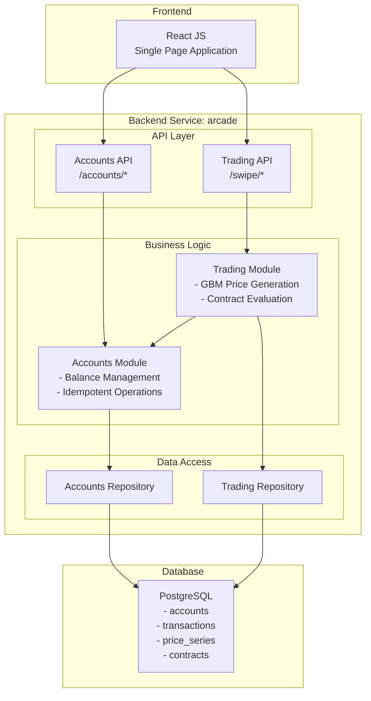

# Service Architecture: Deriv Arcade

## Document Information
| Field | Value |
|-------|-------|
| Version | 1.0 |
| Created | 2026-01-16 |
| Last Updated | 2026-01-16 |
| Status | Draft |
| PRD Reference | [workspace/output/requirements/prd.md](../requirements/prd.md) |
| Domain Model Reference | [workspace/output/domain/domain_model.md](../domain/domain_model.md) |
| User Stories Reference | [workspace/output/stories/stories.md](../stories/stories.md) |

---

## 1. Executive Summary

This document defines the service architecture for **Deriv Arcade**, an arcade-style binary options trading platform. The architecture follows a **modular monolith** approach with a single Golang backend service containing two internal modules that align with the domain boundaries:

- **Accounts Module**: Manages trader accounts, balances, and financial transactions (deposits, withdrawals, stakes, payouts)
- **Trading Module**: Handles price preview generation, contract execution, and trading history

### Key Architectural Decisions

1. **Single Service Architecture**: Given the complexity score of 4/10 and the critical requirement for atomic trade execution (which spans both domains), a modular monolith approach avoids distributed transaction complexity while maintaining clear internal boundaries.

2. **Light Modular Organization**: Per PRD complexity guidelines (score 4-7), the service uses logical separation of concerns without over-engineering—separate packages for API, business logic, and data access.

3. **Shared Database**: A single PostgreSQL database serves both modules, enabling atomic transactions for trade execution without distributed coordination.

4. **Direct Service APIs**: The Golang service exposes REST APIs directly to the React frontend; no API gateway is required for this single-service architecture.

This architecture supports all 25 user stories and 8 PRD feature requirements while maintaining simplicity and operational efficiency.

---

## 2. Service Architecture Overview

### 2.1 Architecture Diagram



### 2.2 Architectural Principles

| Principle | Description |
|-----------|-------------|
| **Modular Monolith** | Single deployable unit with clear internal module boundaries |
| **Domain-Aligned Modules** | Modules map directly to bounded contexts (Accounts, Trading) |
| **Atomic Transactions** | Trade execution spans modules within single database transaction |
| **Data Ownership** | Each module owns its data entities but shares the database |
| **API-First Design** | REST APIs with JSON, documented contracts for each endpoint |

### 2.3 Technology Stack

| Layer | Technology | Rationale |
|-------|------------|-----------|
| Frontend | React JS | Workspace preference, single-page application |
| Backend | Golang | Workspace preference, strong concurrency support |
| API | REST/JSON | Workspace preference, simplicity |
| Database | PostgreSQL | Workspace preference, JSONB support for OHLC data |
| Communication | Internal function calls | Single service, no network overhead |

---

## 3. Service Definitions

### 3.1 Service: arcade

| Attribute | Value |
|-----------|-------|
| **Service ID** | SVC-AR-K3M |
| **Service Name** | arcade |
| **Purpose** | The single backend service for Deriv Arcade that provides account management and binary options trading functionality. It exposes REST APIs for the React frontend and manages all business logic and data persistence. |
| **Domain Alignment** | DOM-AC-K3M (Accounts Domain), DOM-TR-L8K (Trading Domain) |

#### Business Capabilities

| Module | Capabilities |
|--------|--------------|
| Accounts | Account creation with SW-prefixed IDs, balance management, idempotent deposits, idempotent withdrawals, account retrieval |
| Trading | GBM price series generation, quote validation, rise/fall contract execution, contract outcome evaluation, payout calculation, trading history retrieval |

#### Data Domains

| Entity | Module | Description |
|--------|--------|-------------|
| Account | Accounts | Trader account with balance and currency |
| Transaction | Accounts | Financial movements (DEPOSIT, WITHDRAWAL, STAKE, PAYOUT) |
| PriceSeries | Trading | Temporary price preview data (deleted after use) |
| Contract | Trading | Completed trade records with full OHLC series |

#### Public API

| Endpoint | Method | Description | Module |
|----------|--------|-------------|--------|
| `/accounts` | POST | Create new trading account | Accounts |
| `/accounts/{account_id}` | GET | Get account details and balance | Accounts |
| `/accounts/{account_id}/deposits` | POST | Deposit funds (idempotent) | Accounts |
| `/accounts/{account_id}/withdrawals` | POST | Withdraw funds (idempotent) | Accounts |
| `/swipe` | GET | Get price preview (10 candles) | Trading |
| `/swipe/buy` | POST | Place rise/fall trade | Trading |
| `/swipe/list` | GET | List trading history | Trading |

#### Internal API (Inter-Module)

| Function | Provider | Consumer | Purpose |
|----------|----------|----------|---------|
| `GetAccountBalance(accountId)` | Accounts | Trading | Validate sufficient funds before trade |
| `DeductStake(accountId, amount, contractId)` | Accounts | Trading | Atomic stake deduction during trade |
| `CreditPayout(accountId, amount, contractId)` | Accounts | Trading | Atomic payout credit during trade |
| `GetAccount(accountId)` | Accounts | Trading | Validate account exists |

#### Dependencies

None (self-contained service)

#### Key Responsibilities

**Accounts Module**:
1. Generate sequential account IDs with SW prefix
2. Validate currency codes (3 uppercase letters)
3. Process deposits with idempotency key validation
4. Process withdrawals with balance and idempotency validation
5. Maintain transaction audit trail
6. Provide balance information for trading operations

**Trading Module**:
1. Generate 10-candle price preview using GBM algorithm
2. Persist price series temporarily for quote validation
3. Validate quote matches previous SwipeGet
4. Execute atomic trade transactions (stake deduction + payout credit)
5. Evaluate contract outcome (candle 20 vs candle 10)
6. Calculate payout (stake / 0.53 for wins, 0 for losses)
7. Store complete 20-candle series with each contract
8. Retrieve trading history with optional series type filter

#### User Stories Coverage

**Accounts Module** (12 stories):
- US-AC-K3M: Create account
- US-AC-M9J: Deposit funds
- US-AC-R3P: Withdraw funds
- US-AC-K6L: View account
- US-AC-D4Q: Idempotent deposits
- US-AC-W5N: Idempotent withdrawals
- US-AC-G9M: Insufficient balance error
- US-AC-F9L: Invalid amount error
- US-AC-R6K: Invalid currency error
- US-AC-N4F: Account not found error
- US-AC-X2L: Broker account creation
- US-AC-E8P: Flexible external_id

**Trading Module** (13 stories):
- US-TR-V4N: Price preview
- US-TR-M5L: Select series type
- US-TR-W8P: Buy rise contract
- US-TR-F7K: Buy fall contract
- US-TR-J8N: Watch candle animation
- US-TR-P7R: See payout result
- US-TR-Y5Q: View trading history
- US-TR-H3K: Filter history by series
- US-TR-Q4N: Quote validation
- US-TR-B6N: Stake exceeds balance error
- US-TR-R5M: Invalid stake error
- US-TR-H2M: Invalid series type error
- US-TR-S9K: Invalid sentiment error

#### Constraints

| Type | Constraint |
|------|------------|
| Performance | API response time < 200ms (p95) |
| Performance | Contract evaluation < 50ms |
| Performance | Price generation < 100ms for 10 candles |
| Reliability | 100% idempotency success for financial operations |
| Reliability | 100% data integrity for transactions |
| Security | No PII storage (no email, name, address) |
| Data | 2 decimal precision for monetary amounts |
| Data | Full 20-candle series stored per contract |

#### Requirements from Other Services

None (self-contained)

#### Internal Structure

The service will be organized into a few logical components appropriate for a complexity score of 4/10:

```
arcade/
├── cmd/
│   └── server/
│       └── main.go              # Application entry point
├── internal/
│   ├── api/
│   │   ├── router.go            # HTTP router setup
│   │   ├── accounts_handler.go  # Accounts API handlers
│   │   └── trading_handler.go   # Trading API handlers
│   ├── accounts/
│   │   ├── service.go           # Account business logic
│   │   └── repository.go        # Account data access
│   ├── trading/
│   │   ├── service.go           # Trading business logic
│   │   ├── repository.go        # Trading data access
│   │   └── gbm.go               # GBM price generator
│   └── common/
│       ├── errors.go            # Standard error definitions
│       └── decimal.go           # Decimal handling utilities
├── migrations/
│   └── *.sql                    # Database migrations
└── config/
    └── config.go                # Configuration management
```

**Component Descriptions**:
- **API Handler**: REST endpoint definitions, request/response validation, error formatting
- **Business Logic (Service)**: Core domain operations, validation rules, workflow coordination
- **Data Access (Repository)**: Database queries, transaction management, entity mapping
- **GBM Generator**: Geometric Brownian Motion price generation algorithm
- **Common**: Shared utilities for error handling and decimal precision

#### Orchestration Requirements

| Attribute | Value |
|-----------|-------|
| **Startup Dependencies** | PostgreSQL database |
| **Health Check** | `GET /health` returns `{"status": "healthy"}` |
| **Environment Variables** | `DATABASE_URL`, `PORT`, `LOG_LEVEL` |
| **Database Requirements** | PostgreSQL 14+, database `arcade`, migrations applied |
| **Port Allocation** | 8080 (default) |

---

## 4. Data Strategy

### 4.1 Data Ownership

| Entity | Owning Module | Access Pattern |
|--------|---------------|----------------|
| Account | Accounts | Read/Write by Accounts, Read by Trading |
| Transaction | Accounts | Write by Accounts, Read by Accounts |
| PriceSeries | Trading | Read/Write by Trading, deleted after use |
| Contract | Trading | Write by Trading, Read by Trading |

### 4.2 Consistency Patterns

#### Quote Validation Mechanism

The `previous_quote` parameter in SwipeBuy serves as an implicit identifier to match the correct PriceSeries:

1. **SwipeGet**: Generates 10 candles, stores in `price_series` with `quote_value` = 10th candle close
2. **SwipeBuy**: Receives `previous_quote` from client (10th candle close they saw)
3. **Matching**: System finds PriceSeries where `account_id` + `series_type` + `quote_value` matches the request
4. **Validation**: If no match found, return `INVALID_QUOTE` error
5. **Execution**: If match found, proceed with trade and delete the matched PriceSeries

This design handles multiple concurrent SwipeGet calls by using the quote value itself as a unique identifier within the context of account + series_type.

#### Atomic Trade Execution

The critical trade execution flow requires atomicity across modules:

```
BEGIN TRANSACTION
  1. [Trading] Find PriceSeries by account_id + series_type + quote_value
  2. [Trading] Validate PriceSeries exists (INVALID_QUOTE if not)
  3. [Accounts] Validate account balance >= stake (INSUFFICIENT_BALANCE if not)
  4. [Accounts] Deduct stake, create STAKE transaction
  5. [Trading] Generate candles 11-20 from quote_value
  6. [Trading] Evaluate outcome (candle 20 close vs candle 10 close)
  7. [Trading] Calculate payout (stake / 0.53 if win, 0 if loss)
  8. [Accounts] Credit payout, create PAYOUT transaction
  9. [Trading] Create Contract with full 20 candles (candles 1-10 from PriceSeries + 11-20 generated)
  10. [Trading] Delete matched PriceSeries
COMMIT TRANSACTION
```

This is implemented as a single database transaction ensuring all-or-nothing execution.

#### Idempotency Pattern

| Operation | Idempotency Key | Implementation |
|-----------|-----------------|----------------|
| Deposit | `deposit_id` | Check `transactions.idempotency_id` before insert |
| Withdrawal | `withdrawal_id` | Check `transactions.idempotency_id` before insert |
| Trade | N/A | Not idempotent (each SwipeBuy creates new contract) |

### 4.3 Transaction Boundaries

| Operation | Scope | Entities Modified |
|-----------|-------|-------------------|
| Create Account | Single | Account |
| Deposit | Single | Account, Transaction |
| Withdrawal | Single | Account, Transaction |
| SwipeGet | Single | PriceSeries |
| SwipeBuy | Atomic Multi-Entity | Account, Transaction (×2), Contract, PriceSeries (delete) |

### 4.4 Data Integrity Rules

1. **Balance Non-Negative**: Account balance must remain >= 0
2. **Transaction Immutability**: Transactions cannot be modified after creation
3. **Contract Immutability**: Contracts cannot be modified after creation
4. **Referential Integrity**: All foreign keys enforced by database
5. **PAYOUT Always Created**: Even for losses (amount = 0.00), a PAYOUT transaction is recorded

### 4.5 PriceSeries Cleanup Strategy

PriceSeries records are temporary and should be cleaned up in the following scenarios:

| Scenario | Cleanup Method |
|----------|---------------|
| **Normal flow** | Deleted atomically during SwipeBuy transaction |
| **Orphaned records** | Background job deletes PriceSeries older than 5 minutes |
| **Session timeout** | Client-side; user refreshes and gets new SwipeGet |

**Implementation**: A simple cron job or database trigger can delete `price_series` records where `created_at < NOW() - INTERVAL '5 minutes'`. This prevents database bloat from abandoned previews.

### 4.6 Frontend Integration Flow

```
┌─────────────────────────────────────────────────────────────────────────────┐
│                           FRONTEND TRADING FLOW                              │
├─────────────────────────────────────────────────────────────────────────────┤
│                                                                              │
│  [1] User selects series type → GET /swipe?series_type=Vol100               │
│                                                                              │
│  [2] Server generates 10 candles, stores PriceSeries, returns OHLC array    │
│                                                                              │
│  [3] Frontend renders candlestick chart (candles 1-10)                      │
│      Shows RISE/FALL buttons                                                │
│      User enters stake amount                                               │
│                                                                              │
│  [4] User clicks RISE or FALL → POST /swipe/buy                             │
│      Request: {                                                              │
│        account_id: "SW1",                                                   │
│        stake: "10.00",                                                      │
│        series_type: "Vol100",                                               │
│        previous_quote: "50005.234",  ← 10th candle close from step 2       │
│        sentiment: "rise"                                                    │
│      }                                                                       │
│                                                                              │
│  [5] Server validates quote, executes trade, returns candles 11-20 + payout│
│                                                                              │
│  [6] Frontend animates candles 11-20 onto chart                             │
│      Displays outcome: WIN/LOSS and payout amount                           │
│                                                                              │
│  [7] User can:                                                               │
│      - Start new game → Go to step 1                                        │
│      - View history → GET /swipe/list?account_id=SW1                        │
│                                                                              │
└─────────────────────────────────────────────────────────────────────────────┘
```

**Key Frontend Responsibilities**:
- Store `previous_quote` (10th candle close) from SwipeGet response
- Include `previous_quote` in SwipeBuy request for validation
- Animate candles 11-20 received from SwipeBuy response
- Display payout result (win/loss)
- Handle error responses (INVALID_QUOTE, INSUFFICIENT_BALANCE, etc.)

---

## 5. Inter-Module Communication Matrix

Since this is a modular monolith, communication is via internal function calls, not network requests.

| Consumer Module | Provider Module | Required Capabilities | Communication Pattern | Purpose | Priority |
|-----------------|-----------------|----------------------|----------------------|---------|----------|
| Trading | Accounts | `GetAccount(accountId)` | Sync function call | Validate account exists before trade | Critical |
| Trading | Accounts | `GetAccountBalance(accountId)` | Sync function call | Check sufficient funds before trade | Critical |
| Trading | Accounts | `DeductStake(accountId, amount, contractId)` | Sync function call | Debit stake during trade execution | Critical |
| Trading | Accounts | `CreditPayout(accountId, amount, contractId)` | Sync function call | Credit payout during trade execution | Critical |

**Note**: All inter-module calls during SwipeBuy occur within a single database transaction.

---

## 6. Requirements Coverage Matrix

| PRD Section/Requirement | Primary Module | Supporting Module | Implementation Notes |
|-------------------------|----------------|-------------------|---------------------|
| **FEA-AC-T5N: Account Creation** | Accounts | - | POST /accounts, SW-prefixed sequential IDs |
| REQ-AC-K3M: Create with currency and external_id | Accounts | - | Account entity with external_id field |
| REQ-AC-P8R: Sequential SW-prefixed IDs | Accounts | - | Database sequence + SW prefix |
| REQ-AC-X2L: 3-letter currency validation | Accounts | - | Input validation in handler |
| REQ-AC-N7Q: No personal information | Accounts | - | Schema excludes PII fields |
| **FEA-AC-M9J: Deposit Funds** | Accounts | - | POST /accounts/{id}/deposits |
| REQ-AC-H5N: Credit deposit amount | Accounts | - | Balance += amount |
| REQ-AC-L2Q: Idempotency via deposit_id | Accounts | - | Unique constraint on idempotency_id |
| REQ-AC-V8M: Return updated balance | Accounts | - | Response includes new balance |
| REQ-AC-Y3K: 2 decimal precision | Accounts | - | decimal(18,2) in database |
| **FEA-AC-R3P: Withdraw Funds** | Accounts | - | POST /accounts/{id}/withdrawals |
| REQ-AC-B7N: Debit withdrawal amount | Accounts | - | Balance -= amount |
| REQ-AC-D4Q: Idempotency via withdrawal_id | Accounts | - | Unique constraint on idempotency_id |
| REQ-AC-G9M: Validate sufficient balance | Accounts | - | Pre-check balance >= amount |
| REQ-AC-Z5K: Return updated balance | Accounts | - | Response includes new balance |
| **FEA-AC-K6L: Get Account** | Accounts | - | GET /accounts/{id} |
| REQ-AC-E2N: Return balance | Accounts | - | Balance in response |
| REQ-AC-S8Q: Return currency | Accounts | - | Currency in response |
| **FEA-TR-V4N: Price Preview** | Trading | - | GET /swipe |
| REQ-TR-A7M: Generate 10 OHLC candles | Trading | - | GBM generator produces 10 candles |
| REQ-TR-F3Q: GBM per series type | Trading | - | Series config determines parameters |
| REQ-TR-J9K: OHLC for each candle | Trading | - | Open, High, Low, Close in response |
| REQ-TR-N5L: 1-second interval | Trading | - | Timestamp increments by 1 second |
| **FEA-TR-W8P: Place Trade** | Trading | Accounts | POST /swipe/buy |
| REQ-TR-B6N: Deduct stake | Trading | Accounts | Accounts.DeductStake called atomically |
| REQ-TR-E2Q: Generate candles 11-20 | Trading | - | GBM continues from previous_quote |
| REQ-TR-I8M: Immediate evaluation | Trading | - | Outcome determined in same request |
| REQ-TR-M4K: Payout calculation | Trading | - | stake / 0.53 if win, 0 if loss |
| REQ-TR-Q1L: Store full 20 candles | Trading | - | JSONB column stores complete series |
| REQ-TR-U7P: Credit payout | Trading | Accounts | Accounts.CreditPayout called atomically |
| **FEA-TR-Y5Q: List Contracts** | Trading | - | GET /swipe/list |
| REQ-TR-C9N: Return last 50 | Trading | - | LIMIT 50 in query |
| REQ-TR-G5Q: Filter by series_type | Trading | - | Optional WHERE clause |
| REQ-TR-K1M: Return full 20 candles | Trading | - | JSONB column retrieved |
| REQ-TR-O7K: Order by purchase_time desc | Trading | - | ORDER BY purchase_time DESC |
| **FEA-PG-Z3L: GBM Generator** | Trading | - | Internal component |
| REQ-PG-D8N: GBM algorithm | Trading | - | dS = μSdt + σSdW implementation |
| REQ-PG-H4Q: 4 volatility configs | Trading | - | Vol50, Vol100, Vol200, Vol300 |
| REQ-PG-L0M: 50% probability | Trading | - | Statistical property of GBM |
| REQ-PG-P6K: 0.001 precision | Trading | - | Rounding to 3 decimal places |

---

## 7. User Story Coverage Matrix

| Story ID | User Story Summary | Primary Module | Supporting Module | API Exposure |
|----------|-------------------|----------------|-------------------|--------------|
| US-AC-K3M | Create account | Accounts | - | POST /accounts |
| US-AC-M9J | Deposit funds | Accounts | - | POST /accounts/{id}/deposits |
| US-AC-R3P | Withdraw funds | Accounts | - | POST /accounts/{id}/withdrawals |
| US-AC-K6L | View account | Accounts | - | GET /accounts/{id} |
| US-AC-D4Q | Idempotent deposits | Accounts | - | POST /accounts/{id}/deposits |
| US-AC-W5N | Idempotent withdrawals | Accounts | - | POST /accounts/{id}/withdrawals |
| US-AC-G9M | Insufficient balance error | Accounts | - | POST /accounts/{id}/withdrawals |
| US-AC-F9L | Invalid amount error | Accounts | - | POST /accounts/{id}/deposits, withdrawals |
| US-AC-R6K | Invalid currency error | Accounts | - | POST /accounts |
| US-AC-N4F | Account not found error | Accounts | - | All /accounts/{id}/* endpoints |
| US-AC-X2L | Broker account creation | Accounts | - | POST /accounts |
| US-AC-E8P | Flexible external_id | Accounts | - | POST /accounts |
| US-TR-V4N | Price preview | Trading | - | GET /swipe |
| US-TR-M5L | Select series type | Trading | - | GET /swipe?series_type=... |
| US-TR-W8P | Buy rise contract | Trading | Accounts | POST /swipe/buy |
| US-TR-F7K | Buy fall contract | Trading | Accounts | POST /swipe/buy |
| US-TR-J8N | Watch candle animation | Trading | - | POST /swipe/buy (returns candles 11-20) |
| US-TR-P7R | See payout result | Trading | - | POST /swipe/buy (returns payout) |
| US-TR-Y5Q | View trading history | Trading | - | GET /swipe/list |
| US-TR-H3K | Filter history by series | Trading | - | GET /swipe/list?series_type=... |
| US-TR-Q4N | Quote validation | Trading | - | POST /swipe/buy |
| US-TR-B6N | Stake exceeds balance error | Trading | Accounts | POST /swipe/buy |
| US-TR-R5M | Invalid stake error | Trading | - | POST /swipe/buy |
| US-TR-H2M | Invalid series type error | Trading | - | GET /swipe, POST /swipe/buy |
| US-TR-S9K | Invalid sentiment error | Trading | - | POST /swipe/buy |

---

## 8. Development Order Recommendation

Given that this is a single service with two internal modules, development follows a bottom-up approach:

### Phase 1: Foundation (Week 1)
1. **Database Schema & Migrations**
   - Create accounts, transactions, price_series, contracts tables
   - Set up migration tooling
   
2. **Common Utilities**
   - Error handling framework
   - Decimal precision utilities
   - Configuration management

### Phase 2: Accounts Module (Week 1-2)
1. **Account Repository**
   - CRUD operations
   - Balance update with locking
   
2. **Account Service**
   - Account creation with SW-prefix
   - Deposit/withdrawal with idempotency
   
3. **Account API Handlers**
   - All /accounts/* endpoints
   - Error responses

### Phase 3: Trading Module (Week 2-3)
1. **GBM Price Generator**
   - Algorithm implementation
   - Series configuration
   
2. **Trading Repository**
   - PriceSeries CRUD
   - Contract CRUD
   
3. **Trading Service**
   - SwipeGet (price preview)
   - SwipeBuy (trade execution with accounts integration)
   - SwipeList (history)
   
4. **Trading API Handlers**
   - All /swipe/* endpoints
   - Error responses

### Phase 4: Integration & Testing (Week 3)
1. **Integration Testing**
   - End-to-end trade flow
   - Idempotency verification
   - Edge case handling
   
2. **Health Check & Observability**
   - /health endpoint
   - Logging

### Dependency Graph

```
Database Schema
      │
      ├── Common Utilities
      │         │
      ├─────────┤
      │         │
Account      Trading
Repository   Repository
      │         │
Account      Trading
Service ◄────Service
      │         │
Account      Trading
Handler      Handler
      │         │
      └────┬────┘
           │
       API Router
           │
       main.go
```

---

## 9. Quality Checklist

- [x] All services have clear, meaningful names reflecting their domain
- [x] Service boundaries are well-defined and justified (single service, two modules)
- [x] Data ownership strategy is clearly documented
- [x] Database strategy (shared database) is appropriate for the project complexity
- [x] API structure is consistent with REST/JSON pattern
- [x] All PRD requirements are mapped to services (100% coverage)
- [x] All user stories are covered by services (25/25 stories)
- [x] Inter-service dependencies are documented (inter-module communication)
- [x] Consumer-driven requirements are captured
- [x] Architecture diagram accurately represents relationships
- [x] Chosen patterns are appropriate for complexity score 4/10
- [x] Data strategy addresses consistency (atomic transactions)
- [x] Development order considers dependencies
- [x] Service internal structure approach is clear (light modular organization)
- [x] Service internal structures align with PRD complexity score (4/10 → light modules)
- [x] All services have unique IDs following the standard format (SVC-AR-K3M)
- [x] Orchestration requirements are documented (health check, ports, env vars)

---

## Appendix A: Configuration Reference

### Series Configuration

| Series | Initial Value | Volatility | Interest Rate | Quanto Drift | Interval | Precision |
|--------|---------------|------------|---------------|--------------|----------|-----------|
| Vol50 | 10000 | 50% | 0 | 0 | 1 second | 0.001 |
| Vol100 | 50000 | 100% | 0 | 0 | 1 second | 0.001 |
| Vol200 | 100000 | 200% | 0 | 0 | 1 second | 0.001 |
| Vol300 | 200000 | 300% | 0 | 0 | 1 second | 0.001 |

### Payout Calculation

| Parameter | Value |
|-----------|-------|
| Base probability | 50% |
| Commission | 3% |
| Adjusted probability | 53% |
| Payout multiplier | 1 / 0.53 ≈ 1.8868 |
| Win payout | stake × 1.8868 (rounded to 2 decimals) |
| Loss payout | 0.00 |

---

## Appendix B: Error Codes

| Code | HTTP Status | Description | Module |
|------|-------------|-------------|--------|
| ACCOUNT_NOT_FOUND | 404 | Account ID does not exist | Accounts |
| INVALID_CURRENCY | 400 | Currency code format invalid | Accounts |
| INVALID_AMOUNT | 400 | Amount is not positive | Accounts |
| INVALID_STAKE | 400 | Stake is not positive | Trading |
| INSUFFICIENT_BALANCE | 400 | Balance < requested amount | Accounts/Trading |
| INVALID_SERIES_TYPE | 400 | Series type not recognized | Trading |
| INVALID_SENTIMENT | 400 | Sentiment not rise/fall | Trading |
| INVALID_QUOTE | 400 | previous_quote mismatch | Trading |
| DUPLICATE_TRANSACTION | 200 | Idempotency key already used | Accounts |

---

## Appendix C: Changelog

| Version | Date | Author | Changes |
|---------|------|--------|---------|
| 1.0 | 2026-01-16 | Archi | Initial architecture creation |
