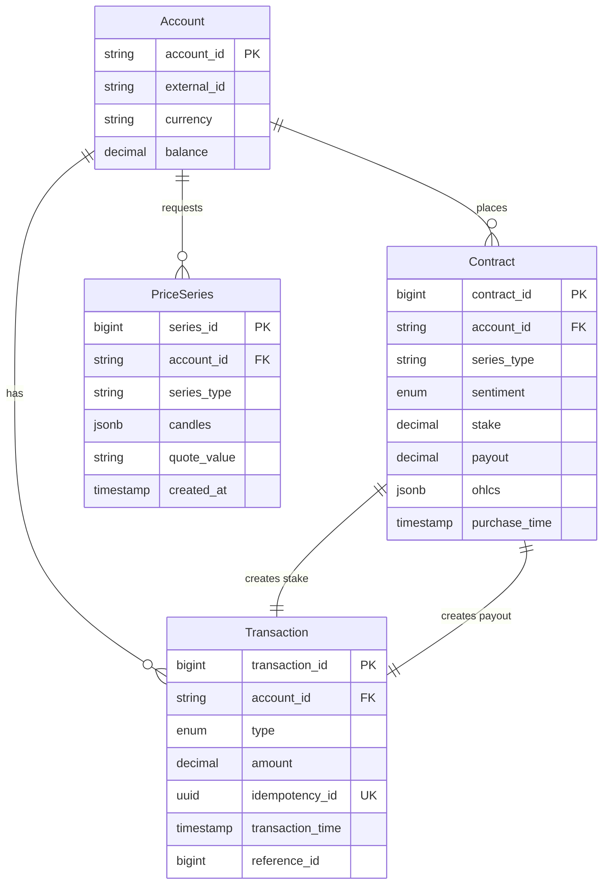
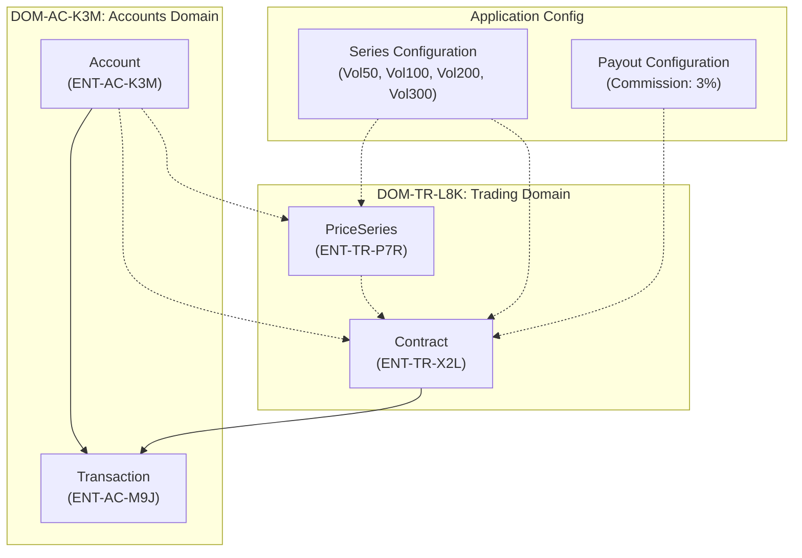

# Domain Model: Deriv Arcade

## Document Information
| Field | Value |
|-------|-------|
| Version | 1.0 |
| Created | 2026-01-16 |
| Last Updated | 2026-01-16 |
| Status | Draft |
| PRD Reference | [workspace/output/requirements/prd.md](../requirements/prd.md) |

---

## 1. Executive Summary

This domain model defines the core business entities and relationships for **Deriv Arcade**, an arcade-style binary options trading platform. The model identifies four primary entities across two bounded contexts:

- **Accounts Domain**: Manages trader accounts and all financial transactions (deposits, withdrawals, stakes, payouts)
- **Trading Domain**: Handles price preview series, contract execution, and trade outcomes

Key architectural decisions:
- **Series Configuration** is application-level config, not a database entity
- **PriceSeries** is persisted temporarily for quote validation, then deleted after contract creation
- **Transactions** are created for all financial movements including zero-value payouts for losses
- **Trade execution** is fully atomic, ensuring all-or-nothing consistency

The model supports all PRD requirements including idempotent financial operations, complete audit trails, and historical trade display.

---

## 2. Core Business Entities

### 2.1 Account (ENT-AC-K3M)

| Attribute | Description |
|-----------|-------------|
| **Entity ID** | ENT-AC-K3M |
| **Entity Name** | Account |
| **Description** | Represents a trader's trading account that holds funds and tracks balance. No personal information stored. |
| **Domain** | Accounts |

**Key Attributes**:
| Attribute | Description | Business Rules |
|-----------|-------------|----------------|
| account_id | Unique identifier with SW prefix | Sequential: SW1, SW2, SW3... |
| external_id | Broker reference identifier | Optional, for external system integration |
| currency | 3-letter currency code | Must be exactly 3 uppercase letters |
| balance | Current account balance | 2 decimal precision, non-negative |

**Business Identifier**: `account_id` (SW-prefixed sequential ID)

**Lifecycle**:
- **Creation**: When trader creates account via API
- **Modification**: Balance updated via transactions (deposit, withdrawal, stake, payout)
- **Deletion**: Not supported (accounts are retained indefinitely)

**Business Rules**:
- BR-AC-J4M: Account ID generated sequentially with SW prefix
- BR-AC-R6K: Currency must be valid 3-letter uppercase code
- BR-AC-N7Q: No personal information (email, name, address) stored

**PRD References**: FEA-AC-T5N, FEA-AC-K6L

---

### 2.2 Transaction (ENT-AC-M9J)

| Attribute | Description |
|-----------|-------------|
| **Entity ID** | ENT-AC-M9J |
| **Entity Name** | Transaction |
| **Description** | Records all financial movements affecting an account's balance, providing a complete audit trail. |
| **Domain** | Accounts |

**Key Attributes**:
| Attribute | Description | Business Rules |
|-----------|-------------|----------------|
| transaction_id | Unique transaction identifier | Auto-generated sequential ID |
| account_id | Reference to owning account | Must exist in Account entity |
| type | Transaction type enumeration | DEPOSIT, WITHDRAWAL, STAKE, PAYOUT |
| amount | Transaction amount | 2 decimal precision, >= 0 for PAYOUT |
| idempotency_id | Unique key for idempotent operations | Required for DEPOSIT and WITHDRAWAL |
| transaction_time | When transaction occurred | ISO8601 timestamp |
| reference_id | Reference to related entity | Contract ID for STAKE/PAYOUT |

**Business Identifier**: `transaction_id` (auto-generated) + `idempotency_id` (for deduplication)

**Lifecycle**:
- **Creation**: When financial operation occurs (deposit, withdrawal, trade execution)
- **Modification**: Not allowed (transactions are immutable)
- **Deletion**: Not allowed (retained indefinitely for audit)

**Transaction Types**:
| Type | Trigger | Amount Rule | Reference |
|------|---------|-------------|-----------|
| DEPOSIT | External deposit via API | Must be positive | None |
| WITHDRAWAL | External withdrawal via API | Must be positive, <= balance | None |
| STAKE | Trade placement (SwipeBuy) | Must be positive, <= balance | Contract ID |
| PAYOUT | Trade settlement | >= 0 (0 for losses, calculated for wins) | Contract ID |

**Business Rules**:
- BR-AC-Q2M: Duplicate idempotency_id returns original transaction result
- BR-AC-F9L: DEPOSIT/WITHDRAWAL amount must be positive
- BR-AC-C8L: WITHDRAWAL amount must not exceed balance
- BR-TR-PAY: PAYOUT transaction always created (0.00 for losses)

**PRD References**: FEA-AC-M9J, FEA-AC-R3P, FEA-TR-W8P

---

### 2.3 PriceSeries (ENT-TR-P7R)

| Attribute | Description |
|-----------|-------------|
| **Entity ID** | ENT-TR-P7R |
| **Entity Name** | PriceSeries |
| **Description** | Temporarily stores the preview price series (10 candles) generated during SwipeGet, persisted until used for quote validation in SwipeBuy. |
| **Domain** | Trading |

**Key Attributes**:
| Attribute | Description | Business Rules |
|-----------|-------------|----------------|
| series_id | Unique series identifier | Auto-generated |
| account_id | Reference to requesting account | Must exist in Account entity |
| series_type | Volatility configuration | Vol50, Vol100, Vol200, Vol300 |
| candles | Array of 10 OHLC candles | JSON structure |
| quote_value | 10th candle close value | Used for validation in SwipeBuy |
| created_at | Generation timestamp | ISO8601 timestamp |

**Business Identifier**: `series_id` (auto-generated)

**Lifecycle**:
- **Creation**: When SwipeGet is called
- **Modification**: Not allowed
- **Deletion**: Immediately after associated contract is created

**Business Rules**:
- BR-TR-L8K: Fresh random series generated from initial value per series type
- BR-TR-Q4N: quote_value must match previous_quote in SwipeBuy request
- BR-PS-DEL: PriceSeries deleted after successful contract creation

**PRD References**: FEA-TR-V4N

---

### 2.4 Contract (ENT-TR-X2L)

| Attribute | Description |
|-----------|-------------|
| **Entity ID** | ENT-TR-X2L |
| **Entity Name** | Contract |
| **Description** | Represents a completed trade (rise/fall binary option) with full price series data and settlement outcome. |
| **Domain** | Trading |

**Key Attributes**:
| Attribute | Description | Business Rules |
|-----------|-------------|----------------|
| contract_id | Unique contract identifier | Auto-generated sequential ID |
| account_id | Reference to trading account | Must exist in Account entity |
| series_type | Volatility configuration used | Vol50, Vol100, Vol200, Vol300 |
| sentiment | Trader's prediction | "rise" or "fall" |
| stake | Amount wagered | 2 decimal precision, positive |
| payout | Amount returned | 2 decimal precision, >= 0 |
| ohlcs | Full 20-candle series | JSON array of OHLC objects |
| purchase_time | Contract execution timestamp | ISO8601 timestamp |
| outcome | Win or loss indicator | Derived from candle comparison |

**Business Identifier**: `contract_id` (auto-generated sequential)

**Lifecycle**:
- **Creation**: When SwipeBuy is executed (atomic with transactions)
- **Modification**: Not allowed (contracts are immutable)
- **Deletion**: Not allowed (retained indefinitely)

**OHLC Candle Structure** (Value Object):
```
{
  "timestamp": "ISO8601",
  "open": "string (decimal)",
  "high": "string (decimal)",
  "low": "string (decimal)",
  "close": "string (decimal)"
}
```

**Business Rules**:
- BR-TR-K3M: IF sentiment=rise AND candle20.close > candle10.close THEN win
- BR-TR-P7R: IF sentiment=fall AND candle20.close < candle10.close THEN win
- BR-TR-X2N: IF candle20.close == candle10.close THEN loss
- BR-TR-J4H: Full 20-candle series MUST be stored
- BR-TR-M4K: Payout = stake / 0.53 if win, else 0

**PRD References**: FEA-TR-W8P, FEA-TR-Y5Q

---

## 3. Entity Relationships

### 3.1 Relationship Diagram



### 3.2 Relationship Catalog

#### REL-AC-T5N: Account → Transaction
| Attribute | Value |
|-----------|-------|
| **Relationship ID** | REL-AC-T5N |
| **Participating Entities** | Account (1) → Transaction (N) |
| **Relationship Type** | Association (One-to-Many) |
| **Cardinality** | 1:N |
| **Business Rule** | An account can have many transactions; each transaction belongs to exactly one account |
| **Cascade Behavior** | Transactions cannot exist without parent account |
| **Temporal Aspect** | Transactions are ordered by transaction_time |

#### REL-AC-M9J: Account → Contract
| Attribute | Value |
|-----------|-------|
| **Relationship ID** | REL-AC-M9J |
| **Participating Entities** | Account (1) → Contract (N) |
| **Relationship Type** | Association (One-to-Many) |
| **Cardinality** | 1:N |
| **Business Rule** | An account can have many contracts; each contract belongs to exactly one account |
| **Cascade Behavior** | Contracts cannot exist without parent account |
| **Temporal Aspect** | Contracts are ordered by purchase_time |

#### REL-TR-P7R: Account → PriceSeries
| Attribute | Value |
|-----------|-------|
| **Relationship ID** | REL-TR-P7R |
| **Participating Entities** | Account (1) → PriceSeries (N) |
| **Relationship Type** | Association (One-to-Many, temporary) |
| **Cardinality** | 1:N |
| **Business Rule** | An account can have multiple active price series; each series belongs to one account |
| **Cascade Behavior** | PriceSeries deleted after contract creation |
| **Temporal Aspect** | Short-lived entity, typically seconds to minutes |

#### REL-TR-X2L: Contract → Transaction (STAKE)
| Attribute | Value |
|-----------|-------|
| **Relationship ID** | REL-TR-X2L |
| **Participating Entities** | Contract (1) → Transaction[STAKE] (1) |
| **Relationship Type** | Association (One-to-One) |
| **Cardinality** | 1:1 |
| **Business Rule** | Each contract creates exactly one STAKE transaction |
| **Cascade Behavior** | Created atomically with contract |
| **Reference** | Transaction.reference_id = Contract.contract_id |

#### REL-TR-Y5Q: Contract → Transaction (PAYOUT)
| Attribute | Value |
|-----------|-------|
| **Relationship ID** | REL-TR-Y5Q |
| **Participating Entities** | Contract (1) → Transaction[PAYOUT] (1) |
| **Relationship Type** | Association (One-to-One) |
| **Cardinality** | 1:1 |
| **Business Rule** | Each contract creates exactly one PAYOUT transaction (including zero payouts for losses) |
| **Cascade Behavior** | Created atomically with contract |
| **Reference** | Transaction.reference_id = Contract.contract_id |

---

## 4. Domain Boundaries

### 4.1 Domain Mapping



### 4.2 Bounded Context Definitions

#### DOM-AC-K3M: Accounts Domain
| Attribute | Value |
|-----------|-------|
| **Domain ID** | DOM-AC-K3M |
| **Domain Name** | Accounts |
| **Description** | Manages trader accounts, balances, and all financial transactions |
| **Core Entities** | Account, Transaction |
| **Responsibility** | Financial state management, idempotent operations, audit trail |
| **Invariants** | Balance >= 0, Transaction immutability, Idempotency |

**Domain Capabilities**:
- Account creation with SW-prefixed ID
- Balance management (deposits, withdrawals)
- Transaction recording with idempotency
- Balance validation for trading operations

#### DOM-TR-L8K: Trading Domain
| Attribute | Value |
|-----------|-------|
| **Domain ID** | DOM-TR-L8K |
| **Domain Name** | Trading |
| **Description** | Handles price preview, contract execution, and trade settlement |
| **Core Entities** | PriceSeries, Contract |
| **Responsibility** | Price generation, quote validation, contract evaluation |
| **Invariants** | 20-candle series integrity, Quote validation, Atomic settlement |

**Domain Capabilities**:
- Price series generation using GBM algorithm
- Quote validation for trade execution
- Contract outcome evaluation
- Historical trade display

### 4.3 Integration Points

| Integration | Source Domain | Target Domain | Mechanism |
|-------------|--------------|---------------|-----------|
| Balance Check | Trading | Accounts | Synchronous call before trade |
| Stake Deduction | Trading | Accounts | Atomic transaction within trade execution |
| Payout Credit | Trading | Accounts | Atomic transaction within trade execution |
| Account Reference | Trading | Accounts | Foreign key relationship |

---

## 5. Data Ownership Strategy

### 5.1 Ownership Principles

1. **Single Owner**: Each entity has exactly one owning domain
2. **Shared References**: Cross-domain entities are referenced by ID only
3. **Atomic Boundaries**: Transactions span domains only within defined saga patterns
4. **Immutable History**: All financial and trading records are immutable once created

### 5.2 Domain Ownership Matrix

| Entity | Owner Domain | Shared With | Access Pattern |
|--------|--------------|-------------|----------------|
| Account | Accounts | Trading (read) | Trading reads balance for validation |
| Transaction | Accounts | Trading (write) | Trading creates STAKE/PAYOUT via Accounts API |
| PriceSeries | Trading | None | Internal to Trading domain |
| Contract | Trading | None | Trading owns entire lifecycle |
| Series Configuration | Application | Trading (read) | Read-only configuration |

### 5.3 Reference Data Strategy

**Series Configuration** (Application-level):
```
| Series  | Initial | Volatility | Rate | Drift | Interval | Precision |
|---------|---------|------------|------|-------|----------|-----------|
| Vol50   | 10000   | 50%        | 0    | 0     | 1 sec    | 0.001     |
| Vol100  | 50000   | 100%       | 0    | 0     | 1 sec    | 0.001     |
| Vol200  | 100000  | 200%       | 0    | 0     | 1 sec    | 0.001     |
| Vol300  | 200000  | 300%       | 0    | 0     | 1 sec    | 0.001     |
```

---

## 6. Consistency Patterns

### 6.1 Transaction Boundaries

#### Strong Consistency Required

| Operation | Entities Involved | Consistency Requirement |
|-----------|-------------------|------------------------|
| Account Creation | Account | Single entity, immediate consistency |
| Deposit | Account, Transaction | Atomic: balance update + transaction record |
| Withdrawal | Account, Transaction | Atomic: balance update + transaction record |
| Trade Execution | Account, Transaction (x2), Contract, PriceSeries | Full atomic transaction |

#### Trade Execution Atomicity (Critical Path)

The trade execution (SwipeBuy) requires atomic consistency across both domains:

```
BEGIN TRANSACTION
  1. Validate PriceSeries.quote_value == request.previous_quote
  2. Validate Account.balance >= request.stake
  3. Deduct stake from Account.balance
  4. Create Transaction (STAKE)
  5. Generate remaining 10 candles
  6. Evaluate contract outcome
  7. Calculate payout
  8. Credit payout to Account.balance
  9. Create Transaction (PAYOUT) -- even if amount is 0
  10. Create Contract with full 20 candles
  11. Delete PriceSeries
COMMIT TRANSACTION
```

### 6.2 Idempotency Patterns

| Operation | Idempotency Key | Behavior on Duplicate |
|-----------|-----------------|----------------------|
| Deposit | deposit_id | Return original transaction |
| Withdrawal | withdrawal_id | Return original transaction |
| Trade | None (not idempotent) | Each request creates new contract |

### 6.3 Eventual Consistency Acceptable

| Operation | Description | Acceptable Delay |
|-----------|-------------|------------------|
| Trading History Display | Last 50 contracts | Immediate (no delay acceptable) |
| Account Balance Display | Current balance | Immediate (no delay acceptable) |

**Note**: Given the transactional nature of trading, eventual consistency is not used in this system.

---

## 7. Data Architecture Principles

### 7.1 Data Isolation

| Principle | Implementation |
|-----------|----------------|
| Domain Boundaries | Accounts and Trading domains have separate conceptual spaces |
| Foreign Keys | Cross-domain references use account_id only |
| No Shared Tables | Each entity belongs to single domain |

### 7.2 Data Sharing Patterns

| Pattern | Use Case |
|---------|----------|
| ID Reference | Contract references account_id, not full Account object |
| Denormalization | Contract stores full OHLC array (no separate table) |
| Copy on Create | PriceSeries candles copied to Contract at trade execution |

### 7.3 Audit and Compliance

| Requirement | Implementation |
|-------------|----------------|
| Transaction History | All transactions immutable, retained indefinitely |
| Contract History | Full 20-candle series stored per contract |
| No PII | No personal information in any entity |

### 7.4 Storage Patterns

| Entity | Storage Pattern | Rationale |
|--------|----------------|-----------|
| Account | Relational (single table) | Simple, direct queries |
| Transaction | Relational (indexed by account, time) | Query by account, time-ordered |
| PriceSeries | Relational (short-lived) | Temporary, deleted after use |
| Contract | Relational with JSONB for OHLC | Complex nested data, queried as whole |

---

## 8. Glossary

### 8.1 Business Terms

| Term | Definition |
|------|------------|
| OHLC | Open-High-Low-Close candlestick data representing price movement |
| GBM | Geometric Brownian Motion - stochastic process for price generation |
| Rise Contract | Binary option betting that candle 20 close > candle 10 close |
| Fall Contract | Binary option betting that candle 20 close < candle 10 close |
| Payout | Amount returned to trader on winning trade |
| Stake | Amount wagered on a trade |
| Series Type | Volatility configuration (Vol50, Vol100, Vol200, Vol300) |
| Idempotency | Ensuring duplicate requests produce same result |
| External ID | Broker-provided reference for account linking |
| SwipeGet | API operation to get price preview (10 candles) |
| SwipeBuy | API operation to place a trade |
| SwipeList | API operation to list trading history |

### 8.2 Entity Quick Reference

| Entity ID | Entity Name | Domain | Description |
|-----------|-------------|--------|-------------|
| ENT-AC-K3M | Account | Accounts | Trader's trading account |
| ENT-AC-M9J | Transaction | Accounts | Financial movement record |
| ENT-TR-P7R | PriceSeries | Trading | Temporary preview price data |
| ENT-TR-X2L | Contract | Trading | Completed trade record |

### 8.3 Relationship Quick Reference

| Relationship ID | Description | Cardinality |
|-----------------|-------------|-------------|
| REL-AC-T5N | Account has Transactions | 1:N |
| REL-AC-M9J | Account places Contracts | 1:N |
| REL-TR-P7R | Account requests PriceSeries | 1:N |
| REL-TR-X2L | Contract creates STAKE Transaction | 1:1 |
| REL-TR-Y5Q | Contract creates PAYOUT Transaction | 1:1 |

### 8.4 Domain Quick Reference

| Domain ID | Domain Name | Core Entities |
|-----------|-------------|---------------|
| DOM-AC-K3M | Accounts | Account, Transaction |
| DOM-TR-L8K | Trading | PriceSeries, Contract |

---

## Appendix A: PRD Requirement Traceability

| PRD Feature | Entities Involved | Domain |
|-------------|-------------------|--------|
| FEA-AC-T5N (Account Creation) | Account | Accounts |
| FEA-AC-M9J (Deposit) | Account, Transaction | Accounts |
| FEA-AC-R3P (Withdrawal) | Account, Transaction | Accounts |
| FEA-AC-K6L (Get Account) | Account | Accounts |
| FEA-TR-V4N (Price Preview) | PriceSeries | Trading |
| FEA-TR-W8P (Place Trade) | Contract, Transaction, PriceSeries | Trading + Accounts |
| FEA-TR-Y5Q (List Contracts) | Contract | Trading |
| FEA-PG-Z3L (Price Generation) | PriceSeries, Contract | Trading |

---

## Appendix B: Changelog

| Version | Date | Author | Changes |
|---------|------|--------|---------|
| 1.0 | 2026-01-16 | Archi | Initial domain model creation |
