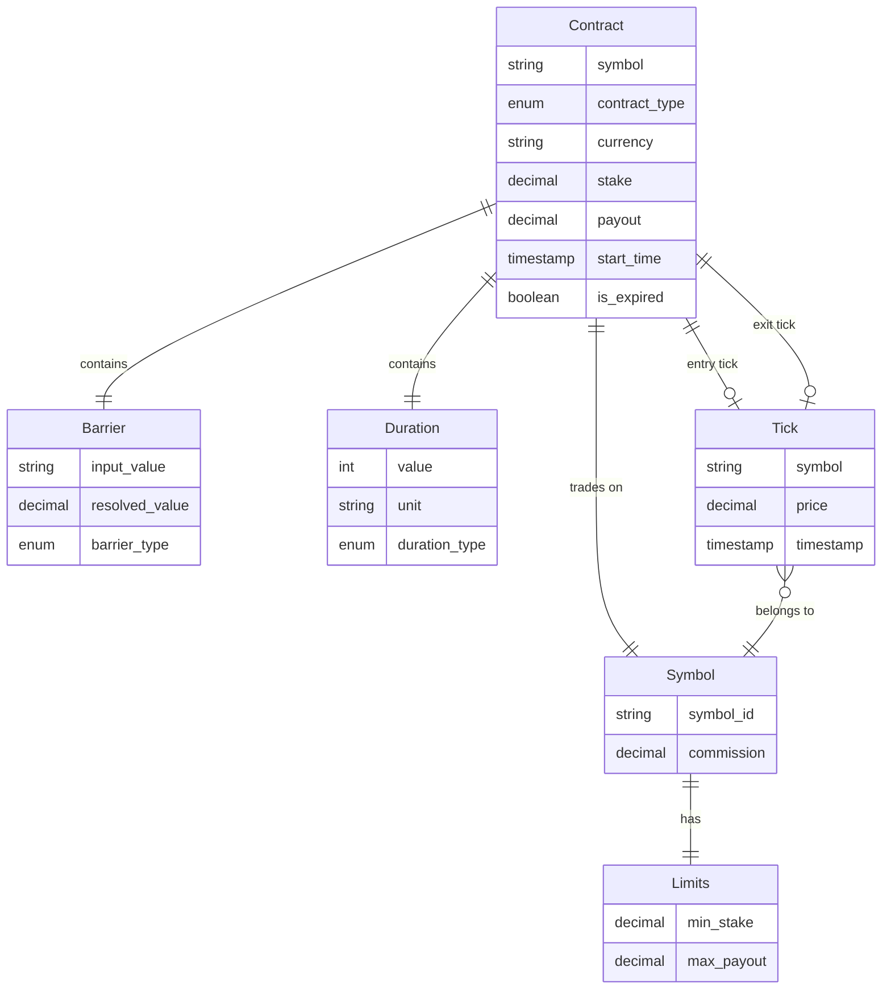
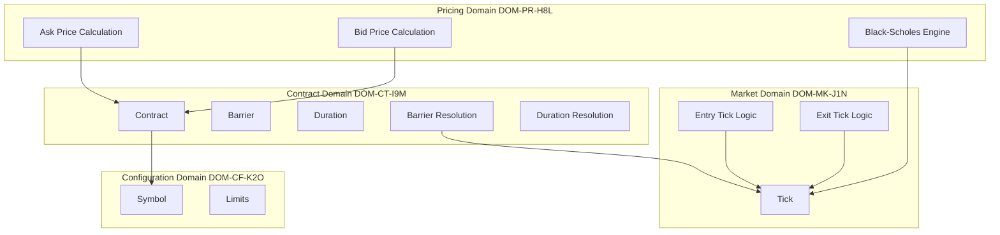

# Domain Model & Data Architecture
# Digital Call/Put Options Pricing Service

**Version**: 1.0  
**Date**: 2026-01-08  
**Status**: Draft

---

## 1. Executive Summary

This domain model defines the core business entities and relationships for the Digital Call/Put Options Pricing Service. The service operates as a stateless pricing engine that calculates Ask prices (for contract purchase) and Bid prices (for contract valuation) for digital options.

**Key Domain Characteristics**:
- **Stateless**: No persistent state; all contract information reconstructed from request parameters
- **Event-Driven**: Market data (ticks) drive pricing updates in streaming scenarios
- **Computational**: Primary value is in price calculation using Black-Scholes model

**Major Entities**:
- **Contract**: Central domain entity representing a digital option with its parameters
- **Tick**: Market price event from external feed service
- **Symbol**: Tradeable underlying asset with its configuration

**Domain Boundaries**:
1. **Pricing Domain**: Black-Scholes calculations, price generation (Ask/Bid)
2. **Market Domain**: Tick handling, entry/exit tick determination
3. **Contract Domain**: Contract parameters, barrier resolution, duration handling

---

## 2. Core Business Entities

### ENT-CT-K3M: Contract

**Description**: A digital option contract representing an agreement where the holder wins a fixed payout if the underlying asset price meets specific conditions at expiry.

**Key Attributes**:
| Attribute | Description |
|-----------|-------------|
| symbol | Underlying asset identifier (e.g., USD/JPY, BTC/USD) |
| contract_type | Type of option: CALL or PUT |
| currency | Payout currency |
| duration | Time or tick specification for contract lifecycle |
| stake | Premium amount paid to enter contract |
| barrier | Price level determining win/loss condition |
| payout | Fixed amount paid on winning (calculated at Ask, provided at Bid) |
| start_time | Contract start timestamp |
| entry_spot | First tick price after start_time |
| entry_spot_time | Timestamp of entry tick |
| exit_spot | Final tick price at expiry |
| exit_spot_time | Timestamp of exit tick |
| is_expired | Whether contract has reached expiry |

**Business Identifier**: Composite of (symbol, contract_type, start_time, barrier, duration) - though contracts are not persisted

**Lifecycle**:
- **Ask Phase**: Proposed contract for pricing; not yet purchased
- **Active Phase**: Contract purchased; payout is fixed and immutable
- **Expired Phase**: Contract has reached expiry; outcome determined

**Business Rules**:
- CALL wins if exit_spot > barrier
- PUT wins if exit_spot < barrier
- Payout is immutable after purchase (BR-LC-M9J)
- Entry spot is first tick AFTER start_time

**PRD References**: REQ-CT-K3M, REQ-CT-P7R, REQ-LC-E1M, REQ-LC-X2N, REQ-LC-P3O

---

### ENT-MK-T5N: Tick

**Description**: A market price point representing a single price update for a symbol from the market data feed.

**Key Attributes**:
| Attribute | Description |
|-----------|-------------|
| symbol | Asset identifier this tick belongs to |
| price | Spot price at this moment |
| timestamp | Market feed timestamp of the tick |

**Business Identifier**: (symbol, timestamp)

**Lifecycle**:
- Created by market feed service (service-feed)
- Consumed by pricing service for calculations
- Not persisted within pricing service

**Business Rules**:
- Tick timestamp comes from market feed, not calculated internally
- Ticks arrive in chronological order for a given symbol
- Stream updates triggered by new tick arrival

**PRD References**: REQ-LC-E1M, REQ-LC-X2N, REQ-ST-U1P, REQ-ST-T2Q

---

### ENT-SY-L8K: Symbol

**Description**: A tradeable underlying asset with its associated configuration parameters defining trading limits and commission structure.

**Key Attributes**:
| Attribute | Description |
|-----------|-------------|
| symbol_id | Unique identifier (e.g., USD/JPY, BTC/USD) |
| min_stake | Minimum allowed stake amount |
| max_payout | Maximum allowed payout amount |
| commission | Commission rate for pricing calculations |

**Business Identifier**: symbol_id

**Lifecycle**:
- Defined in YAML configuration
- Loaded at service startup
- Static during service operation

**Business Rules**:
- Symbol must exist in configuration for requests to be valid
- Commission rate applied during Black-Scholes calculation
- Stakes below min_stake are rejected
- Payouts above max_payout are rejected

**PRD References**: REQ-AP-G1A (limits), Section 4.2 (Symbol Configuration)

---

## 3. Value Objects

### VO-CT-P7R: Barrier

**Description**: The price level that determines the win/loss outcome of a digital option contract.

**Attributes**:
| Attribute | Description |
|-----------|-------------|
| input_value | Raw barrier input (absolute, relative "+/-", or null) |
| resolved_value | Calculated barrier price |
| barrier_type | ABSOLUTE, RELATIVE_PLUS, RELATIVE_MINUS, or ATM |

**Resolution Rules**:
- **Absolute** (BR-BR-Q2M): Numeric value used directly (e.g., "123.45" → 123.45)
- **Relative Plus** (BR-BR-L8K): Entry price + value (e.g., "+0.0023" → entry + 0.0023)
- **Relative Minus** (BR-BR-L8K): Entry price - value (e.g., "-0.0023" → entry - 0.0023)
- **ATM/Default** (BR-BR-T5N): Null/empty → equals entry price

**PRD References**: REQ-BR-A1E, REQ-BR-R2F, REQ-BR-N3G

---

### VO-CT-M9J: Duration

**Description**: Specification of contract lifecycle period, either time-based or tick-based.

**Attributes**:
| Attribute | Description |
|-----------|-------------|
| value | Numeric duration value |
| unit | Duration unit (s, m, h, d, t) |
| duration_type | TIME_BASED or TICK_BASED |
| duration_seconds | Calculated seconds (time-based only) |

**Duration Types**:
| Type | Units | Range |
|------|-------|-------|
| Time-Based | s (seconds), m (minutes), h (hours), d (days) | 1s to 365d |
| Tick-Based | t (ticks) | 1t to 10t |

**Business Rules**:
- Time-based: expiry_time = start_time + duration (BR-DU-M9J)
- Tick-based: Expires when tick_count >= required_ticks (BR-DU-P7R)
- Maximum time duration: 1 year (365 days)
- Maximum tick duration: 10 ticks

**PRD References**: REQ-DU-T1H, REQ-DU-K2I

---

### VO-PR-Q2M: Price

**Description**: A calculated pricing result containing ask or bid price along with supporting information.

**Ask Price Attributes**:
| Attribute | Description |
|-----------|-------------|
| ask_price | Calculated purchase price |
| currency | Contract currency |
| current_spot | Current market spot price |
| current_spot_time | Spot price timestamp |
| payout | Calculated potential payout |
| limits | Trading limits reference |

**Bid Price Attributes**:
| Attribute | Description |
|-----------|-------------|
| bid_price | Current market value |
| is_expired | Contract expiration status |
| current_spot | Current market spot price |
| current_spot_time | Spot price timestamp |
| entry_spot | Entry tick price |
| entry_spot_time | Entry tick timestamp |
| exit_spot | Exit tick price (expired only) |
| exit_spot_time | Exit tick timestamp (expired only) |
| barrier | Resolved barrier value |
| start_time | Contract start time |
| expiry_time | Contract expiry time |
| currency | Contract currency |

**PRD References**: REQ-AP-G1A, REQ-AP-G3C

---

### VO-SY-T5N: Limits

**Description**: Trading constraints configured for a symbol.

**Attributes**:
| Attribute | Description |
|-----------|-------------|
| min_stake | Minimum stake allowed |
| max_payout | Maximum payout allowed |

**PRD References**: REQ-AP-G1A (response), Section 4.2

---

## 4. Entity Relationships

### 4.1 Relationship Diagram

### 4.2 Relationship Catalog

#### REL-CT-A1E: Contract-Symbol Association

**Participating Entities**: Contract → Symbol

**Type**: Many-to-One Association

**Cardinality**: Each Contract references exactly one Symbol; each Symbol can be referenced by many Contracts

**Business Rules**:
- Symbol must exist in configuration for Contract to be valid
- Symbol provides commission rate for pricing calculation
- Symbol provides Limits for validation

**PRD References**: Section 4.2, REQ-AP-G1A

---

#### REL-CT-B2F: Contract-Barrier Composition

**Participating Entities**: Contract ◆→ Barrier

**Type**: Composition

**Cardinality**: One-to-One

**Business Rules**:
- Barrier cannot exist without Contract context
- Barrier resolution requires entry_spot for relative/ATM types
- Resolved barrier is used for win/loss determination

**PRD References**: REQ-BR-A1E, REQ-BR-R2F, REQ-BR-N3G

---

#### REL-CT-C3G: Contract-Duration Composition

**Participating Entities**: Contract ◆→ Duration

**Type**: Composition

**Cardinality**: One-to-One

**Business Rules**:
- Duration defines Contract lifecycle
- Duration type affects stream behavior (time-based vs tick-based)
- Duration determines expiry calculation method

**PRD References**: REQ-DU-T1H, REQ-DU-K2I

---

#### REL-CT-D4H: Contract-EntryTick Association

**Participating Entities**: Contract → Tick (as entry_spot)

**Type**: Association

**Cardinality**: One-to-Zero-or-One (entry tick determined after start)

**Business Rules**:
- Entry tick is first tick AFTER start_time
- Entry tick timestamp comes from market feed
- Entry tick used for barrier resolution (relative/ATM)

**PRD References**: REQ-LC-E1M

---

#### REL-CT-E5I: Contract-ExitTick Association

**Participating Entities**: Contract → Tick (as exit_spot)

**Type**: Association

**Cardinality**: One-to-Zero-or-One (exit tick exists only when expired)

**Business Rules**:
- Time-based: Exit tick at or after expiry_time
- Tick-based: Exit tick is Nth tick after entry
- Only populated when is_expired = true

**PRD References**: REQ-LC-X2N

---

#### REL-SY-F6J: Symbol-Limits Composition

**Participating Entities**: Symbol ◆→ Limits

**Type**: Composition

**Cardinality**: One-to-One

**Business Rules**:
- Limits defined per Symbol in configuration
- Used for input validation and response enrichment

**PRD References**: Section 4.2

---

#### REL-MK-G7K: Tick-Symbol Association

**Participating Entities**: Tick → Symbol

**Type**: Many-to-One Association

**Cardinality**: Many Ticks belong to one Symbol

**Business Rules**:
- Ticks arrive from service-feed per symbol subscription
- Tick stream filtered by symbol

**PRD References**: Section 4.1

---

## 5. Domain Boundaries

### 5.1 Domain Mapping

### 5.2 Bounded Contexts

| Domain ID | Domain Name | Responsibility | Entities |
|-----------|-------------|----------------|----------|
| DOM-PR-H8L | Pricing Domain | Black-Scholes calculations, Ask/Bid price generation | Price (VO) |
| DOM-CT-I9M | Contract Domain | Contract representation, barrier/duration resolution | Contract, Barrier, Duration |
| DOM-MK-J1N | Market Domain | Tick handling, entry/exit determination | Tick |
| DOM-CF-K2O | Configuration Domain | Symbol configuration, trading limits | Symbol, Limits |

### 5.3 Integration Points

| From Domain | To Domain | Integration Type | Data Exchanged |
|-------------|-----------|------------------|----------------|
| Pricing | Contract | Direct Use | Contract parameters for calculation |
| Pricing | Market | Direct Use | Current spot price for calculations |
| Contract | Market | Direct Use | Entry/Exit tick for barrier resolution |
| Contract | Configuration | Lookup | Symbol validation, limits retrieval |
| Market | External (service-feed) | gRPC | Tick streams, latest tick |

---

## 6. Data Ownership Strategy

### 6.1 Ownership Principles

Given the stateless nature of this service:
- **No Persistent Ownership**: The service does not own persistent data
- **Transient Ownership**: Contract/Tick data owned only during request processing
- **Configuration Ownership**: Symbol configuration owned by the service (loaded at startup)
- **External Ownership**: Market data (Ticks) owned by service-feed

### 6.2 Domain Ownership Matrix

| Entity/Concept | Owning Domain | Ownership Type | Notes |
|----------------|---------------|----------------|-------|
| Contract | Contract Domain | Transient | Reconstructed from request params |
| Barrier | Contract Domain | Transient | Resolved per request |
| Duration | Contract Domain | Transient | Parsed per request |
| Tick | Market Domain | External | Owned by service-feed |
| Symbol | Configuration Domain | Static | Loaded from YAML config |
| Limits | Configuration Domain | Static | Part of Symbol config |
| Price (Ask/Bid) | Pricing Domain | Computed | Generated per request |

### 6.3 Shared Data Handling

| Shared Concept | Sharing Domains | Strategy |
|----------------|-----------------|----------|
| Tick Data | Market, Pricing, Contract | Passed by reference within request context |
| Symbol Config | Contract, Pricing | Loaded once, accessed by all domains |
| Entry/Exit Spots | Contract, Pricing | Contract domain determines, Pricing domain uses |

---

## 7. Consistency Patterns

### 7.1 Transaction Boundaries

Given the stateless, read-only nature (no persistence), traditional transaction boundaries don't apply. Instead, we define **Consistency Boundaries**:

| Boundary | Scope | Consistency Type |
|----------|-------|------------------|
| Single Request | One Ask/Bid calculation | Strong (atomic computation) |
| Stream Session | Multiple updates for one contract | Eventual (each update is consistent snapshot) |

### 7.2 Strong Consistency Requirements

| Requirement | Scope | Rationale |
|-------------|-------|-----------|
| Payout Immutability | Bid requests | Payout from purchase MUST be used as-is (BR-LC-M9J) |
| Barrier Resolution | Per request | Barrier must be consistently resolved before calculation |
| Entry/Exit Determination | Per stream | Entry/exit ticks must be determined consistently |

### 7.3 Eventual Consistency Acceptance

| Area | Acceptable Lag | Notes |
|------|----------------|-------|
| Tick Stream Updates | < 500ms | Stream latency tolerance from NFR-PF-L1A |
| Price Refresh | 5 seconds max | Time-based stream heartbeat (BR-ST-Q2M) |

---

## 8. Data Architecture Principles

### 8.1 Data Isolation

- **Request Isolation**: Each request/stream operates on its own isolated data context
- **No Shared Mutable State**: Service maintains no mutable state between requests
- **Stream Isolation**: Each stream maintains its own tick counter (tick-based contracts)

### 8.2 Data Sharing Patterns

| Pattern | Usage |
|---------|-------|
| Request Context | Contract parameters passed through request context |
| Configuration Lookup | Immutable symbol config accessed on demand |
| Stream Subscription | Market data received via streaming subscription |

### 8.3 Architectural Alignment

Per workspace preferences:
- **No Persistence Layer**: No database access, fully stateless
- **Dependency Direction**: Dependencies flow toward Pricing (core)
- **Interface Location**: Interfaces defined where consumed, not implemented
- **gRPC Handlers**: Receive requests and delegate; no direct data assembly

---

## 9. Glossary

### 9.1 Business Terms

| Term | Definition |
|------|------------|
| Ask | The price to purchase (enter) a contract |
| Bid | The current market value of an active contract |
| Barrier | The price level that determines win/loss outcome |
| Digital Option | Binary option with fixed payout on win, zero on loss |
| Entry Spot | First tick price after contract start time |
| Exit Spot | Final tick price at contract expiry |
| Payout | Fixed amount client receives on winning |
| Stake | Premium paid to enter the contract |
| Tick | A single price update from market feed |
| ATM (At-The-Money) | Option where barrier equals entry price |

### 9.2 Entity Quick Reference

| Entity ID | Name | Domain |
|-----------|------|--------|
| ENT-CT-K3M | Contract | Contract Domain |
| ENT-MK-T5N | Tick | Market Domain |
| ENT-SY-L8K | Symbol | Configuration Domain |

### 9.3 Value Object Quick Reference

| VO ID | Name | Parent Entity |
|-------|------|---------------|
| VO-CT-P7R | Barrier | Contract |
| VO-CT-M9J | Duration | Contract |
| VO-PR-Q2M | Price | N/A (computed) |
| VO-SY-T5N | Limits | Symbol |

### 9.4 Relationship Quick Reference

| Rel ID | Relationship | Type |
|--------|--------------|------|
| REL-CT-A1E | Contract → Symbol | Association |
| REL-CT-B2F | Contract → Barrier | Composition |
| REL-CT-C3G | Contract → Duration | Composition |
| REL-CT-D4H | Contract → Entry Tick | Association |
| REL-CT-E5I | Contract → Exit Tick | Association |
| REL-SY-F6J | Symbol → Limits | Composition |
| REL-MK-G7K | Tick → Symbol | Association |

### 9.5 Domain Boundary Quick Reference

| Domain ID | Name |
|-----------|------|
| DOM-PR-H8L | Pricing Domain |
| DOM-CT-I9M | Contract Domain |
| DOM-MK-J1N | Market Domain |
| DOM-CF-K2O | Configuration Domain |

---

## 10. Changelog

| Version | Date | Author | Changes |
|---------|------|--------|---------|
| 1.0 | 2026-01-08 | Domain Architect | Initial domain model creation |
