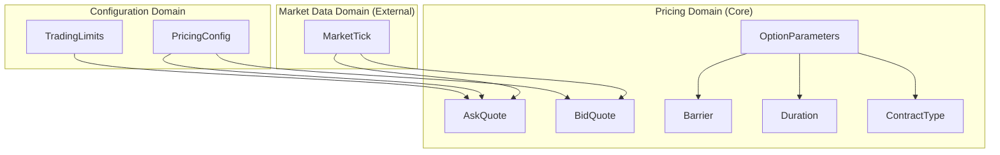
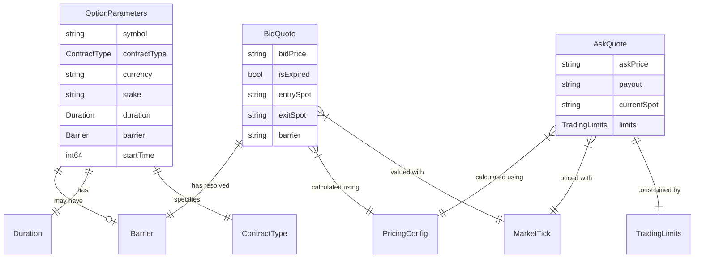
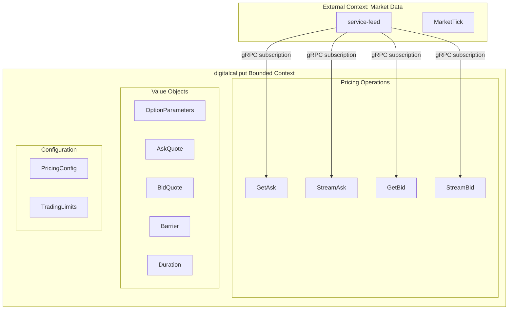
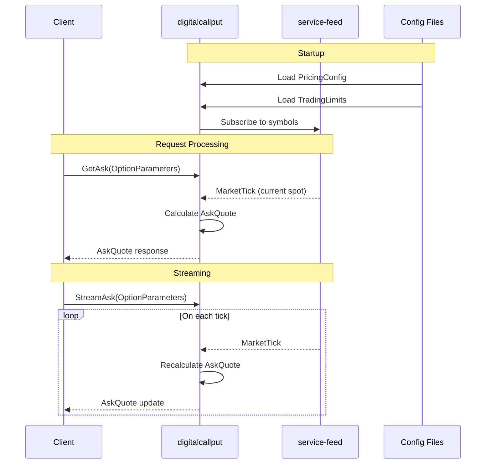

# Domain Model & Data Architecture
# Digital Call/Put Options Pricing Service

**Document Version**: 1.0
**Last Updated**: 2025-12-23
**Service Name**: digitalcallput

---

## Executive Summary

This domain model defines the conceptual data architecture for the Digital Call/Put Options Pricing Service, a **stateless gRPC microservice** that calculates real-time prices for binary options contracts using the Black-Scholes pricing model.

### Key Characteristics
- **Stateless Design**: No persistent entities; all objects are transient value objects
- **Single Bounded Context**: Focused pricing domain with minimal external dependencies
- **Value Object Centric**: Emphasis on immutable data structures for request/response processing
- **External Data Sources**: Market data from service-feed, configuration from files

### Domain Overview Diagram

---

## 1. Value Objects

Given the stateless nature of this service, all domain concepts are modeled as **value objects** - immutable data structures with no persistent identity.

### 1.1 OptionParameters

**ID**: `VO-PR-K3M`

**Description**: Input specification for an option contract pricing request. This is the primary input structure for all pricing operations.

**Attributes**:
| Attribute | Description | Constraints |
|-----------|-------------|-------------|
| symbol | Underlying asset identifier | Required, non-empty, must exist in service-feed |
| contractType | Option direction (CALL/PUT) | Required, enum value |
| currency | Payout currency code | Required, valid currency code |
| stake | Premium amount | Required, positive decimal, >= min_stake |
| duration | Contract duration specification | Required, format: `\d+[smhdt]` |
| barrier | Strike price specification | Optional, relative or absolute format |
| startTime | Contract start timestamp | Required for Bid requests only |

**Business Rules**:
- Symbol must be subscribable via service-feed
- Stake must be a positive decimal value
- Stake must meet minimum stake requirement from configuration
- Duration must follow valid format pattern
- startTime is only relevant for bid calculations (ignored for ask)

**PRD References**: [Section 4.1](../requirements/prd.md:171), [Section 7.1](../requirements/prd.md:566)

---

### 1.2 ContractType

**ID**: `VO-PR-L8K`

**Description**: Enumeration representing the direction of the digital option contract.

**Values**:
| Value | Description | Win Condition |
|-------|-------------|---------------|
| CALL | Bullish position | Exit spot > Barrier |
| PUT | Bearish position | Exit spot < Barrier |

**Business Rules**:
- Only CALL and PUT are valid contract types
- Determines the win/loss calculation at contract expiry

**PRD References**: [Section 7.3](../requirements/prd.md:635)

---

### 1.3 Duration

**ID**: `VO-PR-M9J`

**Description**: Contract duration specification supporting both time-based and tick-based formats.

**Attributes**:
| Attribute | Description | Constraints |
|-----------|-------------|-------------|
| value | Numeric duration amount | Positive integer |
| unit | Duration unit | One of: s, m, h, d, t |
| durationType | Classification | TIME_BASED or TICK_BASED |

**Supported Units**:
| Unit | Name | Conversion | Type |
|------|------|------------|------|
| s | Seconds | 1 second | TIME_BASED |
| m | Minutes | 60 seconds | TIME_BASED |
| h | Hours | 3600 seconds | TIME_BASED |
| d | Days | 86400 seconds | TIME_BASED |
| t | Ticks | N tick arrivals | TICK_BASED |

**Business Rules**:
- Format must match pattern: `^\d+[smhdt]$`
- Value must be positive integer
- **Critical**: Tick-based durations (`t`) have NO time-based fallback - contract remains active until N ticks received
- Time-based durations have 5-second update fallback if no ticks arrive

**PRD References**: [Section 4.2.3](../requirements/prd.md:343), [Entry 12 in Preferences](../requirements/preferences.md:164)

---

### 1.4 Barrier

**ID**: `VO-PR-N7R`

**Description**: Strike price specification for the option contract. Can be specified relatively to entry spot, absolutely, or left empty to default to entry spot.

**Attributes**:
| Attribute | Description | Constraints |
|-----------|-------------|-------------|
| type | Barrier specification type | RELATIVE, ABSOLUTE, or NONE |
| rawValue | Original input value | String from request |
| calculatedValue | Resolved barrier price | Decimal, determined at pricing time |

**Barrier Types**:
| Type | Format | Example | Calculation |
|------|--------|---------|-------------|
| RELATIVE | `+/-\d+` | "+50", "-100" | entry_spot + relative_value (pips) |
| ABSOLUTE | `\d+\.?\d*` | "1.2345" | Exact value provided |
| NONE | null/empty | - | entry_spot (at contract start) |

**Business Rules**:
- No range limits on relative barrier values (per Entry 9)
- Absolute barriers must be positive
- NONE barriers are resolved to entry spot when contract starts
- Invalid format returns INVALID_ARGUMENT gRPC error

**PRD References**: [Section 4.2.2](../requirements/prd.md:322), [Entry 9 in Preferences](../requirements/preferences.md:99)

---

### 1.5 AskQuote

**ID**: `VO-PR-P4S`

**Description**: Result of ask price calculation for a proposal. Represents the price to purchase a new contract.

**Attributes**:
| Attribute | Description | Constraints |
|-----------|-------------|-------------|
| askPrice | Purchase price | Decimal string, equals stake |
| currency | Contract currency | From request |
| currentSpot | Current market price | From service-feed |
| currentSpotTime | Spot timestamp | Unix epoch |
| payout | Potential win amount | Calculated, commission-adjusted |
| limits | Applicable trading limits | From configuration |

**Calculation Logic**:
1. Fetch current spot from service-feed
2. Calculate probability using Black-Scholes
3. Determine raw payout = stake / probability
4. Apply commission: final_payout = raw_payout × (1 - 0.02)
5. Ask price = stake

**Business Rules**:
- Commission (2%) is applied but NOT visible in response (Entry 8)
- Limits come from global configuration

**PRD References**: [Section 4.1.1](../requirements/prd.md:175), [Entry 8 in Preferences](../requirements/preferences.md:89)

---

### 1.6 BidQuote

**ID**: `VO-PR-Q2T`

**Description**: Result of bid price calculation for an active contract. Represents the current market value.

**Attributes**:
| Attribute | Description | Constraints |
|-----------|-------------|-------------|
| bidPrice | Current contract value | Decimal string |
| isExpired | Expiry status | Boolean |
| currentSpot | Current market price | From service-feed |
| currentSpotTime | Spot timestamp | Unix epoch |
| entrySpot | Contract entry price | First tick after startTime |
| entrySpotTime | Entry timestamp | Unix epoch |
| exitSpot | Contract exit price | Present if expired |
| exitSpotTime | Exit timestamp | Present if expired |
| barrier | Resolved barrier value | Decimal string |
| startTime | Contract start | From request |
| expiryTime | Calculated expiry | startTime + duration |
| currency | Contract currency | From request |

**Calculation Logic**:
1. Determine entry spot (first tick after startTime)
2. Calculate barrier (resolve relative/absolute/none)
3. Calculate expiry time based on duration type
4. If not expired: bid_price = payout × remaining_probability
5. If expired: bid_price = payout (if win) or 0 (if loss)

**Expiry Determination**:
- Time-based: expiryTime = startTime + duration_in_seconds
- Tick-based: After N ticks received (no time calculation)

**PRD References**: [Section 4.1.3](../requirements/prd.md:238)

---

### 1.7 MarketTick

**ID**: `VO-MK-R8U`

**Description**: Real-time market data point received from service-feed. This is an **external value object** not owned by this service.

**Attributes**:
| Attribute | Description | Source |
|-----------|-------------|--------|
| symbol | Asset identifier | service-feed |
| price | Current spot price | service-feed |
| timestamp | Tick timestamp | service-feed |

**Source**: `github.com/junbon-deriv/service-feed`

**Business Rules**:
- This service does NOT own this data
- Received via gRPC subscription from service-feed
- Drives stream updates for all pricing operations
- If unavailable, return UNAVAILABLE gRPC error

**PRD References**: [Section 4.3.1](../requirements/prd.md:363)

---

### 1.8 TradingLimits

**ID**: `VO-CF-S5V`

**Description**: Configuration for trading constraints applied to all contracts.

**Attributes**:
| Attribute | Description | Default |
|-----------|-------------|---------|
| minStake | Minimum stake amount | "1.00" |
| maxPayout | Maximum payout allowed | "50000.00" |

**Business Rules**:
- Loaded from configuration file at startup
- Global scope (same for all symbols) - Entry 7
- Requires service restart to change
- Stake below minStake returns FAILED_PRECONDITION error

**PRD References**: [Section 4.3.2](../requirements/prd.md:385), [Entry 3 in Preferences](../requirements/preferences.md:35)

---

### 1.9 PricingConfig

**ID**: `VO-CF-T3W`

**Description**: Global pricing parameters for Black-Scholes calculations.

**Attributes**:
| Attribute | Description | Value |
|-----------|-------------|-------|
| volatility | Annual volatility (σ) | 0.10 (10%) |
| commission | Commission rate | 0.02 (2%) |
| interestRate | Risk-free rate (r) | 0.0 (0%) |
| quantoDrift | Quanto adjustment (q) | 0.0 |

**Business Rules**:
- All values are fixed and global (Entry 2, Entry 7)
- Loaded from configuration file at startup
- Requires service restart to change
- Commission is applied internally, not exposed in responses

**PRD References**: [Section 4.3.2](../requirements/prd.md:385), [Entry 2 in Preferences](../requirements/preferences.md:22)

---

## 2. Value Object Relationships

### 2.1 Relationship Diagram

### 2.2 Relationship Catalog

#### REL-PR-A1X: OptionParameters → ContractType
- **Type**: Composition
- **Cardinality**: 1:1
- **Description**: Every option parameters instance must specify exactly one contract type
- **Business Rule**: Contract type determines win/loss calculation

#### REL-PR-B2Y: OptionParameters → Duration
- **Type**: Composition
- **Cardinality**: 1:1
- **Description**: Every option parameters instance must specify exactly one duration
- **Business Rule**: Duration determines expiry calculation method

#### REL-PR-C3Z: OptionParameters → Barrier
- **Type**: Association
- **Cardinality**: 1:0..1
- **Description**: Option parameters may optionally include a barrier specification
- **Business Rule**: If not provided, barrier defaults to entry spot

#### REL-PR-D4A: AskQuote → MarketTick
- **Type**: Dependency
- **Cardinality**: N:1
- **Description**: Ask quotes depend on current market tick for spot price
- **Business Rule**: Each calculation uses the latest available tick

#### REL-PR-E5B: AskQuote → PricingConfig
- **Type**: Dependency
- **Cardinality**: N:1
- **Description**: Ask quotes use global pricing configuration
- **Business Rule**: Volatility and commission from config drive calculation

#### REL-PR-F6C: AskQuote → TradingLimits
- **Type**: Dependency
- **Cardinality**: N:1
- **Description**: Ask quotes include trading limits in response
- **Business Rule**: Limits come from global configuration

#### REL-PR-G7D: BidQuote → MarketTick
- **Type**: Dependency
- **Cardinality**: N:1
- **Description**: Bid quotes depend on current market tick for valuation
- **Business Rule**: Each calculation uses the latest available tick

#### REL-PR-H8E: BidQuote → PricingConfig
- **Type**: Dependency
- **Cardinality**: N:1
- **Description**: Bid quotes use global pricing configuration
- **Business Rule**: Same pricing parameters as ask calculations

#### REL-PR-I9F: BidQuote → Barrier
- **Type**: Composition
- **Cardinality**: 1:1
- **Description**: Bid quote contains the resolved barrier value
- **Business Rule**: Barrier is resolved from raw input at calculation time

---

## 3. Domain Boundaries

### 3.1 Single Bounded Context

This service operates as a **single bounded context** focused entirely on pricing calculations. Due to its stateless nature and focused responsibility, there are no internal domain subdivisions.

### 3.2 Context Boundary Definition

| Context | Ownership | Data Flow | Integration |
|---------|-----------|-----------|-------------|
| **digitalcallput** | Full | Request → Processing → Response | gRPC server |
| **service-feed** | External | Tick subscription | gRPC client |
| **Configuration** | Local | File → Memory | File system |

---

## 4. Data Ownership Strategy

### 4.1 Ownership Model

Given the stateless architecture, data ownership follows a simple pattern:

| Data Type | Owner | Lifecycle | Storage |
|-----------|-------|-----------|---------|
| OptionParameters | Client (transient) | Request duration | None |
| AskQuote | Service (transient) | Response duration | None |
| BidQuote | Service (transient) | Response duration | None |
| MarketTick | service-feed | Real-time stream | External |
| PricingConfig | Configuration files | Service lifetime | File system |
| TradingLimits | Configuration files | Service lifetime | File system |

### 4.2 Data Flow Diagram

---

## 5. Consistency Patterns

### 5.1 Consistency Model

As a stateless service, traditional consistency concerns (ACID, eventual consistency) do not apply. However, the following consistency patterns are relevant:

| Pattern | Application | Description |
|---------|-------------|-------------|
| **Read Consistency** | Market Data | Always use latest available tick |
| **Configuration Consistency** | Pricing params | Consistent within service lifetime |
| **Calculation Consistency** | Pricing | Same inputs always produce same outputs |

### 5.2 Consistency Guarantees

1. **Market Data Freshness**: Pricing uses the most recent tick available
2. **Configuration Immutability**: Config doesn't change during service lifetime
3. **Idempotent Calculations**: Black-Scholes is deterministic given same inputs
4. **No Transaction Boundaries**: Each request is independent, no cross-request state

---

## 6. Data Architecture Principles

### 6.1 Stateless Design

- **No Database**: Service maintains no persistent storage
- **No Session State**: Each request is fully independent
- **Memory Only**: All calculations happen in-memory
- **Horizontal Scaling**: Any instance can handle any request

### 6.2 Data Isolation

- **Request Isolation**: Each request carries all needed context
- **No Shared State**: No shared mutable state between requests
- **Configuration Sharing**: Read-only config shared across requests

### 6.3 External Data Patterns

- **Subscription Model**: service-feed provides continuous tick stream
- **Latest Value**: Always use most recent tick for calculations
- **Graceful Degradation**: Handle feed unavailability with appropriate errors

---

## 7. Glossary

### 7.1 Business Terms

| Term | Definition |
|------|------------|
| **Digital Option** | Binary option with fixed payout on win, zero on loss |
| **Ask Price** | Price to purchase a new contract (equals stake) |
| **Bid Price** | Current market value of an active contract |
| **Barrier** | Strike price that determines win/loss |
| **Entry Spot** | Market price when contract starts |
| **Exit Spot** | Market price at contract expiry |
| **Payout** | Amount returned on winning contract |
| **Stake** | Premium paid to purchase contract |
| **Tick** | Single market data update from service-feed |

### 7.2 Value Object Reference

| ID | Name | Domain |
|----|------|--------|
| VO-PR-K3M | OptionParameters | Pricing |
| VO-PR-L8K | ContractType | Pricing |
| VO-PR-M9J | Duration | Pricing |
| VO-PR-N7R | Barrier | Pricing |
| VO-PR-P4S | AskQuote | Pricing |
| VO-PR-Q2T | BidQuote | Pricing |
| VO-MK-R8U | MarketTick | Market Data |
| VO-CF-S5V | TradingLimits | Configuration |
| VO-CF-T3W | PricingConfig | Configuration |

### 7.3 Relationship Reference

| ID | From | To | Type |
|----|------|----|------|
| REL-PR-A1X | OptionParameters | ContractType | Composition |
| REL-PR-B2Y | OptionParameters | Duration | Composition |
| REL-PR-C3Z | OptionParameters | Barrier | Association |
| REL-PR-D4A | AskQuote | MarketTick | Dependency |
| REL-PR-E5B | AskQuote | PricingConfig | Dependency |
| REL-PR-F6C | AskQuote | TradingLimits | Dependency |
| REL-PR-G7D | BidQuote | MarketTick | Dependency |
| REL-PR-H8E | BidQuote | PricingConfig | Dependency |
| REL-PR-I9F | BidQuote | Barrier | Composition |

---

## 8. PRD Traceability

| PRD Section | Domain Coverage |
|-------------|-----------------|
| 4.1 API Endpoints | OptionParameters, AskQuote, BidQuote |
| 4.2 Pricing Logic | PricingConfig, Barrier, Duration |
| 4.3 Data Integration | MarketTick, TradingLimits, PricingConfig |
| 4.4 Validation | All value object constraints |
| 5.1 Performance | Stateless design enables scaling |
| 7.1 Request Models | OptionParameters |
| 7.2 Response Models | AskQuote, BidQuote, TradingLimits |

---

## 9. Quality Checklist

- [x] All major business concepts from PRD are represented
- [x] Value objects use consistent business terminology
- [x] Relationships accurately reflect business rules
- [x] Single bounded context aligns with service scope
- [x] Data ownership is clearly established (mostly transient)
- [x] Consistency requirements documented (N/A for stateless)
- [x] No implementation details in conceptual model
- [x] Model supports all PRD requirements
- [x] Glossary includes all domain-specific terms

---

**End of Document**
