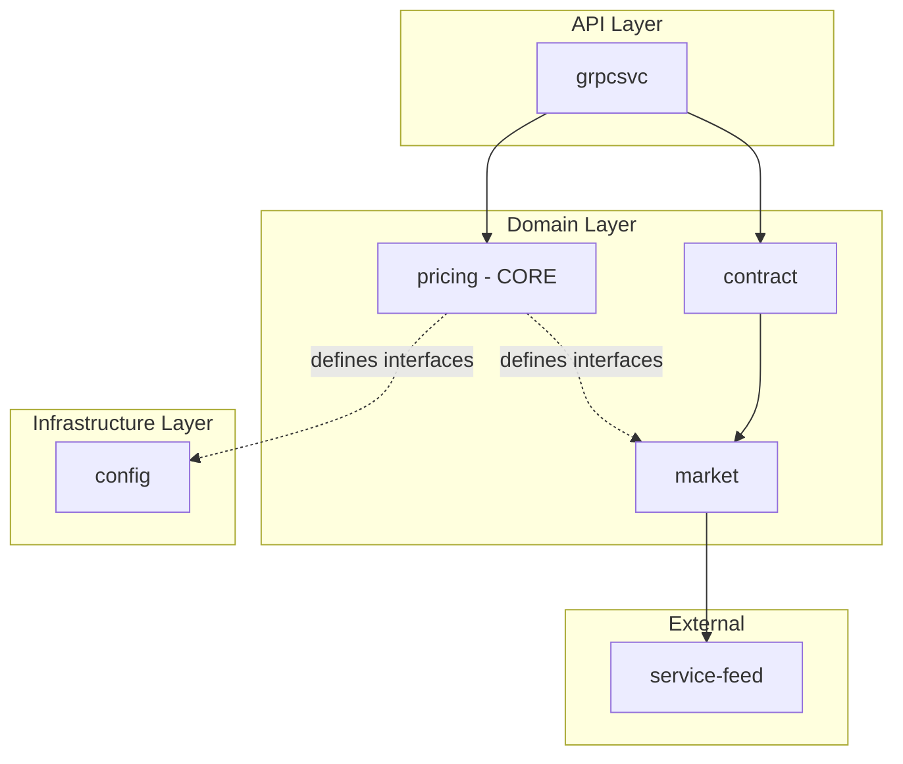

# Service Specification
# Digital Call/Put Options Pricing Service

**Service Name**: digitalcallput  
**Service ID**: SVC-PR-K3M  
**Version**: 1.0  
**Date**: 2026-01-08  
**Status**: Draft  
**Complexity Score**: 6/10 (Standard)

---

## 1. Service Overview

The digitalcallput service is a stateless Go microservice that provides real-time pricing for digital (binary) options contracts. It calculates Ask prices (contract purchase) and Bid prices (contract valuation) using the Black-Scholes pricing model.

**Purpose**: Enable real-time options pricing with support for both single-request and streaming scenarios.

**Domain Alignment**:
- DOM-PR-H8L (Pricing Domain) - Primary
- DOM-CT-I9M (Contract Domain) - Supporting
- DOM-MK-J1N (Market Domain) - Supporting
- DOM-CF-K2O (Configuration Domain) - Supporting

---

## 2. Tech Stack

| Component | Technology | Rationale |
|-----------|------------|-----------|
| Language | Go 1.21+ | Performance, concurrency, team expertise, per workspace preferences |
| API Protocol | gRPC | Streaming support, binary efficiency, strong typing |
| Serialization | Protocol Buffers (proto3) | Schema evolution, cross-language support |
| Configuration | Viper + YAML | Standard Go config, human-readable symbol config |
| CLI Framework | Cobra | Standard Go CLI framework (from go-templates) |
| Logging | log/slog | Structured logging, standard library |
| Build | Make | Standard Go project tooling (from go-templates) |
| Containerization | Docker | Deployment consistency |

**External Dependencies**:
- service-feed (gRPC) - Market data provider
- go-templates - Project scaffold

---

## 3. User Story Coverage

This service fulfills the following user stories:

### Ask Pricing
- US-PR-K3M: Ask price for Call option
- US-PR-P7R: Ask price for Put option
- US-PR-A1E: See payout with Ask
- US-PR-B2F: See trading limits
- US-PR-C3G: See spot price/timestamp
- US-PR-D4H: Streaming Ask updates
- US-PR-E5I: Ask update on new tick
- US-PR-F6J: Ask update every 5 seconds

### Bid Pricing
- US-PR-G7K: Bid price for active contract
- US-PR-H8L: See resolved barrier
- US-PR-I9M: See entry spot/timestamp
- US-PR-J1N: See exit spot on expiry
- US-PR-L2O: Payout preserved (immutable)
- US-PR-M3P: Streaming Bid updates
- US-PR-N4Q: Stream terminates on expiry
- US-PR-O5R: Time-based Bid stream behavior
- US-PR-Q6S: Tick-based Bid stream behavior

### Contract Handling
- US-CT-R7T through US-CT-C9E: Barrier types and duration handling

### Market Integration
- US-MK-D1F through US-MK-F3H: Entry/exit tick handling

### Validation
- US-VL-G4I through US-VL-L9N: Error handling

---

## 4. Architecture Design

### 4.1 Design Rationale

The service uses **internal module boundaries** within a single deployable unit:

| Decision | Rationale |
|----------|-----------|
| Single Service | Cohesive business domain, no data persistence, simpler deployment |
| Internal Modules | Separation of concerns without microservice overhead |
| Dependency Inversion | Pricing core has no dependencies; all modules depend on pricing |
| Stateless | All contract state reconstructed from request parameters |

### 4.2 Architectural Rules (STRICT)

These rules MUST be enforced during implementation:

1. **Handler Delegation**: gRPC handlers receive requests and delegate to domain modules. Handlers MUST NOT fetch data from various sources or assemble responses directly.

2. **Standard Error Codes**: Always return gRPC standard error codes with descriptive messages.

3. **Dependency Direction**: All dependencies flow toward the pricing core. Other modules depend on pricing; pricing depends on nothing else within the service.

4. **Interface Location**: Interfaces are defined where they are consumed, not where they are implemented.

5. **No models/types Package**: No shared models package. Each module defines its own types as needed.

### 4.3 Module Relationships



**Dependency Flow**:
- [`grpcsvc`](service.md:147) → [`pricing`](service.md:180) (core)
- [`grpcsvc`](service.md:147) → [`contract`](service.md:245)
- [`contract`](service.md:245) → [`market`](service.md:307)
- [`market`](service.md:307) → service-feed (external)
- [`config`](service.md:366) (standalone, accessed via interfaces)

---

## 5. Directory Structure

Following go-templates with domain-specific internal modules:

```
digitalcallput/
├── cmd/
│   └── digitalcallput/
│       └── main.go                  # Application entry point (go-templates)
├── internal/
│   ├── app/
│   │   ├── app.go                   # Application setup, dependency wiring
│   │   └── app_test.go              # Application integration tests
│   ├── grpcsvc/
│   │   ├── grpcsvc.go               # gRPC handler implementations
│   │   ├── grpcsvc_test.go          # Handler unit tests
│   │   ├── ask.go                   # GetAsk, StreamAsk handlers
│   │   ├── bid.go                   # GetBid, StreamBid handlers
│   │   └── validation.go            # Input validation logic
│   ├── pricing/
│   │   ├── pricing.go               # Core pricing types and interfaces
│   │   ├── ask.go                   # Ask price calculation
│   │   ├── ask_test.go              # Ask calculation tests
│   │   ├── bid.go                   # Bid price calculation
│   │   ├── bid_test.go              # Bid calculation tests
│   │   ├── blackscholes.go          # Black-Scholes formula implementation
│   │   └── blackscholes_test.go     # Black-Scholes tests
│   ├── contract/
│   │   ├── contract.go              # Contract types
│   │   ├── barrier.go               # Barrier resolution logic
│   │   ├── barrier_test.go          # Barrier tests
│   │   ├── duration.go              # Duration parsing and handling
│   │   └── duration_test.go         # Duration tests
│   ├── market/
│   │   ├── market.go                # Market interfaces (implements pricing interfaces)
│   │   ├── feed.go                  # service-feed client wrapper
│   │   ├── feed_test.go             # Feed client tests
│   │   ├── tick.go                  # Tick handling and entry/exit logic
│   │   └── tick_test.go             # Tick logic tests
│   ├── config/
│   │   ├── config.go                # YAML configuration loader
│   │   └── config_test.go           # Config loading tests
│   └── tools/
│       └── tools.go                 # Build tools (go-templates)
├── api/
│   └── digitalcallput/              # Generated protobuf code
│       ├── digitalcallput.pb.go
│       └── digitalcallput_grpc.pb.go
├── proto/
│   └── digitalcallput/
│       └── v1/
│           └── digitalcallput.proto # Service definition
├── config/
│   └── symbols.yaml                 # Symbol configuration
├── buf.gen.yaml                     # Protobuf generation config
├── buf.yaml                         # Buf configuration
├── Makefile                         # Build targets
├── Dockerfile                       # Container definition
├── .golangci.yml                    # Linter configuration
├── go.mod                           # Go modules
├── go.sum                           # Go modules checksum
└── README.md                        # Service documentation
```

---

## 6. Component/Module Specifications

### 6.1 grpcsvc Module

**Purpose**: Implements gRPC service handlers that receive requests and delegate to domain modules.

**File Ownership**: `internal/grpcsvc/`

**Core Functionality**:

#### Handlers

| Handler | Type | Purpose |
|---------|------|---------|
| GetAsk | Unary | Single Ask price calculation |
| StreamAsk | Server Stream | Continuous Ask price updates |
| GetBid | Unary | Single Bid price calculation |
| StreamBid | Server Stream | Continuous Bid price updates |

#### Handler Pattern (STRICT)

```go
// grpcsvc/ask.go
func (s *Service) GetAsk(ctx context.Context, req *pb.GetAskRequest) (*pb.GetAskResponse, error) {
    // 1. Validate input
    if err := s.validateAskRequest(req); err != nil {
        return nil, err // Return gRPC status error
    }
    
    // 2. Delegate to pricing module
    result, err := s.pricer.CalculateAsk(ctx, pricing.AskInput{
        Symbol:       req.Symbol,
        ContractType: req.ContractType,
        Currency:     req.Currency,
        Duration:     req.Duration,
        Stake:        req.Stake,
        Barrier:      req.Barrier,
        PricingTime:  req.PricingTime,
    })
    if err != nil {
        return nil, s.mapError(err) // Map domain errors to gRPC status
    }
    
    // 3. Return response (mapping done by pricing module)
    return result.ToProto(), nil
}
```

**FORBIDDEN Pattern** (handlers must NOT do this):
```go
// ❌ WRONG: Handler fetching data and assembling response
func (s *Service) GetAsk(ctx context.Context, req *pb.GetAskRequest) (*pb.GetAskResponse, error) {
    spot, _ := s.feedClient.GetLatestTick(ctx, req.Symbol)    // ❌ Handler fetching
    config, _ := s.configLoader.GetSymbol(req.Symbol)          // ❌ Handler fetching
    price := blackscholes.Calculate(spot, config.Volatility)   // ❌ Handler calculating
    return &pb.GetAskResponse{AskPrice: price}, nil            // ❌ Handler assembling
}
```

**Dependencies**:
- pricing.Pricer interface (for Ask/Bid calculations)
- contract.ContractBuilder interface (for contract parameter handling)

**Configuration**: None (receives dependencies via constructor)

---

### 6.2 pricing Module (CORE)

**Purpose**: Core domain module containing Black-Scholes calculations and price generation. This module has NO dependencies on other internal modules.

**File Ownership**: `internal/pricing/`

**Core Types and Interfaces**:

```go
// pricing/pricing.go

// Pricer is the main interface for price calculations
type Pricer interface {
    CalculateAsk(ctx context.Context, input AskInput) (*AskResult, error)
    CalculateBid(ctx context.Context, input BidInput) (*BidResult, error)
}

// MarketDataProvider is defined in pricing (consumed here)
type MarketDataProvider interface {
    GetLatestTick(ctx context.Context, symbol string) (*Tick, error)
    GetTick(ctx context.Context, symbol string, timestamp int64) (*Tick, error)
    StreamTicks(ctx context.Context, symbol string) (<-chan *Tick, error)
}

// ConfigProvider is defined in pricing (consumed here)
type ConfigProvider interface {
    GetSymbolConfig(symbol string) (*SymbolConfig, error)
}

// AskInput contains all parameters for Ask calculation
type AskInput struct {
    Symbol       string
    ContractType ContractType
    Currency     string
    Duration     string
    Stake        string
    Barrier      *string
    PricingTime  *int64
}

// AskResult contains the Ask calculation output
type AskResult struct {
    AskPrice        string
    Currency        string
    CurrentSpot     string
    CurrentSpotTime int64
    Payout          string
    Limits          Limits
}

// BidInput contains all parameters for Bid calculation
type BidInput struct {
    Symbol       string
    ContractType ContractType
    Currency     string
    Duration     string
    Barrier      *string
    StartTime    int64
    Payout       string  // REQUIRED - never recalculated
}

// BidResult contains the Bid calculation output
type BidResult struct {
    BidPrice        string
    IsExpired       bool
    CurrentSpot     string
    CurrentSpotTime int64
    EntrySpot       string
    EntrySpotTime   int64
    ExitSpot        *string
    ExitSpotTime    *int64
    Barrier         string
    StartTime       int64
    ExpiryTime      int64
    Currency        string
}
```

**Business Logic**:

#### Ask Calculation (ask.go)
```go
// CalculateAsk implements Ask price calculation
func (p *pricer) CalculateAsk(ctx context.Context, input AskInput) (*AskResult, error) {
    // 1. Get current spot
    tick, err := p.market.GetLatestTick(ctx, input.Symbol)
    if err != nil {
        return nil, fmt.Errorf("failed to get market data: %w", err)
    }
    
    // 2. Get symbol config
    config, err := p.config.GetSymbolConfig(input.Symbol)
    if err != nil {
        return nil, fmt.Errorf("unknown symbol: %w", err)
    }
    
    // 3. Parse and validate stake
    stake, err := decimal.NewFromString(input.Stake)
    if err != nil || stake.LessThan(config.MinStake) {
        return nil, ErrStakeBelowMinimum
    }
    
    // 4. Calculate probability using Black-Scholes
    duration := parseDuration(input.Duration)
    barrier := resolveBarrier(input.Barrier, tick.Price)
    probability := p.blackScholes.Calculate(tick.Price, barrier, duration, config)
    
    // 5. Calculate payout and ask price
    payout := stake.Div(probability)
    if payout.GreaterThan(config.MaxPayout) {
        return nil, ErrPayoutExceedsMaximum
    }
    askPrice := stake.Sub(stake.Mul(config.Commission))
    
    return &AskResult{
        AskPrice:        askPrice.StringFixed(8),
        Payout:          payout.StringFixed(8),
        CurrentSpot:     tick.Price.StringFixed(8),
        CurrentSpotTime: tick.Timestamp,
        Currency:        input.Currency,
        Limits:          Limits{MaxPayout: config.MaxPayout, MinStake: config.MinStake},
    }, nil
}
```

#### Bid Calculation (bid.go)
```go
// CalculateBid implements Bid price calculation
// CRITICAL: payout comes from input, never recalculated
func (p *pricer) CalculateBid(ctx context.Context, input BidInput) (*BidResult, error) {
    // 1. Get entry tick
    entryTick, err := p.market.GetTick(ctx, input.Symbol, input.StartTime)
    if err != nil {
        return nil, fmt.Errorf("failed to get entry tick: %w", err)
    }
    
    // 2. Resolve barrier using entry price
    barrier := resolveBarrier(input.Barrier, entryTick.Price)
    
    // 3. Calculate expiry
    duration := parseDuration(input.Duration)
    expiryTime := calculateExpiry(input.StartTime, duration)
    
    // 4. Get current spot
    currentTick, err := p.market.GetLatestTick(ctx, input.Symbol)
    if err != nil {
        return nil, fmt.Errorf("failed to get current spot: %w", err)
    }
    
    // 5. Determine if expired and calculate bid
    isExpired := time.Now().Unix() >= expiryTime
    var bidPrice decimal.Decimal
    var exitSpot *string
    var exitSpotTime *int64
    
    if isExpired {
        // Get exit tick
        exitTick, _ := p.market.GetTick(ctx, input.Symbol, expiryTime)
        exitPrice := exitTick.Price.StringFixed(8)
        exitTime := exitTick.Timestamp
        exitSpot = &exitPrice
        exitSpotTime = &exitTime
        
        // Determine win/loss
        payout, _ := decimal.NewFromString(input.Payout)
        if isWin(input.ContractType, exitTick.Price, barrier) {
            bidPrice = payout
        } else {
            bidPrice = decimal.Zero
        }
    } else {
        // Calculate bid using Black-Scholes with remaining time
        remaining := expiryTime - time.Now().Unix()
        payout, _ := decimal.NewFromString(input.Payout)
        probability := p.blackScholes.CalculateRemaining(currentTick.Price, barrier, remaining)
        bidPrice = payout.Mul(probability)
    }
    
    return &BidResult{
        BidPrice:        bidPrice.StringFixed(8),
        IsExpired:       isExpired,
        CurrentSpot:     currentTick.Price.StringFixed(8),
        CurrentSpotTime: currentTick.Timestamp,
        EntrySpot:       entryTick.Price.StringFixed(8),
        EntrySpotTime:   entryTick.Timestamp,
        ExitSpot:        exitSpot,
        ExitSpotTime:    exitSpotTime,
        Barrier:         barrier.StringFixed(8),
        StartTime:       input.StartTime,
        ExpiryTime:      expiryTime,
        Currency:        input.Currency,
    }, nil
}
```

#### Black-Scholes Implementation (blackscholes.go)
```go
// BlackScholes implements digital option pricing using Black-Scholes model
type BlackScholes struct {
    volatility float64  // Fixed at 10% (0.10)
    rate       float64  // Fixed at 0% (0.00)
}

// Calculate returns the probability of winning for a digital option
func (bs *BlackScholes) Calculate(spot, barrier decimal.Decimal, durationYears float64, config *SymbolConfig) decimal.Decimal {
    // Standard Black-Scholes for digital options
    // d2 = (ln(S/K) + (r - σ²/2)T) / (σ√T)
    // Probability = N(d2) for calls, N(-d2) for puts
    
    S := spot.InexactFloat64()
    K := barrier.InexactFloat64()
    T := durationYears
    σ := bs.volatility
    r := bs.rate
    
    d2 := (math.Log(S/K) + (r-σ*σ/2)*T) / (σ * math.Sqrt(T))
    probability := normalCDF(d2)
    
    return decimal.NewFromFloat(probability)
}
```

**Error Types**:
```go
var (
    ErrStakeBelowMinimum   = errors.New("stake below minimum")
    ErrPayoutExceedsMaximum = errors.New("payout exceeds maximum")
    ErrUnknownSymbol       = errors.New("unknown symbol")
    ErrInvalidDuration     = errors.New("invalid duration format")
    ErrInvalidBarrier      = errors.New("invalid barrier format")
    ErrMarketUnavailable   = errors.New("market data unavailable")
)
```

---

### 6.3 contract Module

**Purpose**: Handles contract parameter processing including barrier resolution and duration parsing.

**File Ownership**: `internal/contract/`

**Core Functionality**:

#### Barrier Resolution (barrier.go)
```go
// BarrierType defines the type of barrier specification
type BarrierType int

const (
    BarrierTypeAbsolute BarrierType = iota
    BarrierTypeRelativePlus
    BarrierTypeRelativeMinus
    BarrierTypeATM  // At-the-money (default)
)

// Barrier represents a resolved barrier value
type Barrier struct {
    InputValue    *string
    ResolvedValue decimal.Decimal
    Type          BarrierType
}

// ResolveBarrier resolves barrier based on input and entry price
func ResolveBarrier(input *string, entryPrice decimal.Decimal) (*Barrier, error) {
    if input == nil || *input == "" {
        // ATM barrier - equals entry price
        return &Barrier{
            InputValue:    nil,
            ResolvedValue: entryPrice,
            Type:          BarrierTypeATM,
        }, nil
    }
    
    value := *input
    
    if strings.HasPrefix(value, "+") {
        // Relative positive
        offset, err := decimal.NewFromString(value[1:])
        if err != nil {
            return nil, fmt.Errorf("%w: invalid relative barrier format", ErrInvalidBarrier)
        }
        return &Barrier{
            InputValue:    input,
            ResolvedValue: entryPrice.Add(offset),
            Type:          BarrierTypeRelativePlus,
        }, nil
    }
    
    if strings.HasPrefix(value, "-") {
        // Relative negative
        offset, err := decimal.NewFromString(value[1:])
        if err != nil {
            return nil, fmt.Errorf("%w: invalid relative barrier format", ErrInvalidBarrier)
        }
        return &Barrier{
            InputValue:    input,
            ResolvedValue: entryPrice.Sub(offset),
            Type:          BarrierTypeRelativeMinus,
        }, nil
    }
    
    // Absolute barrier
    resolved, err := decimal.NewFromString(value)
    if err != nil {
        return nil, fmt.Errorf("%w: invalid absolute barrier format", ErrInvalidBarrier)
    }
    return &Barrier{
        InputValue:    input,
        ResolvedValue: resolved,
        Type:          BarrierTypeAbsolute,
    }, nil
}
```

#### Duration Handling (duration.go)
```go
// DurationType defines time-based vs tick-based durations
type DurationType int

const (
    DurationTypeTime DurationType = iota
    DurationTypeTick
)

// Duration represents a parsed duration specification
type Duration struct {
    Value    int
    Unit     string
    Type     DurationType
    Seconds  int64  // For time-based: total seconds; for tick-based: 0
}

// ParseDuration parses a duration string (e.g., "1m", "30s", "5t")
func ParseDuration(input string) (*Duration, error) {
    if len(input) < 2 {
        return nil, ErrInvalidDuration
    }
    
    unit := input[len(input)-1:]
    valueStr := input[:len(input)-1]
    
    value, err := strconv.Atoi(valueStr)
    if err != nil || value <= 0 {
        return nil, fmt.Errorf("%w: invalid duration value", ErrInvalidDuration)
    }
    
    switch unit {
    case "s":
        if value > 365*24*60*60 {
            return nil, fmt.Errorf("%w: duration exceeds maximum", ErrInvalidDuration)
        }
        return &Duration{Value: value, Unit: unit, Type: DurationTypeTime, Seconds: int64(value)}, nil
    case "m":
        seconds := int64(value * 60)
        if seconds > 365*24*60*60 {
            return nil, fmt.Errorf("%w: duration exceeds maximum", ErrInvalidDuration)
        }
        return &Duration{Value: value, Unit: unit, Type: DurationTypeTime, Seconds: seconds}, nil
    case "h":
        seconds := int64(value * 60 * 60)
        if seconds > 365*24*60*60 {
            return nil, fmt.Errorf("%w: duration exceeds maximum", ErrInvalidDuration)
        }
        return &Duration{Value: value, Unit: unit, Type: DurationTypeTime, Seconds: seconds}, nil
    case "d":
        if value > 365 {
            return nil, fmt.Errorf("%w: duration exceeds maximum", ErrInvalidDuration)
        }
        return &Duration{Value: value, Unit: unit, Type: DurationTypeTime, Seconds: int64(value * 24 * 60 * 60)}, nil
    case "t":
        if value > 10 {
            return nil, fmt.Errorf("%w: tick duration exceeds maximum (10)", ErrInvalidDuration)
        }
        return &Duration{Value: value, Unit: unit, Type: DurationTypeTick, Seconds: 0}, nil
    default:
        return nil, fmt.Errorf("%w: unknown duration unit '%s'", ErrInvalidDuration, unit)
    }
}

// CalculateExpiry calculates expiry time for time-based durations
func (d *Duration) CalculateExpiry(startTime int64) int64 {
    if d.Type == DurationTypeTick {
        return 0  // Tick-based doesn't have time-based expiry
    }
    return startTime + d.Seconds
}
```

---

### 6.4 market Module

**Purpose**: Wraps service-feed client and provides tick retrieval and stream management. Implements interfaces defined in the pricing module.

**File Ownership**: `internal/market/`

**Core Functionality**:

#### Feed Client (feed.go)
```go
// Feed implements pricing.MarketDataProvider interface
type Feed struct {
    client grpcfeed.TicksClient
}

// NewFeed creates a new Feed client
func NewFeed(conn *grpc.ClientConn) *Feed {
    return &Feed{
        client: grpcfeed.NewTicksClient(conn),
    }
}

// GetLatestTick implements pricing.MarketDataProvider
func (f *Feed) GetLatestTick(ctx context.Context, symbol string) (*pricing.Tick, error) {
    resp, err := f.client.GetLatestTick(ctx, &grpcfeed.GetLatestTickRequest{
        Symbol: symbol,
    })
    if err != nil {
        return nil, fmt.Errorf("service-feed unavailable: %w", err)
    }
    
    price, _ := decimal.NewFromString(resp.Price)
    return &pricing.Tick{
        Symbol:    symbol,
        Price:     price,
        Timestamp: resp.Timestamp,
    }, nil
}

// GetTick retrieves tick at or after specific timestamp
func (f *Feed) GetTick(ctx context.Context, symbol string, timestamp int64) (*pricing.Tick, error) {
    resp, err := f.client.GetTicks(ctx, &grpcfeed.GetTicksRequest{
        Symbol: symbol,
        From:   timestamp,
        To:     timestamp + 1,  // Get first tick after timestamp
        Limit:  1,
    })
    if err != nil {
        return nil, fmt.Errorf("service-feed unavailable: %w", err)
    }
    
    if len(resp.Ticks) == 0 {
        return nil, fmt.Errorf("no tick found at timestamp %d", timestamp)
    }
    
    tick := resp.Ticks[0]
    price, _ := decimal.NewFromString(tick.Price)
    return &pricing.Tick{
        Symbol:    symbol,
        Price:     price,
        Timestamp: tick.Timestamp,
    }, nil
}

// StreamTicks returns a channel of tick updates
func (f *Feed) StreamTicks(ctx context.Context, symbol string) (<-chan *pricing.Tick, error) {
    stream, err := f.client.StreamTicks(ctx, &grpcfeed.StreamTicksRequest{
        Symbol: symbol,
    })
    if err != nil {
        return nil, fmt.Errorf("failed to start tick stream: %w", err)
    }
    
    ch := make(chan *pricing.Tick, 100)
    go func() {
        defer close(ch)
        for {
            resp, err := stream.Recv()
            if err != nil {
                return
            }
            price, _ := decimal.NewFromString(resp.Price)
            ch <- &pricing.Tick{
                Symbol:    symbol,
                Price:     price,
                Timestamp: resp.Timestamp,
            }
        }
    }()
    
    return ch, nil
}
```

#### Tick Handling (tick.go)
```go
// EntryTickResolver determines the entry tick for a contract
type EntryTickResolver struct {
    feed pricing.MarketDataProvider
}

// GetEntryTick returns the first tick after start_time
func (r *EntryTickResolver) GetEntryTick(ctx context.Context, symbol string, startTime int64) (*pricing.Tick, error) {
    // Entry tick is first tick AFTER start_time
    return r.feed.GetTick(ctx, symbol, startTime+1)
}

// ExitTickResolver determines the exit tick for a contract
type ExitTickResolver struct {
    feed pricing.MarketDataProvider
}

// GetExitTick returns the tick at or after expiry time
func (r *ExitTickResolver) GetExitTick(ctx context.Context, symbol string, expiryTime int64) (*pricing.Tick, error) {
    return r.feed.GetTick(ctx, symbol, expiryTime)
}

// TickCounter tracks tick count for tick-based contracts
type TickCounter struct {
    count    int
    required int
}

// NewTickCounter creates a new tick counter
func NewTickCounter(required int) *TickCounter {
    return &TickCounter{required: required}
}

// Increment increments the tick count and returns true if contract has expired
func (tc *TickCounter) Increment() bool {
    tc.count++
    return tc.count >= tc.required
}

// Count returns current tick count
func (tc *TickCounter) Count() int {
    return tc.count
}
```

---

### 6.5 config Module

**Purpose**: Loads and provides symbol configuration from YAML. Implements interfaces defined in the pricing module.

**File Ownership**: `internal/config/`

**Core Functionality**:

```go
// config/config.go

// Config implements pricing.ConfigProvider interface
type Config struct {
    symbols map[string]*pricing.SymbolConfig
}

// SymbolFileConfig represents YAML structure
type SymbolFileConfig struct {
    Symbols []struct {
        Symbol     string `yaml:"symbol"`
        MinStake   string `yaml:"min_stake"`
        MaxPayout  string `yaml:"max_payout"`
        Commission string `yaml:"commission"`
    } `yaml:"symbols"`
}

// Load loads symbol configuration from YAML file
func Load(path string) (*Config, error) {
    data, err := os.ReadFile(path)
    if err != nil {
        return nil, fmt.Errorf("failed to read config file: %w", err)
    }
    
    var fileConfig SymbolFileConfig
    if err := yaml.Unmarshal(data, &fileConfig); err != nil {
        return nil, fmt.Errorf("failed to parse config file: %w", err)
    }
    
    cfg := &Config{
        symbols: make(map[string]*pricing.SymbolConfig),
    }
    
    for _, s := range fileConfig.Symbols {
        minStake, _ := decimal.NewFromString(s.MinStake)
        maxPayout, _ := decimal.NewFromString(s.MaxPayout)
        commission, _ := decimal.NewFromString(s.Commission)
        
        cfg.symbols[s.Symbol] = &pricing.SymbolConfig{
            Symbol:     s.Symbol,
            MinStake:   minStake,
            MaxPayout:  maxPayout,
            Commission: commission,
        }
    }
    
    return cfg, nil
}

// GetSymbolConfig implements pricing.ConfigProvider
func (c *Config) GetSymbolConfig(symbol string) (*pricing.SymbolConfig, error) {
    cfg, ok := c.symbols[symbol]
    if !ok {
        return nil, fmt.Errorf("symbol not found: %s", symbol)
    }
    return cfg, nil
}
```

**Symbol Configuration File** (`config/symbols.yaml`):
```yaml
symbols:
  - symbol: "USD/JPY"
    min_stake: "1.00000000"
    max_payout: "50000.00000000"
    commission: "0.02000000"
  - symbol: "EUR/USD"
    min_stake: "1.00000000"
    max_payout: "50000.00000000"
    commission: "0.02000000"
  - symbol: "BTC/USD"
    min_stake: "5.00000000"
    max_payout: "10000.00000000"
    commission: "0.03000000"
```

---

## 7. Data Architecture

### 7.1 Data Models

This service is **stateless** - no persistent data storage. All data is:

| Data Category | Type | Lifecycle |
|---------------|------|-----------|
| Contract Parameters | Transient | Request-scoped |
| Pricing Results | Computed | Per request/stream update |
| Symbol Configuration | Static | Loaded at startup |
| Tick Data | External | Retrieved from service-feed |
| Stream State | Connection-scoped | Per active stream |

### 7.2 Data Precision Requirements

| Data Type | Precision | Implementation |
|-----------|-----------|----------------|
| Monetary values | 8 decimal places | `decimal.Decimal` |
| Prices (spot, barrier) | 8 decimal places | `decimal.Decimal` |
| Duration (years) | 10 decimal places | `float64` |
| Timestamps | Unix epoch seconds | `int64` |

### 7.3 Data Validation Rules

| Field | Rules |
|-------|-------|
| symbol | Non-empty, must exist in configuration |
| contract_type | Must be CALL or PUT (not UNSPECIFIED) |
| currency | Valid 3-letter currency code |
| duration | Format: `[number][s|m|h|d|t]` |
| stake | Positive, >= min_stake |
| barrier | Optional; if present: absolute or +/- relative |
| start_time | Required for Bid; must be past timestamp |
| payout | Required for Bid; positive decimal |

---

## 8. Security Architecture

### 8.1 Authentication

- Authentication handled by upstream services
- Service trusts requests from internal network
- No API keys or tokens implemented at service level

### 8.2 Authorization

- No authorization implemented (single purpose service)
- Rate limiting enforced by upstream API gateway

### 8.3 Data Protection

- No sensitive data persisted
- gRPC with optional TLS for transport security
- Logging excludes raw prices in production

---

## 9. Performance & Scalability

### 9.1 Performance Requirements

| Metric | Target |
|--------|--------|
| GetAsk response time | < 100ms p95 |
| GetBid response time | < 100ms p95 |
| Stream first response | < 500ms |
| Stream update latency | < 200ms from tick receipt |
| Concurrent streams | 10,000 per instance |
| Requests per second | 5,000 RPS per instance |

### 9.2 Scalability Strategy

- **Horizontal Scaling**: Stateless design allows unlimited horizontal scaling
- **Connection Pooling**: Reuse service-feed gRPC connections
- **Stream Management**: Efficient goroutine per stream with proper cleanup
- **Memory Management**: Bounded stream channels (100 buffer)

### 9.3 Resource Management

```go
// Stream context with timeout
ctx, cancel := context.WithTimeout(ctx, 30*time.Minute)
defer cancel()

// Channel buffering for tick streams
tickCh := make(chan *Tick, 100)

// Connection pooling for service-feed
var feedConnPool = sync.Pool{
    New: func() interface{} {
        conn, _ := grpc.Dial(feedAddress, grpc.WithInsecure())
        return conn
    },
}
```

---

## 10. Error Handling & Resilience

### 10.1 Error Categories

| Category | gRPC Code | Example |
|----------|-----------|---------|
| Validation | INVALID_ARGUMENT | Missing required field, invalid format |
| Not Found | NOT_FOUND | Unknown symbol |
| Unavailable | UNAVAILABLE | service-feed down |
| Internal | INTERNAL | Calculation error |

### 10.2 Error Response Format

```go
// Map domain errors to gRPC status
func mapError(err error) error {
    switch {
    case errors.Is(err, pricing.ErrStakeBelowMinimum):
        return status.Errorf(codes.InvalidArgument, "stake below minimum: %v", err)
    case errors.Is(err, pricing.ErrPayoutExceedsMaximum):
        return status.Errorf(codes.InvalidArgument, "payout exceeds maximum: %v", err)
    case errors.Is(err, pricing.ErrUnknownSymbol):
        return status.Errorf(codes.NotFound, "unknown symbol: %v", err)
    case errors.Is(err, pricing.ErrMarketUnavailable):
        return status.Errorf(codes.Unavailable, "market data unavailable: %v", err)
    default:
        return status.Errorf(codes.Internal, "internal error: %v", err)
    }
}
```

### 10.3 Resilience Patterns

- **Graceful Degradation**: Return UNAVAILABLE when service-feed is down
- **No Partial Responses**: All-or-nothing for each request
- **Stream Termination**: Clean termination on errors, expiry, or disconnect
- **Context Cancellation**: Respect context cancellation throughout

---

## 11. External Dependencies

### 11.1 Service Dependencies

| Dependency | Type | Purpose | Criticality |
|------------|------|---------|-------------|
| service-feed | gRPC | Market data (ticks) | Critical |

### 11.2 service-feed Integration

**Repository**: https://github.com/junbon-deriv/service-feed

**Required Endpoints**:
| Endpoint | Usage |
|----------|-------|
| GetLatestTick | Single tick retrieval for unary requests |
| StreamTicks | Continuous tick stream for streaming endpoints |
| GetTicks | Historical ticks for entry/exit determination |

**Client Implementation**: Follow pattern in `service-feed/client/client.go`

### 11.3 Third-Party Libraries

| Library | Purpose |
|---------|---------|
| shopspring/decimal | High-precision decimal arithmetic |
| spf13/viper | Configuration management |
| spf13/cobra | CLI framework |
| grpc-ecosystem/grpc-gateway | HTTP gateway (optional) |

---

## 12. Deployment Requirements

### 12.1 Environment Variables

| Variable | Description | Default |
|----------|-------------|---------|
| GRPC_ADDRESS | gRPC server bind address | :8090 |
| HTTP_ADDRESS | HTTP gateway bind address | :8080 |
| LOG_LEVEL | Logging level (DEBUG, INFO, WARN, ERROR) | INFO |
| LOG_TEXT_FORMAT | Use text format instead of JSON | false |
| FEED_HOST | service-feed hostname | localhost |
| FEED_PORT | service-feed port | 50052 |
| CONFIG_PATH | Path to symbols.yaml | ./config/symbols.yaml |

### 12.2 Health Check

**gRPC Health Check**:
- Endpoint: `/grpc.health.v1.Health/Check`
- Protocol: gRPC Health Checking Protocol

**HTTP Health Check** (via gateway):
- Endpoint: `GET /health`
- Response: `{"status": "SERVING"}`

### 12.3 Startup Dependencies

1. **service-feed** must be reachable (graceful degradation if not)
2. **symbols.yaml** must be readable

### 12.4 Container Configuration

**Dockerfile**:
```dockerfile
FROM golang:1.21-alpine AS builder
WORKDIR /app
COPY go.mod go.sum ./
RUN go mod download
COPY . .
RUN CGO_ENABLED=0 GOOS=linux go build -o /digitalcallput ./cmd/digitalcallput

FROM alpine:latest
RUN apk --no-cache add ca-certificates
WORKDIR /root/
COPY --from=builder /digitalcallput .
COPY config/ ./config/
EXPOSE 8090 8080
CMD ["./digitalcallput"]
```

### 12.5 Resource Recommendations

| Resource | Minimum | Recommended |
|----------|---------|-------------|
| CPU | 0.5 cores | 2 cores |
| Memory | 256MB | 512MB |
| Replicas | 2 | 3+ |

---

## 13. Development Guidelines

### 13.1 Code Organization

- Follow standard Go project layout
- Use go-templates as scaffold
- Each module owns its types (no shared models package)
- Interfaces defined where consumed

### 13.2 Testing Strategy

#### Test Case ID Convention
Format: `TC-DC-[3CHAR]` where DC = digitalcallput

#### Unit Tests

| Test Case ID | Component | Description |
|--------------|-----------|-------------|
| TC-DC-A1B | pricing | Black-Scholes calculation accuracy |
| TC-DC-C2D | pricing | Ask calculation with various barriers |
| TC-DC-E3F | pricing | Bid calculation for active contracts |
| TC-DC-G4H | pricing | Bid calculation for expired contracts |
| TC-DC-I5J | contract | Barrier resolution - absolute |
| TC-DC-K6L | contract | Barrier resolution - relative |
| TC-DC-M7N | contract | Barrier resolution - ATM default |
| TC-DC-O8P | contract | Duration parsing - time-based |
| TC-DC-Q9R | contract | Duration parsing - tick-based |
| TC-DC-S1T | grpcsvc | Input validation - missing fields |
| TC-DC-U2V | grpcsvc | Input validation - invalid formats |
| TC-DC-W3X | market | Feed client - successful retrieval |
| TC-DC-Y4Z | market | Feed client - error handling |

#### Integration Tests

| Test Case ID | Scenario |
|--------------|----------|
| TC-DC-A5B | End-to-end GetAsk flow |
| TC-DC-C6D | End-to-end GetBid flow |
| TC-DC-E7F | StreamAsk with tick updates |
| TC-DC-G8H | StreamBid until expiry |
| TC-DC-I9J | Error propagation from service-feed |

#### Test Commands
```bash
# Run all tests
make test

# Run with coverage
make test-coverage

# Run specific module tests
go test ./internal/pricing/...
go test ./internal/contract/...
```

### 13.3 Build Commands

```bash
# Generate protobuf code
make proto

# Build binary
make build

# Run linter
make lint

# Run all checks
make check
```

---

## 14. Implementation Order

### Phase 1: Foundation (Week 1)
1. **Project Setup**: Initialize from go-templates
2. **Proto Definition**: Define gRPC service and messages
3. **Configuration Module**: Symbol YAML loading

### Phase 2: Core Domain (Week 1-2)
4. **Pricing Core**: Black-Scholes implementation
5. **Contract Module**: Duration parsing, barrier resolution
6. **Market Module**: service-feed client integration

### Phase 3: API Layer (Week 2)
7. **GetAsk Handler**: Unary Ask endpoint
8. **GetBid Handler**: Unary Bid endpoint
9. **Input Validation**: All validation rules

### Phase 4: Streaming (Week 2-3)
10. **StreamAsk Handler**: Streaming Ask with tick subscription
11. **StreamBid Handler**: Streaming Bid with expiry detection
12. **Stream Management**: 5-second heartbeat, tick counting

### Phase 5: Hardening (Week 3)
13. **Error Handling**: gRPC error codes, graceful degradation
14. **Testing**: Unit tests, integration tests
15. **Performance**: Optimization, profiling

---

## 15. Changelog

| Version | Date | Author | Changes |
|---------|------|--------|---------|
| 1.0 | 2026-01-08 | Service Architect | Initial service specification |
