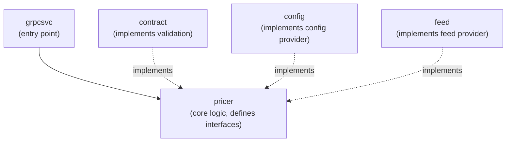
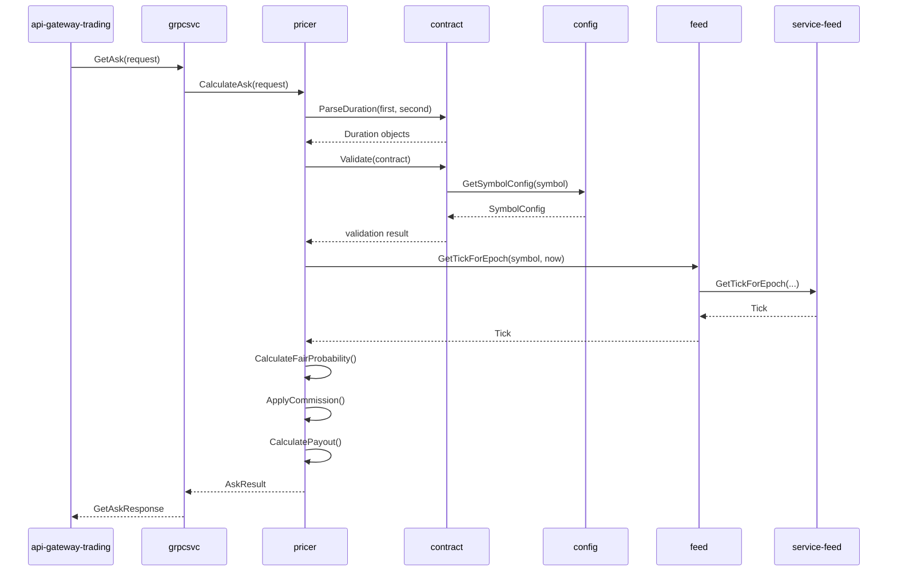

# Service Specification: Double Rise/Fall Pricing Service

> **Service**: `service-pricer-doublerisefall`
> **Version**: 1.0.2
> **Status**: Draft
> **Created**: 2026-01-15

---

## Overview

The Double Rise/Fall Pricing Service is an internal gRPC service that calculates contract prices for Double Rise/Fall binary options. It implements a closed-form analytical pricing model using bivariate normal distribution to determine fair probabilities for path-dependent contracts that require spot price to breach a barrier at two distinct evaluation times (t1 and t2).

**Domain**: Derivatives Pricing Domain (Single Bounded Context)

---

## Tech Stack

| Technology | Version | Purpose | Rationale |
|------------|---------|---------|-----------|
| **Go** | 1.21+ | Primary language | Team standard, excellent concurrency support, strong typing |
| **gRPC** | v1 | API protocol | High-performance binary protocol for internal services |
| **Protocol Buffers** | v3 | Message serialization | Strongly typed, efficient serialization |
| **buf** | latest | Protobuf toolchain | Modern build tool with linting and breaking change detection |
| **Viper** | latest | Configuration | Flexible YAML loading with hot-reload capability |
| **slog** | stdlib | Logging | Go standard library structured logging |
| **google.golang.org/grpc** | latest | gRPC implementation | Official Go gRPC library |

### Technology Justification

- **Go**: Chosen for its simplicity, fast compilation, excellent concurrency primitives (goroutines/channels for streaming), and strong ecosystem for gRPC services.
- **gRPC-only (no REST)**: This is an internal service consumed only by `api-gateway-trading`. REST gateway adds unnecessary complexity and latency.
- **YAML Configuration**: Human-readable format for symbol configuration, supports hot-reload without service restart.

---

## User Story Coverage

| Story ID | Description | Implementation |
|----------|-------------|----------------|
| US-001 | As a trading gateway, I need to get contract prices for client display | [`GetAsk`](../../api/service-pricer-doublerisefall_internal.md:82) RPC |
| US-002 | As a trading gateway, I need real-time price updates for live pricing | [`StreamAsk`](../../api/service-pricer-doublerisefall_internal.md:169) RPC |
| US-003 | As a trading gateway, I need to value active contracts | [`GetBid`](../../api/service-pricer-doublerisefall_internal.md:210) RPC |
| US-004 | As a trading gateway, I need real-time contract value updates | [`StreamBid`](../../api/service-pricer-doublerisefall_internal.md:320) RPC |
| US-005 | As a trading gateway, I need validation errors with clear codes | gRPC status codes with error details |

---

## Architecture Design

### Design Philosophy

The service follows **light modular organization** (complexity score 6/10) with these principles:

1. **Interface-at-Consumer Pattern**: Interfaces are defined in the package that consumes them (primarily `pricer`), not in a separate interfaces package.
2. **Dependency Inversion**: Core pricing logic (`pricer`) defines what it needs; implementations (`feed`, `config`, `contract`) satisfy those interfaces.
3. **Single Responsibility**: Each package has one clear purpose.
4. **Stateless Design**: All state is passed via request; no in-memory contract storage.

### Dependency Direction



**Rules**:
1. `grpcsvc` depends on `pricer` (calls pricing methods)
2. `pricer` defines interfaces (`ConfigProvider`, `FeedProvider`, `ContractValidator`)
3. `config`, `feed`, `contract` implement interfaces defined in `pricer`
4. `pricer` **MUST NOT** import from `config`, `feed`, or `contract`
5. All packages **MUST NOT** import from `grpcsvc`

### Data Flow



---

## Directory Structure

```
service-pricer-doublerisefall/
├── cmd/doublerisefall/
│   └── main.go                      # Application entry point, CLI setup
├── config/
│   └── symbols.yml                  # Symbol configuration (commission, limits)
├── internal/
│   ├── app/
│   │   ├── app.go                   # Application initialization, DI wiring
│   │   └── app_test.go              # Application bootstrap tests
│   ├── config/
│   │   ├── config.go                # SymbolConfig, Manager, YAML loading
│   │   └── config_test.go           # Configuration loading tests
│   ├── contract/
│   │   ├── contract.go              # Duration parsing, Contract type, validation
│   │   └── contract_test.go         # Validation and duration tests
│   ├── feed/
│   │   ├── client.go                # Wrapper for service-feed/client
│   │   └── client_test.go           # Feed client tests (mocked)
│   ├── grpcsvc/
│   │   ├── grpcsvc.go               # gRPC handlers (thin layer)
│   │   └── grpcsvc_test.go          # Handler tests
│   └── pricer/
│       ├── pricer.go                # Core pricing logic, interfaces
│       └── pricer_test.go           # Pricing calculation tests
├── api/
│   └── proto/
│       └── doublerisefall/
│           └── v1/
│               └── doublerisefall.proto  # Service API definition
├── buf.yaml                          # Buf configuration
├── buf.gen.yaml                      # Buf generation config
├── Makefile                          # Build automation
├── Dockerfile                        # Container build
├── go.mod                            # Go module definition
├── go.sum                            # Go dependencies
└── README.md                         # Service documentation
```

---

## Component Specifications

### 1. grpcsvc Package

**Path**: `internal/grpcsvc/grpcsvc.go`

**Purpose**: Thin gRPC handler layer that maps proto messages to domain operations and back.

**Core Functionality**:

| Function | Signature | Description |
|----------|-----------|-------------|
| [`NewService`](../../code/service-pricer-doublerisefall/internal/grpcsvc/grpcsvc.go) | `(pricer Pricer) *Service` | Creates gRPC service with pricer dependency |
| [`GetAsk`](../../code/service-pricer-doublerisefall/internal/grpcsvc/grpcsvc.go) | `(ctx, *GetAskRequest) (*GetAskResponse, error)` | Handles single ask price request |
| [`StreamAsk`](../../code/service-pricer-doublerisefall/internal/grpcsvc/grpcsvc.go) | `(*StreamAskRequest, stream) error` | Handles streaming ask prices |
| [`GetBid`](../../code/service-pricer-doublerisefall/internal/grpcsvc/grpcsvc.go) | `(ctx, *GetBidRequest) (*GetBidResponse, error)` | Handles single bid price request |
| [`StreamBid`](../../code/service-pricer-doublerisefall/internal/grpcsvc/grpcsvc.go) | `(*StreamBidRequest, stream) error` | Handles streaming bid prices |

**Responsibilities**:
- Map proto request messages to domain types
- Invoke pricer for calculations
- Map domain results to proto response messages
- Convert domain errors to gRPC status codes
- Manage stream lifecycle for StreamAsk/StreamBid

**Dependencies**:
- Depends on: `pricer.Pricer` interface

**Error Mapping**:

| Domain Error | gRPC Status | Code |
|--------------|-------------|------|
| `ErrInvalidSymbol` | `INVALID_ARGUMENT` | `ERR-DR-S1V` |
| `ErrInvalidDuration` | `INVALID_ARGUMENT` | `ERR-DR-D2U` |
| `ErrDurationOrder` | `INVALID_ARGUMENT` | `ERR-DR-D3O` |
| `ErrDurationGap` | `INVALID_ARGUMENT` | `ERR-DR-D4G` |
| `ErrInvalidStake` | `INVALID_ARGUMENT` | `ERR-DR-K5S` |
| `ErrPayoutExceeded` | `INVALID_ARGUMENT` | `ERR-DR-P6X` |
| `ErrPricingTimeFuture` | `INVALID_ARGUMENT` | `ERR-DR-T2F` |
| `ErrMissingStartTime` | `INVALID_ARGUMENT` | `ERR-DR-T1M` |
| `ErrMissingPayout` | `INVALID_ARGUMENT` | `ERR-DR-P2Y` |
| `ErrInvalidContractType` | `INVALID_ARGUMENT` | `ERR-DR-C2T` |
| `ErrInvalidCurrency` | `INVALID_ARGUMENT` | `ERR-DR-C3U` |
| `ErrSymbolDisabled` | `FAILED_PRECONDITION` | `ERR-DR-Y7D` |
| `ErrMissingEntryTick` | `FAILED_PRECONDITION` | `ERR-DR-E3T` |
| `ErrMarketDataUnavailable` | `UNAVAILABLE` | `ERR-DR-M8E` |
| `ErrStreamDisconnected` | `UNAVAILABLE` | `ERR-DR-C1D` |
| `ErrInternal` | `INTERNAL` | `ERR-DR-I9N` |

**Example Implementation**:

```go
package grpcsvc

import (
    "context"
    
    pb "github.com/regentmarkets/service-pricer-doublerisefall/api/doublerisefall/v1"
    "google.golang.org/grpc/codes"
    "google.golang.org/grpc/status"
)

// Pricer defines the pricing operations required by the gRPC service.
type Pricer interface {
    CalculateAsk(ctx context.Context, req *AskRequest) (*AskResult, error)
    CalculateBid(ctx context.Context, req *BidRequest) (*BidResult, error)
    StreamAsk(ctx context.Context, req *AskRequest) (<-chan *AskResult, <-chan error)
    StreamBid(ctx context.Context, req *BidRequest) (<-chan *BidResult, <-chan error)
}

// Service implements the DoubleRiseFallService gRPC service.
type Service struct {
    pb.UnimplementedDoubleRiseFallServiceServer
    pricer Pricer
}

// NewService creates a new gRPC service.
func NewService(pricer Pricer) *Service {
    return &Service{pricer: pricer}
}

// GetAsk calculates the ask price for a contract.
func (s *Service) GetAsk(ctx context.Context, req *pb.GetAskRequest) (*pb.GetAskResponse, error) {
    // Map proto to domain
    askReq := mapProtoToAskRequest(req)
    
    // Call pricer
    result, err := s.pricer.CalculateAsk(ctx, askReq)
    if err != nil {
        return nil, mapDomainErrorToGRPC(err)
    }
    
    // Map domain to proto
    return mapAskResultToProto(result), nil
}
```

---

### 2. pricer Package

**Path**: `internal/pricer/pricer.go`

**Purpose**: Core pricing logic implementing the bivariate normal formula for Double Rise/Fall contracts. This package defines all interfaces consumed by the service.

**Interfaces Defined**:

```go
// ConfigProvider provides symbol configuration.
type ConfigProvider interface {
    GetSymbolConfig(symbol string) (*SymbolConfig, error)
}

// FeedProvider provides market data access.
type FeedProvider interface {
    GetTickForEpoch(ctx context.Context, symbol string, epoch int64) (*Tick, bool, error)
    GetTicksFromLimit(ctx context.Context, symbol string, start int64, limit int64) ([]*Tick, bool, error)
    Subscribe(ctx context.Context, symbol string, start int64) Subscription
}

// Subscription represents a real-time tick subscription.
type Subscription interface {
    C() <-chan *Tick
    Err() error
    Close()
}

// ContractValidator validates contract parameters.
type ContractValidator interface {
    ParseDuration(s string) (Duration, error)
    ValidateAskRequest(req *AskRequest, config *SymbolConfig) error
    ValidateBidRequest(req *BidRequest, config *SymbolConfig) error
}
```

**Core Functionality**:

| Function | Purpose |
|----------|---------|
| [`NewPricer`](../../code/service-pricer-doublerisefall/internal/pricer/pricer.go) | Creates pricer with dependencies |
| [`CalculateAsk`](../../code/service-pricer-doublerisefall/internal/pricer/pricer.go) | Computes ask price and payout |
| [`CalculateBid`](../../code/service-pricer-doublerisefall/internal/pricer/pricer.go) | Evaluates contract value |
| [`StreamAsk`](../../code/service-pricer-doublerisefall/internal/pricer/pricer.go) | Continuous ask price updates |
| [`StreamBid`](../../code/service-pricer-doublerisefall/internal/pricer/pricer.go) | Continuous bid price updates |
| [`calculateFairProbability`](../../code/service-pricer-doublerisefall/internal/pricer/pricer.go) | Bivariate normal formula |
| [`applyCommission`](../../code/service-pricer-doublerisefall/internal/pricer/pricer.go) | Adds commission to fair probability |
| [`calculatePayout`](../../code/service-pricer-doublerisefall/internal/pricer/pricer.go) | Computes payout from stake/price |

**Pricing Formula Implementation**:

```go
import "math"

// calculateFairProbability computes P_fair using bivariate normal distribution.
// Formula: P_fair = 1/4 + arcsin(sqrt(t1/t2)) / (2π)
func calculateFairProbability(t1Seconds, t2Seconds int64) float64 {
    // Calculate correlation
    rho := math.Sqrt(float64(t1Seconds) / float64(t2Seconds))
    
    // Calculate fair probability
    pFair := 0.25 + math.Asin(rho)/(2*math.Pi)
    
    return pFair
}

// applyCommission adds commission to fair probability.
// Returns client price (P_client = P_fair + commission)
func applyCommission(pFair, commission float64) float64 {
    return pFair + commission
}

// calculatePayout computes payout from stake and client price.
// Formula: Payout = Stake / P_client
func calculatePayout(stake, pClient float64) float64 {
    if pClient <= 0 || pClient > 1 {
        return 0
    }
    return stake / pClient
}
```

**Domain Types**:

```go
// AskRequest contains parameters for ask price calculation.
type AskRequest struct {
    Symbol         string
    ContractType   ContractType
    Currency       string
    FirstDuration  Duration
    SecondDuration Duration
    Stake          float64
    PricingTime    int64 // Optional, defaults to now
}

// AskResult contains the calculated ask price and metadata.
type AskResult struct {
    AskPrice       string // 4 decimal precision
    Currency       string
    CurrentSpot    string
    CurrentSpotTime int64
    Payout         string // 2 decimal precision
    MaxPayout      string
    MinStake       string
}

// BidRequest contains parameters for bid price calculation.
type BidRequest struct {
    Symbol         string
    ContractType   ContractType
    Currency       string
    FirstDuration  Duration
    SecondDuration Duration
    StartTime      int64
    Stake          float64
    Payout         float64 // Original payout from Ask
    PricingTime    int64
}

// BidResult contains the calculated bid price and contract state.
type BidResult struct {
    BidPrice        string
    IsExpired       bool
    CurrentSpot     string
    CurrentSpotTime int64
    EntrySpot       string
    EntrySpotTime   int64
    ExitSpot        string
    ExitSpotTime    int64
    Barrier         string
    StartTime       int64
    ExpiryTime      int64
    EvaluationTime  int64 // t1
    Currency        string
}

// ContractType represents RISE or FALL.
type ContractType int

const (
    ContractTypeUnspecified ContractType = iota
    ContractTypeRise
    ContractTypeFall
)

// Duration represents a parsed duration with unit discriminator.
type Duration struct {
    Value int64
    Unit  DurationUnit
}

// DurationUnit discriminates between time and tick-based durations.
type DurationUnit string

const (
    DurationUnitSeconds DurationUnit = "s"
    DurationUnitMinutes DurationUnit = "m"
    DurationUnitHours   DurationUnit = "h"
    DurationUnitDays    DurationUnit = "d"
    DurationUnitTicks   DurationUnit = "t"
)
```

**Bid Evaluation Logic**:

```go
// evaluateContract determines win/loss at expiry.
func (p *Pricer) evaluateContract(
    contractType ContractType,
    barrier float64,
    spotT1 float64,
    spotT2 float64,
) (won bool) {
    switch contractType {
    case ContractTypeRise:
        // Win if spot > barrier at BOTH t1 AND t2
        return spotT1 > barrier && spotT2 > barrier
    case ContractTypeFall:
        // Win if spot < barrier at BOTH t1 AND t2
        return spotT1 < barrier && spotT2 < barrier
    default:
        return false
    }
}
```

**Test Cases**:

| Test ID | Description | Input | Expected Output |
|---------|-------------|-------|-----------------|
| TC-DR-P1A | Fair probability for t1=60s, t2=120s | t1=60, t2=120 | P_fair ≈ 0.4167 |
| TC-DR-P2B | Payout with 5% commission | stake=10, P_fair=0.4167 | payout ≈ 21.44 |
| TC-DR-P3C | RISE win evaluation | barrier=100, spot_t1=101, spot_t2=102 | won=true |
| TC-DR-P4D | RISE loss at t1 | barrier=100, spot_t1=99, spot_t2=102 | won=false |
| TC-DR-P5E | FALL win evaluation | barrier=100, spot_t1=99, spot_t2=98 | won=true |

---

### 3. contract Package

**Path**: `internal/contract/contract.go`

**Purpose**: Duration parsing, contract validation rules, and contract lifecycle utilities. Implements `ContractValidator` interface defined in `pricer`.

**Core Functionality**:

| Function | Signature | Description |
|----------|-----------|-------------|
| [`ParseDuration`](../../code/service-pricer-doublerisefall/internal/contract/contract.go) | `(s string) (Duration, error)` | Parse "1m", "30s", "5t" into Duration |
| [`ValidateAskRequest`](../../code/service-pricer-doublerisefall/internal/contract/contract.go) | `(req, config) error` | Validate ask parameters |
| [`ValidateBidRequest`](../../code/service-pricer-doublerisefall/internal/contract/contract.go) | `(req, config) error` | Validate bid parameters |
| [`ToSeconds`](../../code/service-pricer-doublerisefall/internal/contract/contract.go) | `(d Duration) int64` | Convert time-based duration to seconds |
| [`ValidateDurationGap`](../../code/service-pricer-doublerisefall/internal/contract/contract.go) | `(d1, d2 Duration) error` | Ensure minimum gap |

**Duration Parsing**:

```go
import (
    "fmt"
    "regexp"
    "strconv"
)

var durationRegex = regexp.MustCompile(`^(\d+)(s|m|h|d|t)$`)

// ParseDuration parses a duration string into a Duration value.
func ParseDuration(s string) (Duration, error) {
    matches := durationRegex.FindStringSubmatch(s)
    if matches == nil {
        return Duration{}, ErrInvalidDuration
    }
    
    value, _ := strconv.ParseInt(matches[1], 10, 64)
    unit := DurationUnit(matches[2])
    
    return Duration{Value: value, Unit: unit}, nil
}

// ToSeconds converts a time-based duration to seconds.
// Returns error for tick-based durations.
func (d Duration) ToSeconds() (int64, error) {
    switch d.Unit {
    case DurationUnitSeconds:
        return d.Value, nil
    case DurationUnitMinutes:
        return d.Value * 60, nil
    case DurationUnitHours:
        return d.Value * 3600, nil
    case DurationUnitDays:
        return d.Value * 86400, nil
    case DurationUnitTicks:
        return 0, ErrTickDurationNoSeconds
    default:
        return 0, ErrInvalidDuration
    }
}
```

**Validation Rules**:

| Rule | Validation | Error Code |
|------|------------|------------|
| Symbol supported | Symbol in config | `ERR-DR-S1V` |
| Symbol enabled | config.Enabled == true | `ERR-DR-Y7D` |
| Stake minimum | stake >= config.MinStake | `ERR-DR-K5S` |
| Payout maximum | payout <= config.MaxPayout | `ERR-DR-P6X` |
| Duration order | t2 > t1 | `ERR-DR-D3O` |
| Duration gap (time) | t2 - t1 >= 10 seconds | `ERR-DR-D4G` |
| Duration gap (tick) | t2 - t1 >= 2 ticks | `ERR-DR-D4G` |
| Duration unit match | Both time-based OR both tick-based | `ERR-DR-D2U` |
| Time range (time-based) | 10s <= duration <= 86400s | `ERR-DR-D2U` |
| Tick range (tick-based) | 2t <= duration <= 10t | `ERR-DR-D2U` |

**Test Cases**:

| Test ID | Description | Input | Expected |
|---------|-------------|-------|----------|
| TC-DR-C1A | Parse seconds duration | "30s" | Duration{30, "s"} |
| TC-DR-C2B | Parse tick duration | "5t" | Duration{5, "t"} |
| TC-DR-C3C | Invalid format rejected | "5x" | ErrInvalidDuration |
| TC-DR-C4D | Duration order validation | t1="2m", t2="1m" | ErrDurationOrder |
| TC-DR-C5E | Gap validation (time) | t1="1m", t2="1m5s" | ErrDurationGap |
| TC-DR-C6F | Gap validation (tick) | t1="2t", t2="3t" | ErrDurationGap |

---

### 4. config Package

**Path**: `internal/config/config.go`

**Purpose**: Symbol configuration loading from YAML with hot-reload capability. Implements `ConfigProvider` interface defined in `pricer`.

**Configuration Schema**:

```yaml
# config/symbols.yml
symbols:
  R_10:
    commission: 0.05
    max_payout: 1000.00
    min_stake: 1.00
    enabled: true
  R_25:
    commission: 0.05
    max_payout: 1000.00
    min_stake: 1.00
    enabled: true
  R_50:
    commission: 0.05
    max_payout: 1000.00
    min_stake: 1.00
    enabled: true
  R_75:
    commission: 0.05
    max_payout: 1000.00
    min_stake: 1.00
    enabled: true
  R_100:
    commission: 0.05
    max_payout: 1000.00
    min_stake: 1.00
    enabled: true

defaults:
  commission: 0.05
  max_payout: 1000.00
  min_stake: 1.00
```

**Core Functionality**:

| Function | Signature | Description |
|----------|-----------|-------------|
| [`NewManager`](../../code/service-pricer-doublerisefall/internal/config/config.go) | `(path string) (*Manager, error)` | Load config from YAML |
| [`GetSymbolConfig`](../../code/service-pricer-doublerisefall/internal/config/config.go) | `(symbol string) (*SymbolConfig, error)` | Get config for symbol |
| [`Reload`](../../code/service-pricer-doublerisefall/internal/config/config.go) | `(ctx context.Context) error` | Hot-reload configuration |
| [`WatchConfig`](../../code/service-pricer-doublerisefall/internal/config/config.go) | `(ctx context.Context) error` | Watch for file changes |

**Types**:

```go
// SymbolConfig contains per-symbol configuration.
type SymbolConfig struct {
    Symbol     string
    Commission float64 // Decimal, e.g., 0.05 for 5%
    MaxPayout  float64 // Maximum payout in USD
    MinStake   float64 // Minimum stake in USD
    Enabled    bool    // Whether symbol is tradeable
}

// Manager handles configuration loading and access.
type Manager struct {
    mu      sync.RWMutex
    configs map[string]*SymbolConfig
    path    string
}
```

**Implementation**:

```go
import (
    "context"
    "sync"
    
    "github.com/spf13/viper"
)

// NewManager creates a config manager and loads configuration.
func NewManager(path string) (*Manager, error) {
    m := &Manager{
        configs: make(map[string]*SymbolConfig),
        path:    path,
    }
    
    if err := m.load(); err != nil {
        return nil, fmt.Errorf("failed to load config: %w", err)
    }
    
    return m, nil
}

// GetSymbolConfig returns configuration for a specific symbol.
func (m *Manager) GetSymbolConfig(symbol string) (*SymbolConfig, error) {
    m.mu.RLock()
    defer m.mu.RUnlock()
    
    cfg, ok := m.configs[symbol]
    if !ok {
        return nil, ErrInvalidSymbol
    }
    
    return cfg, nil
}
```

**Test Cases**:

| Test ID | Description | Input | Expected |
|---------|-------------|-------|----------|
| TC-DR-F1A | Load valid config | symbols.yml | No error, 5 symbols loaded |
| TC-DR-F2B | Get existing symbol | "R_100" | SymbolConfig{commission: 0.05, ...} |
| TC-DR-F3C | Get unknown symbol | "INVALID" | ErrInvalidSymbol |
| TC-DR-F4D | Hot-reload detection | File change | Config updated |

---

### 5. feed Package

**Path**: `internal/feed/client.go`

**Purpose**: Thin wrapper around `service-feed/client` for market data access. Implements `FeedProvider` interface defined in `pricer`.

**Core Functionality**:

| Function | Signature | Description |
|----------|-----------|-------------|
| [`NewClient`](../../code/service-pricer-doublerisefall/internal/feed/client.go) | `(addr string) (*Client, error)` | Create feed client wrapper |
| [`GetTickForEpoch`](../../code/service-pricer-doublerisefall/internal/feed/client.go) | `(ctx, symbol, epoch) (*Tick, bool, error)` | Get tick at time |
| [`GetTicksFromLimit`](../../code/service-pricer-doublerisefall/internal/feed/client.go) | `(ctx, symbol, start, limit) ([]*Tick, bool, error)` | Get N ticks from time |
| [`Subscribe`](../../code/service-pricer-doublerisefall/internal/feed/client.go) | `(ctx, symbol, start) Subscription` | Real-time tick stream |
| [`Close`](../../code/service-pricer-doublerisefall/internal/feed/client.go) | `() error` | Close connection |

**Implementation Pattern**:

```go
import (
    "context"
    "time"
    
    "github.com/regentmarkets/service-feed/client"
)

// Tick represents a market data tick (local type, not proto).
type Tick struct {
    Symbol string
    Time   int64  // Unix epoch seconds
    Quote  string // Price as string
}

// Client wraps the service-feed client.
type Client struct {
    inner *client.Client
}

// NewClient creates a new feed client wrapper.
func NewClient(addr string) (*Client, error) {
    c, err := client.New(addr, 3, time.Second)
    if err != nil {
        return nil, fmt.Errorf("failed to create feed client: %w", err)
    }
    return &Client{inner: c}, nil
}

// GetTickForEpoch retrieves the tick at or after the specified epoch.
func (c *Client) GetTickForEpoch(ctx context.Context, symbol string, epoch int64) (*Tick, bool, error) {
    tick, isFinal, err := c.inner.GetTickForEpoch(ctx, symbol, epoch)
    if err != nil {
        return nil, false, fmt.Errorf("feed error: %w", err)
    }
    if tick == nil {
        return nil, isFinal, nil
    }
    return &Tick{
        Symbol: tick.Symbol,
        Time:   tick.Time.Seconds,
        Quote:  tick.Quote,
    }, isFinal, nil
}

// Subscription wraps the feed subscription.
type Subscription struct {
    inner *client.Subscription
    ch    chan *Tick
}

// Subscribe creates a real-time tick subscription.
func (c *Client) Subscribe(ctx context.Context, symbol string, start int64) Subscription {
    sub := c.inner.Subscribe(ctx, symbol, start)
    s := Subscription{
        inner: sub,
        ch:    make(chan *Tick),
    }
    go s.forward()
    return s
}

func (s *Subscription) forward() {
    defer close(s.ch)
    for tick := range s.inner.C() {
        s.ch <- &Tick{
            Symbol: tick.Symbol,
            Time:   tick.Time.Seconds,
            Quote:  tick.Quote,
        }
    }
}
```

**Usage in Pricer**:

| Operation | Feed Method | Use Case |
|-----------|-------------|----------|
| GetAsk (current spot) | `GetTickForEpoch(ctx, symbol, time.Now().Unix())` | Display current price |
| GetBid (entry tick) | `GetTickForEpoch(ctx, symbol, startTime)` | Determine barrier |
| GetBid (t1 spot) | `GetTickForEpoch(ctx, symbol, evaluationTime)` | First evaluation |
| GetBid (t2 spot) | `GetTickForEpoch(ctx, symbol, expiryTime)` | Final evaluation |
| StreamAsk/StreamBid | `Subscribe(ctx, symbol, start)` | Real-time updates |
| Tick-based contracts | `GetTicksFromLimit(ctx, symbol, start, n)` | Count N ticks |

**Test Cases**:

| Test ID | Description | Scenario | Expected |
|---------|-------------|----------|----------|
| TC-DR-E1A | Get tick for epoch | Valid symbol/time | Tick returned |
| TC-DR-E2B | Get tick not found | Future epoch | nil, isFinal=false |
| TC-DR-E3C | Subscription receive | Subscribe, wait | Ticks received on channel |
| TC-DR-E4D | Connection error | Invalid address | Error returned |

---

### 6. app Package

**Path**: `internal/app/app.go`

**Purpose**: Application initialization, dependency injection wiring, and lifecycle management.

**Core Functionality**:

| Function | Signature | Description |
|----------|-----------|-------------|
| [`New`](../../code/service-pricer-doublerisefall/internal/app/app.go) | `(cfg *Config) (*App, error)` | Create application |
| [`Run`](../../code/service-pricer-doublerisefall/internal/app/app.go) | `(ctx context.Context) error` | Start gRPC server |
| [`Shutdown`](../../code/service-pricer-doublerisefall/internal/app/app.go) | `(ctx context.Context) error` | Graceful shutdown |

**Dependency Wiring**:

```go
// New creates a new application with all dependencies wired.
func New(cfg *Config) (*App, error) {
    // 1. Create config manager
    configMgr, err := config.NewManager(cfg.ConfigPath)
    if err != nil {
        return nil, fmt.Errorf("config: %w", err)
    }
    
    // 2. Create feed client
    feedClient, err := feed.NewClient(cfg.FeedServiceAddr)
    if err != nil {
        return nil, fmt.Errorf("feed: %w", err)
    }
    
    // 3. Create contract validator
    validator := contract.NewValidator(configMgr)
    
    // 4. Create pricer (core logic)
    pricer := pricer.NewPricer(configMgr, feedClient, validator)
    
    // 5. Create gRPC service
    svc := grpcsvc.NewService(pricer)
    
    // 6. Create gRPC server
    server := grpc.NewServer(
        grpc.UnaryInterceptor(loggingInterceptor),
        grpc.StreamInterceptor(streamLoggingInterceptor),
    )
    pb.RegisterDoubleRiseFallServiceServer(server, svc)
    
    return &App{
        server:     server,
        feedClient: feedClient,
        config:     configMgr,
    }, nil
}
```

---

## Data Architecture

### Data Models

| Entity | Ownership | Persistence | Lifecycle |
|--------|-----------|-------------|-----------|
| **Contract** | Request-scoped | None | Request/response only |
| **Duration** | Request-scoped | None | Parsed per request |
| **SymbolConfig** | Service | YAML file | Loaded at startup, hot-reload |
| **Tick** | External (service-feed) | None | Fetched per request |

### Data Flow

1. **Ask Flow**: Request → Parse durations → Validate → Get spot → Calculate price → Response
2. **Bid Flow**: Request → Parse durations → Validate → Get entry tick → Get t1/t2 ticks → Evaluate → Response
3. **Stream Flow**: Request → Validate → Subscribe to feed → On each tick, recalculate → Send update

### Precision Handling

| Value | Precision | Rounding |
|-------|-----------|----------|
| Unit price (P_client) | 4 decimal places | Round half-up |
| Payout | 2 decimal places | Round half-up |
| Spot prices | Original from feed | No rounding |

---

## Security Architecture

### Authentication

| Aspect | Implementation |
|--------|----------------|
| **Method** | mTLS (mutual TLS) |
| **Certificate Management** | Kubernetes secrets |
| **Certificate Rotation** | Automated via cert-manager |

### Authorization

| Aspect | Implementation |
|--------|----------------|
| **Model** | Service mesh policy |
| **Allowed Consumers** | `api-gateway-trading` only |
| **Enforcement** | Istio/Linkerd authorization policy |

### Data Protection

| Aspect | Implementation |
|--------|----------------|
| **In Transit** | TLS 1.3 |
| **At Rest** | N/A (no persistent storage) |
| **Logging** | No PII logged |

---

## Performance & Scalability

### Performance Requirements

| Metric | Target | Measurement |
|--------|--------|-------------|
| **Latency (P50)** | < 5ms | Unary calls |
| **Latency (P99)** | < 10ms | Unary calls |
| **Stream Setup** | < 50ms | Time to first message |
| **Throughput** | 10,000 req/s | Per instance |

### Scalability Strategy

| Aspect | Strategy |
|--------|----------|
| **Horizontal Scaling** | Stateless design enables multiple instances |
| **Load Balancing** | gRPC-aware (L7) load balancer |
| **Resource Limits** | CPU: 100m-500m, Memory: 64Mi-256Mi |

### Caching Strategy

| Data | Caching | Rationale |
|------|---------|-----------|
| Symbol Config | In-memory | Low cardinality, rarely changes |
| Market Data | None | Must be real-time |
| Pricing Results | None | Context-dependent |

---

## Error Handling & Resilience

### Error Categories

| Category | gRPC Status | Retry | Examples |
|----------|-------------|-------|----------|
| **Validation** | `INVALID_ARGUMENT` | No | Invalid symbol, duration |
| **Precondition** | `FAILED_PRECONDITION` | No | Symbol disabled, missing tick |
| **Transient** | `UNAVAILABLE` | Yes | Market data unavailable |
| **Internal** | `INTERNAL` | No | Unexpected errors |

### Retry Strategy

| Scenario | Strategy |
|----------|----------|
| Market data fetch | 3 retries, 1s exponential backoff (handled by feed client) |
| Stream reconnection | Automatic reconnect via feed subscription |
| Config reload | Retry on startup, graceful fallback on hot-reload |

### Circuit Breaker

| Dependency | Threshold | Timeout | Recovery |
|------------|-----------|---------|----------|
| `service-feed` | 5 failures | 30s | Half-open after 10s |

### Monitoring Points

| Metric | Type | Labels |
|--------|------|--------|
| `doublerisefall_ask_latency_seconds` | Histogram | symbol, status |
| `doublerisefall_bid_latency_seconds` | Histogram | symbol, status |
| `doublerisefall_stream_connections` | Gauge | symbol, type |
| `doublerisefall_errors_total` | Counter | error_code |

---

## External Dependencies

### Services

| Service | Protocol | Purpose | Criticality |
|---------|----------|---------|-------------|
| `service-feed` | gRPC | Market data (ticks) | **Critical** |

### Libraries

| Library | Version | Purpose |
|---------|---------|---------|
| `google.golang.org/grpc` | latest | gRPC implementation |
| `google.golang.org/protobuf` | latest | Protobuf runtime |
| `github.com/spf13/viper` | latest | Configuration |
| `github.com/regentmarkets/service-feed/client` | latest | Feed client |

---

## Deployment Requirements

### Environment Variables

| Variable | Description | Default | Required |
|----------|-------------|---------|----------|
| `FEED_SERVICE_ADDR` | Address of service-feed | `service-feed:50051` | Yes |
| `CONFIG_PATH` | Path to symbols.yml | `/config/symbols.yml` | Yes |
| `GRPC_PORT` | gRPC server port | `50051` | No |
| `HEALTH_PORT` | HTTP health check port | `8081` | No |
| `LOG_LEVEL` | Logging level | `info` | No |

### Health Check Endpoint

| Endpoint | Protocol | Response |
|----------|----------|----------|
| `/health` | HTTP | `{"status": "healthy"}` |
| `/ready` | HTTP | `{"status": "ready"}` |
| gRPC Health | gRPC | `grpc.health.v1.Health/Check` |

### Startup Dependencies

| Dependency | Check | Action on Failure |
|------------|-------|-------------------|
| `service-feed` | gRPC health check | Retry with backoff |
| Config file | File exists | Exit with error |

### Container Configuration

```dockerfile
FROM golang:1.21-alpine AS builder
WORKDIR /app
COPY . .
RUN go build -o /doublerisefall ./cmd/doublerisefall

FROM alpine:3.19
COPY --from=builder /doublerisefall /usr/local/bin/
COPY config/symbols.yml /config/symbols.yml
EXPOSE 50051 8081
ENTRYPOINT ["doublerisefall"]
```

### Kubernetes Resources

```yaml
resources:
  requests:
    cpu: 100m
    memory: 64Mi
  limits:
    cpu: 500m
    memory: 256Mi
```

---

## Development Guidelines

### Code Organization

| Package | Imports | Exports |
|---------|---------|---------|
| `grpcsvc` | `pricer` | gRPC handlers |
| `pricer` | None (defines interfaces) | Pricing logic, interfaces |
| `contract` | `pricer` (for types) | Validation, duration parsing |
| `config` | `pricer` (for types) | Config management |
| `feed` | `pricer` (for types) | Feed client wrapper |
| `app` | All | Application lifecycle |

### Testing Strategy

| Level | Scope | Tools |
|-------|-------|-------|
| **Unit** | Individual functions | `testing`, table-driven tests |
| **Integration** | Package interactions | Mock interfaces |
| **E2E** | Full service | `grpcurl`, mock feed service |

**Test ID Convention**: `TC-DR-[PKG][NUM][CHAR]`
- PKG: Package indicator (P=pricer, C=contract, F=config, E=feed, G=grpcsvc)
- NUM: Test number
- CHAR: Random character for uniqueness

### Deployment Model

| Aspect | Value |
|--------|-------|
| **Containerization** | Docker |
| **Orchestration** | Kubernetes |
| **Service Mesh** | Istio/Linkerd |
| **CI/CD** | GitHub Actions |

### Configuration Management

| Environment | Config Source |
|-------------|---------------|
| Local | `config/symbols.yml` |
| Staging | ConfigMap |
| Production | ConfigMap + Secrets |

---

## Implementation Order

Based on the architecture's development order recommendation:

### Phase 1: Foundation (Day 1-2)
1. **Generate service scaffold** using `go-templates`
2. **Implement `config` package** - YAML loading, SymbolConfig
3. **Implement `contract` package** - Duration parsing, validation rules

### Phase 2: Core Logic (Day 3-5)
4. **Implement `pricer` package** - Define interfaces, fair probability, payout calculation
5. **Implement `feed` package** - Wrapper around `service-feed/client`

### Phase 3: Integration (Day 6-7)
6. **Implement `grpcsvc` package** - Wire gRPC handlers, error mapping
7. **Implement `app` package** - Dependency injection, startup

### Phase 4: Streaming (Day 8-9)
8. **Add streaming support** - `StreamAsk` and `StreamBid`
9. **Integration testing** - End-to-end tests with mock feed

### Phase 5: Production Readiness (Day 10)
10. **Health checks**, graceful shutdown, configuration hot-reload

---

## Changelog

| Version | Date | Author | Changes |
|---------|------|--------|---------|
| 1.0.2 | 2026-01-15 | AI Generated | Added missing INTERNAL_ERROR (ERR-DR-I9N) to grpcsvc error mapping table |
| 1.0.1 | 2026-01-15 | AI Generated | Added missing error codes (ERR-DR-T2F, ERR-DR-T1M, ERR-DR-P2Y, ERR-DR-C2T, ERR-DR-C3U, ERR-DR-C1D) to grpcsvc error mapping table for complete API alignment |
| 1.0.0 | 2026-01-15 | AI Generated | Initial service specification |

---

> **Document Version**: 1.0.2
> **Last Updated**: 2026-01-15
